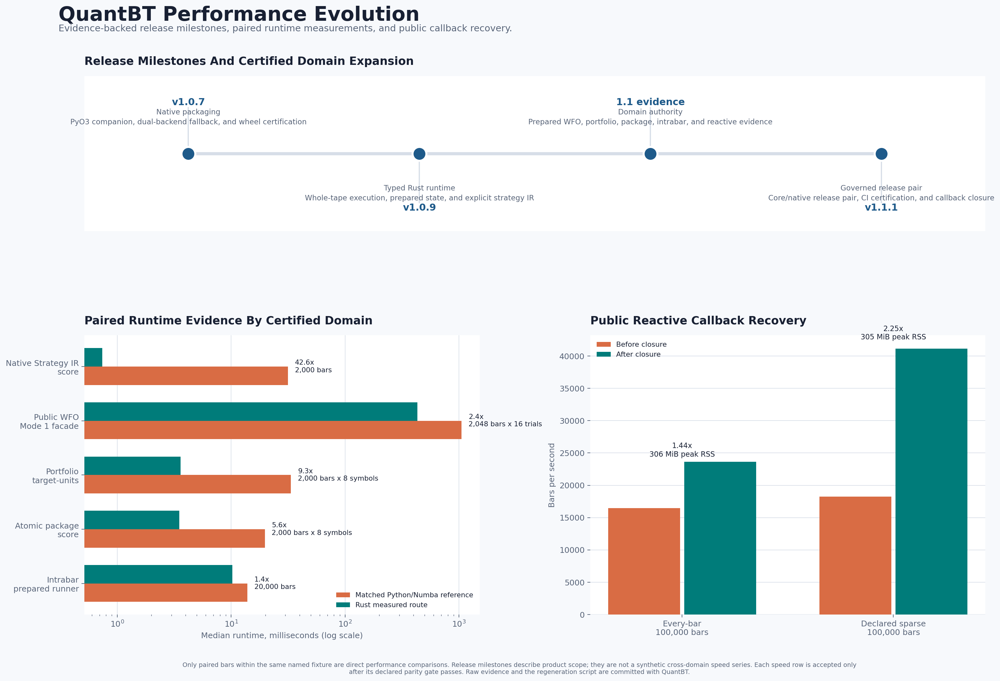

# QuantBT Performance Evolution



This visual is generated from committed benchmark evidence rather than a
manually maintained marketing table. It intentionally separates release scope
from performance claims:

- The timeline describes when major runtime and domain capabilities became
  available in the product lineage.
- Each paired runtime bar compares Rust with its declared Python or Numba
  counterpart on the same fixture only.
- The callback panel shows a separate public-reactive recovery on matched
  100,000-bar fixtures. It is not folded into a Rust kernel claim.

Do not compare the heights of different paired-runtime rows: each route has a
different contract, bar count, symbol count, result profile, and work
denominator. Every source artifact records those conditions together with its
parity evidence.

## Reproduce

```bash
python tools/generate_performance_evolution.py --check
python tools/generate_performance_evolution.py
```

The curated map lives in
[`benchmarks/history/release_performance_evolution_v1.json`](../../benchmarks/history/release_performance_evolution_v1.json).
It resolves its values directly from the phase artifacts listed in that file.
Changing a source path, selector, or numeric field causes `--check` to fail.

For workload definitions, warm-up rules, RSS interpretation, and current
release evidence, read [Benchmarking Governance](benchmarking.md).
