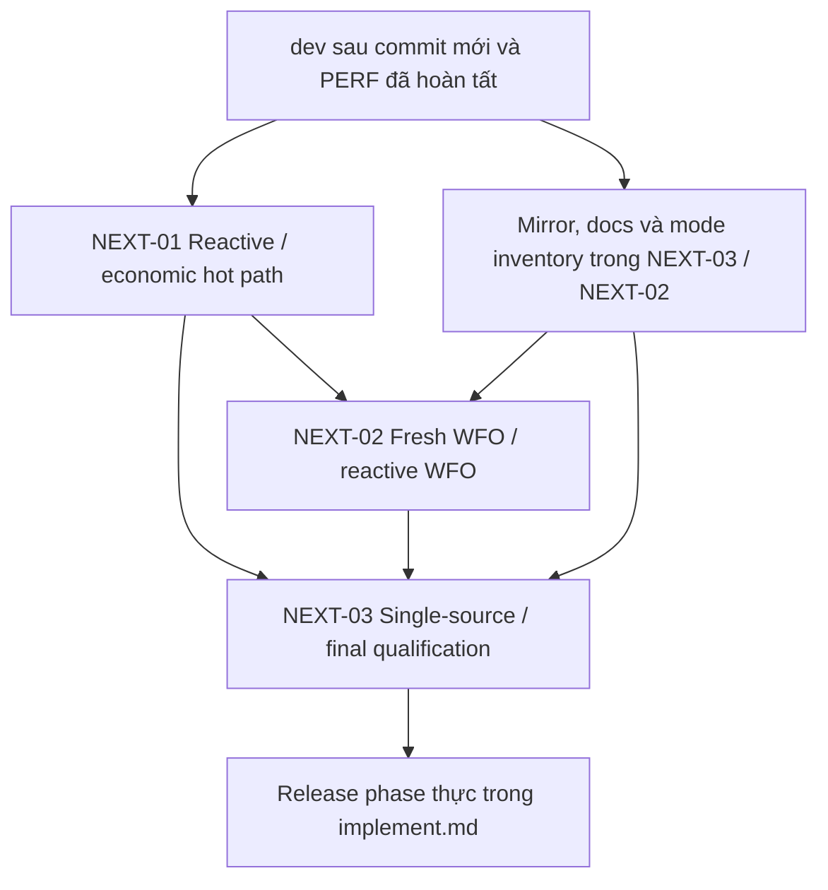

# QuantBT `dev` — Reactive, WFO và Reactive-WFO Performance Closure

## Ba phase mới sau PERF-01…PERF-07 — Implementation blueprint, revision 2

**Ngày:** 2026-09-07  
**Repository mục tiêu:** `BobbyAxerol/quantbt`, nhánh `dev`  
**Phạm vi:** tăng tốc public reactive Python, fresh WFO và reactive WFO; giữ domain/oracle và toàn bộ research transparency; chuẩn hóa single-source package, mirror và documentation.  
**Quan hệ với kế hoạch cũ:** thay phần thiết kế trong `QUANTBT_DEV_NEXT_3_PHASES_DRAFT_VI.md`; không mở lại hoặc đổi trạng thái PERF-01…PERF-07 đã hoàn tất theo xác nhận của người dùng.  
**Trạng thái chứng cứ:** `IMPLEMENTATION_BLUEPRINT / LATEST_DEV_COMMIT_NOT_VERIFIED`. Đây không phải source audit của commit mới, benchmark đã chạy trên QuantBT, hoặc giấy phép publish.

> Kết quả phải đạt là một sản phẩm chạy nhanh hơn trên workload thực, không phải thêm vài crate Rust, giảm một counter, hoặc đóng tất cả checkbox. Domain correctness, causal behavior, oracle và transparency là điều kiện vào performance gate, không phải thứ có thể hy sinh để qua gate.

---

## Mục lục và đường đọc

| Phần | Nội dung |
|---|---|
| **0–3** | Giới hạn chứng cứ, đối chiếu commit mới, architecture và bốn outcome tốc độ |
| **4 — NEXT-01** | 12 work packages cho reactive và financial hot path |
| **5 — NEXT-02** | 14 work packages cho fresh WFO và reactive WFO |
| **6 — NEXT-03** | 10 work packages cho mirror, package, audit, docs và qualification |
| **7–8** | Research-audit contract và 60 tình huống kiểm thử đối kháng |
| **9–11** | Workload/measurement suite, cách ghép implement.md và các shortcut bị cấm |
| **Phụ lục A–B** | Hai utility chạy trong checkout/môi trường benchmark thật |
| **Phụ lục C–D** | Evidence bundle, primary sources và hashes của tài liệu đầu vào |

Đọc phần 0–3 trước khi code. Mỗi work package phải được map vào symbol/test thật trên checkout; các tên đề xuất không phải danh sách modules đang thiếu. Chuẩn bị kế hoạch mirror từ đầu, nhưng đo và qualify artifacts sau lần thay đổi code/layout cuối.

---

## 0. Phạm vi kiểm chứng và quyết định thiết kế

### 0.1 Điều đã và chưa kiểm chứng trong lần viết này

Đã đọc toàn bộ bản ba phase draft được đính kèm và đối chiếu các quyết định trước: strategy tiếp tục là Python; không thêm `quantbt-features`; bảy phase PERF đã làm; yêu cầu tăng tốc cả reactive và WFO trên package cài thật; không mất trial history, parameter space, objective components hoặc audit.

Đã thử truy xuất `dev`, raw source, GitHub commit API và `git ls-remote`. Git trong môi trường này lỗi DNS. Một số trang web đọc được chỉ là cache: trang `commits/dev` đang hiển thị các commit cuối tháng 7/2026, không chứng minh HEAD mà người dùng vừa cập nhật. Trang `implement.md` đọc được cũng là bản cache cũ. **Không dùng chúng để gán SHA, version, function lỗi hoặc trạng thái phase cho commit hiện tại.**

Chưa có diff hoặc findings gốc của lượt Astra mới. Vì vậy không tự đặt tên các lỗi Astra đã tìm, không tuyên bố chúng còn tồn tại và không đề nghị hoàn tác các fix chưa đọc.

Hai utility trong phụ lục đã được kiểm tra trên Git repository giả lập và timing fixtures nhân tạo. Chúng không chạy QuantBT và không chứng minh QuantBT nhanh hơn. Chúng giúp agent chạy trong checkout thật thu đúng source identity và nghiệm thu số đo thay vì dựa vào trí nhớ hoặc README.

### 0.2 Điểm cần sửa trong chính bản ba phase trước

Bản trước đặt **exact-span** và **checkpoint/prefix reuse** làm hai mục tiêu trung tâm. Các kỹ thuật này có giá trị, nhưng không đủ để giải quyết yêu cầu lần này:

- Strategy quyết định mỗi bar không có nhiều khoảng được phép skip.
- Fresh WFO với candidates khác nhau từ đầu không có nhiều checkpoint dùng chung.
- Resume nhanh không chứng minh một study chạy mới nhanh hơn.
- Mirror cleanup làm package đúng, nhưng không tự làm matching/accounting nhanh hơn.

Revision này đổi trọng tâm sang **fresh execution trên public routes**. Exact-span và checkpoint vẫn có nhánh triển khai có điều kiện bên trong phase, nhưng không được dùng để thay thế outcome every-bar reactive, fresh WFO hoặc reactive WFO.

### 0.3 Ba phase và kết quả bắt buộc

| Phase | Outcome bắt buộc | Không làm lại |
|---|---|---|
| **NEXT-01 — Reactive Public Runtime & Economic Hot-Path Closure** | Public reactive dùng đúng runtime đã tối ưu; every-bar path giảm chi phí thật; sparse path giảm projection/native work khi hợp lệ; shared domain vẫn đúng | Không tạo pool, order arena, context protocol hoặc accounting engine thứ hai |
| **NEXT-02 — Fresh WFO & Reactive-WFO Evaluation Closure** | Fresh studies/cache-cold nhanh hơn; public WFO tái sử dụng runtime đúng lifetime; reactive WFO không bị Python dispatch/IPC/report bào mòn; đủ trial transparency | Không lấy cache-hit/resume thay fresh WFO; không đưa features vào core; không đổi sampler để giả speedup |
| **NEXT-03 — Single-Source Package, Audit/Docs & Product Qualification** | Retire root mirror an toàn; wheel/sdist/consumer imports đúng; documentation có executable examples; nghiệm thu lại code cuối so với sản phẩm cũ | Không xóa oracle, không xóa Python strategy; không bundle/rewrite packaging ngoài scope |

Các ID là namespace kế hoạch, không khẳng định chúng chưa xuất hiện trong `implement.md`. Nếu đã có NEXT-01…03, cập nhật section/errata theo diff; nếu trùng ID khác, maintainer chọn một prefix thống nhất. Không đổi số phase đã complete. Phase release đang mở chỉ tiếp tục sau manifest hợp lệ; nếu đã release thì dùng candidate mới, không sửa certificate lịch sử.

### 0.4 Những giới hạn giữ nguyên

QuantBT không nhận trách nhiệm indicator, feature engineering, training alpha, hedge-ratio research hoặc tự compile arbitrary Python. Strategy vẫn sinh signal, target, orders và package intents. Core sở hữu simulation, financial state, engine events, metric reducers và data contract.

Detailed latent order-book simulation tiếp tục là option hậu tuyển chọn; không bật cho mọi WFO candidate. Không thêm full options, inverse/quanto, cross-exchange hoặc triangular domain vào đợt performance này. Mọi shared primitive thay đổi vẫn phải chạy regression cho các capability đã support, gồm options containment.

Không tuyên bố “Rust-primary” đồng nghĩa không còn Python: reactive Python vẫn có decision authority ở Python. Native runtime phải giảm phần giao tiếp và engine work, không giả vờ số `native_entry_calls=1` là không còn callback.

---

## 1. Reconcile commit mới trước khi sửa: bắt buộc nhưng không phải phase thứ tư

### 1.1 Baseline phải là ba mốc khác nhau

| Mốc | Định nghĩa | Dùng để trả lời |
|---|---|---|
| **B0** | Last-known-good product người dùng thực sự dùng, core/native artifacts và môi trường được pin | Sản phẩm mới có nhanh hơn phiên bản cũ không? |
| **B1** | `dev` hiện tại sau commit mới/Astra fixes và PERF đã hoàn tất | Ba phase mới tạo thêm lợi ích gì? |
| **B2** | Candidate sau từng thay đổi và candidate cuối | Code được đề xuất có đúng, nhanh và đóng gói được không? |

Không lấy moving `main` làm B0; không tự chọn một version dễ cài. Nếu B0 sửa được một bug bằng contract mới ở B1, giữ hai comparison lanes: legacy reproduction và corrected-contract. Correctness dựa trên spec đã sửa, không ép giữ bug chỉ để khớp số cũ.

Mỗi mốc có source SHA/tree hash, dirty state, lockfile hashes, Python/native versions, native extension hash, actual imported origins, build profile, platform/CPU topology, dataset/strategy/params hashes và output contract. Package version một mình không đủ.

### 1.2 Quy trình đọc commit mới và lượt fix trước

1. Resolve local `HEAD` và xác nhận đang ở đúng branch/commit dự kiến. Không tự `pull`, checkout hay reset worktree của người dùng.
2. Chọn base của lượt sửa từ commit history; không mặc định `HEAD^` bao phủ toàn bộ lượt Astra nếu có nhiều commits hoặc merge.
3. Đọc `upgrade/implement.md` từ checkout này, sau đó diff code, tests, benchmark artifacts và docs trong khoảng base…HEAD.
4. Mỗi finding cũ được map vào `FixReconciliationLedger`; phân loại `FIXED_WITH_TEST`, `PARTIAL_FIX`, `NOT_REPRODUCED`, `REGRESSION`, `UNVERIFIED`.
5. Với bug thật, ưu tiên chứng minh test thất bại ở bản trước và pass ở bản sau khi có thể chạy hai artifact cùng contract. Nếu bản trước không build được hoặc bug không deterministic, ghi đúng giới hạn; không đánh dấu “reproduced” chỉ vì test mới pass.
6. Chỉ phần còn thiếu/mới được code trong NEXT. Những implementation hiện đã tốt giữ nguyên; không tạo abstraction trùng để khớp tên trong tài liệu.

Schema ledger đề xuất:

```text
finding_id, origin_commit_or_report, old_symptom
fixed_in_commit, changed_symbols, public_callers
contract_ids, failing_fixture, new_test
old_result, current_result, test_environment
remaining_delta, owner, disposition
```

**Không ghi `Astra fixed X` nếu chưa có diff hoặc report chứng minh X.**

### 1.3 Source map: dùng vị trí thật, không tạo file theo tên trong blueprint

Các root lịch sử để bắt đầu tìm: `src/quantbt/endpoint.py`, `src/quantbt/walkforward.py`, `src/quantbt/backends/`, strategy/optimization/result modules, `rust/crates/`, `rust/native_event/`, tests/benchmarks và packaging workflows. Đây là **search anchors**, không phải xác nhận đường dẫn còn nguyên trên HEAD mới.

Mỗi requirement bắt buộc gắn:

```text
public factory
→ config resolver
→ prepared request / handle
→ actual runtime / worker entry
→ engine/account implementation
→ metrics/result adapter
→ audit/export
→ installed-wheel test
```

Gắn file + symbol + line range của **đúng SHA** vào ledger. Một private helper pass không thay public-path proof. Nếu module đã split/rename, map vào module đang có; không resurrect file cũ.

### 1.4 Forensic pointers phải được xác nhận bằng profiler

| Pointer cần tìm | Rủi ro cần kiểm tra | Chỉ sửa khi |
|---|---|---|
| Python loop gọi `process_bar`, nhiều wrappers/context builders | Public path vẫn trả chi phí per-bar adapter | Call graph và exclusive timings chỉ ra chi phí |
| `trials_dataframe`, `study.trials`, `get_trials`, `pd.concat` trong callback từng trial | Full-history materialization lặp | Có count/bytes và scaling evidence |
| `.copy()`, `.to_vec()`, `ascontiguousarray` trên trial/fold path | Repeated ingress hoặc hidden materialization | Ownership/copy census phân biệt required vs repeated copies |
| Clone request/session/account trong callback hoặc từng leg | Wrapper hoặc preview work lớn | Profile cho thấy thời gian; shared authority không bị tách |
| Global atomic counters/log formatting/hashing trong hot loop | Observer cost lấn engine | Observer-on/off cùng financial outcomes |
| `sys.path`, import root namespaces, dynamic file loader | Test/benchmark chạy nhầm source | Actual module origins và class identity chứng minh |

Regex/AST scan chỉ tạo review pointers; **không phải bug detector, profiler hoặc call graph chứng nhận**.

---

## 2. Architecture đích: hoàn thiện dataflow hiện có, không thêm stack thứ hai

### 2.1 Ownership và control flow

```text
Python public facade
  ├─ validate public configuration / backward-compatible aliases
  ├─ strategy object / prepared strategy input
  └─ optimizer coordinator (nếu WFO)
               ↓ compile/resolve once per legitimate lifetime
Existing immutable prepared run/evaluation plan
  ├─ market, calendar, instrument handles
  ├─ economic contracts + initial state
  ├─ callback/intent protocol + data availability
  ├─ metric/retention/audit requirements
  └─ performance plan + resource budget
               ↓
Existing Rust simulation owner
  ├─ event/target/intrabar/portfolio/package specialized loop
  ├─ order lifecycle / execution model
  ├─ accounting / fee / funding / margin
  ├─ wake detection and numeric context projection
  ├─ Python callback at permitted decision boundary only
  ├─ native reducers and typed audit records
  └─ bounded raw results
               ↓
Python presentation / objective composition / optuna tell
               ↓
Canonical result + full research ledger + requested financial artifacts
```

Nâng cấp là nối và tinh gọn đường trên, không phải viết lại domain theo một tên crate mới. Extract crate chỉ sau behavior-preserving refactor có bằng chứng, không gộp với numeric rewrite hoặc route promotion.

### 2.2 Hai fingerprint không được trộn

**Economic fingerprint:** data/instrument/calendar, account/initial state, intent hoặc strategy code/config/state, observation/effective clock, fill/fee/funding/liquidation policies, metric numeric semantics, RNG/scenario, pruning contract khi nó ảnh hưởng execution prefix.

**Performance fingerprint:** resolved kernel, buffer layout/retention representation, topology/tile sizes, scheduler mode, cache/spill policy, build/toolchain/PGO, callback transport.

Performance plan đổi không được âm thầm đổi economic contract. Cross-build cache reuse phải xét semantic compatibility, không chỉ version string. Artifact cache có role/cutoff permissions: hash giống không cho phép dùng holdout vào selection.

### 2.3 Authority descriptor

Public result cần hiển thị rõ requested và resolved route:

```text
requested_backend / resolved_backend / resolution_reason
runtime_class
strategy_decision_authority
simulation_control_authority
execution_authority / accounting_authority / metrics_authority
native_entry_calls / python_callback_calls / writer_native_crossings
prepared_ingress_copies / per_evaluation_copy_bytes
financial_retention / research_retention
code_build_identity / economic_fingerprint / performance_fingerprint
```

Không gán `fully_native=true` cho một run chứa Python callbacks. Không dùng `auto` làm benchmark bằng chứng cho Rust nếu resolver thực tế chọn Python; performance table phải có explicit Rust/co-runtime row.

### 2.4 P0 invariants dùng chung

Timestamps/IDs/order priority/status/quantities ở lot representation phải exact theo contract. Floating comparison dùng tolerance pin trước; không nới tolerance sau khi gặp mismatch. Nếu rounding đổi margin rejection, fill, prune hoặc selected params thì đó là domain/selection change, không phải “sai số nhỏ”.

Account state không được double-count: với derivative model có wallet, equity bằng wallet cộng unrealized PnL; cumulative realized/fee/funding counters là attribution, không cộng vào wallet lần hai. Spot-cash và derivatives vẫn là account contracts khác; các tối ưu không được unify bằng cách coi spot là derivative leverage 1.

Callback timing, fill ordering, fees, funding, liquidation, fold carry và optimizer schedule đều giữ versioned behavior. Bug được chứng minh phải sửa trong correctness PR riêng, rồi pin lại affected baseline trước performance comparison.

---

## 3. Outcome contract — lần này không đóng bằng checkbox đơn thuần

### 3.1 Bốn performance outcomes độc lập

```text
O-R1: unmodified every-bar Python reactive, fresh run
O-R2: declared sparse Python reactive, fresh run
O-W1: ordinary WFO, fresh study / cache-cold
O-W2: reactive WFO, fresh study / cache-cold
```

Thêm B0 product-regression gate, audit/schema gate và single-source distribution gate. Exact-span, completed-result cache và checkpoint/resume có bảng bổ sung riêng, không được thay O-R1/O-W1/O-W2.

### 3.2 Engineering targets đề xuất, không phải speedup đã đạt

Mục tiêu mở đầu để maintainer khóa **trước implementation**:

| Workload trọng yếu | Runtime B2/B1 p50 mục tiêu | So B0 khi cùng contract |
|---|---:|---|
| Every-bar reactive thật, cùng strategy API | ≤ 0,80 | Không regression vượt budget đã pin |
| Sparse reactive đủ điều kiện | ≤ 0,70 | Không regression; index/setup tính vào public wall time |
| Fresh WFO fixed candidates, same CPU budget | ≤ 0,70 | Phải có public comparison, không chỉ kernel |
| Fresh reactive WFO, same CPU budget | ≤ 0,70 | Báo cả unmodified và optimized-protocol strategy |

Đây là **mục tiêu kỹ thuật**, không dự đoán bảo đảm. Chạy B1 profile và Amdahl check trước khi khóa con số cuối. Nếu tỷ trọng có thể tối ưu quá nhỏ, maintainer trình bằng chứng và xin đổi target **trước patch**, không hạ target sau khi code không đạt. Không dùng `NOT_BENEFICIAL` của từng kỹ thuật để đổi outcome toàn phase thành thành công.

Nếu chỉ protocol opt-in nhanh mà unmodified strategy không nhanh, hai bảng phải nói rõ. Chuyển sang nhiều CPU hơn có thể tăng throughput, nhưng phải tách same-core improvement khỏi scale-out gain.

### 3.3 Measurement rules

So ba loại: public end-to-end, warm prepared evaluation và phase-exclusive costs. Wall time không bằng tổng CPU time của workers. Queue wait/producer overlap phải có timeline; không cộng callback lồng trong native-call span hai lần.

B2/B1 paired runs cùng data, seeds, candidate matrix, contracts, retention, process topology và installed artifacts. Tách import-cold, first-run-cold, warm-prepared, cache-hit và resume. Fresh gate dùng result-cache hit = 0 và reused-prefix bars = 0; prepared market reuse trong cùng WFO run vẫn hợp lệ.

Dùng paired samples luân phiên theo randomized AB/BA order; giảm thermal/frequency drift. P50 ít nhất 30 cặp làm mốc khởi đầu. P95 cần sample count lớn hơn và báo uncertainty; 100 observations vẫn không tự bảo đảm tail estimation chính xác. Control noise, CPU budget, memory limit, BLAS threads và compiler/toolchain.

Thông số thử workload được chọn từ dữ liệu thực và frozen trước patch. Synthetic no-op hoặc flat-only fixtures phục vụ diagnosis, không thay MRS/Grid/strategy đại diện chưa được cung cấp.

### 3.4 Diagnostic interventions để tìm nguyên nhân

1. End-to-end callback thật.
2. Cùng callback nhưng profiling/sampling có phân tách native và Python self-time.
3. Captured command tape replay qua same engine: chỉ đo lower-bound engine work, **không phải parity của reactive strategy**.
4. No-op callback với cùng projection shape: chỉ đo transport/projection floor, không thay fixture kinh tế.
5. Public result đã retained vs lazy materialization: cùng logical outputs được yêu cầu.
6. Audit encode/flush enabled vs separate isolated benchmark: report overhead, không tắt audit trong product comparison.

Các can thiệp giúp xác định phần tối ưu, không được dùng số đo của bài toán rẻ hơn làm tốc độ production.

---

## 4. NEXT-01 — Reactive Public Runtime & Economic Hot-Path Closure

**Outcome:** giảm thời gian của reactive workload chạy mới, gồm every-bar Python; tối ưu sparse ở phần thật sự có thể bỏ; không yêu cầu strategy chuyển Rust.  
**Entry:** checkout/diff mới đã map, oracle và economic contracts được pin; source mapping nằm trong N1.01.  
**Các subsystem dùng lại:** callback protocols, prepared market/session, writer, sparse scheduler, order arena/indexes, account/metrics/result của PERF hiện có.

### N1.01 — Reconcile fixes và public call graph

Chạy collector phụ lục A, đọc diff base…HEAD và điền ledger §1.2. Map ít nhất object every-bar, numeric every-bar, sparse, high-churn, audit và reactive WFO adapter vào đúng runtime.

Public test phải assert actual route token do runtime phát, native extension origin và relevant counts. Không chỉ monkeypatch private helper để chứng minh wrapper gọi helper. Kiểm các default có thể đưa request về compatibility: output profile, arbitrary fields, unsupported order type, strategy requirements hoặc conflicting backend flags.

**Deliverable:** `source_route_map`, `new_commit_fix_ledger`, reproducer cho mỗi regression còn thật. Một finding được commit mới giải quyết thì ghi fixed; không làm lại. Nếu không đủ evidence để chứng nhận đã fixed thì status giữ unverified, không tự bịa test pass.

### N1.02 — Một run plan, một runtime entry path

Tại boundary public, resolve config/aliases/capabilities một lần. Chuẩn hóa thành prepared request immutable; các per-bar loops không được gọi public resolver, rebuild kwargs/config dict, hash toàn tape hoặc dò version của native extension.

Điểm cần đọc trong call graph: wrapper từ endpoint → adapter → adapter khác → session bridge có lặp field conversion, result decode hoặc validation cùng buffer hay không. Loại tầng chỉ forward dữ liệu khi benchmark chứng minh overhead, nhưng giữ một chỗ validation mandatory trước hot loop và dynamic checks cần ở từng command/fill.

Expected work shape:

```text
one public request
  → one resolved run plan
  → one prepared native session ownership boundary
  → repeated engine steps + callbacks, không repeated public plan construction
  → one final result envelope
```

Đây không phải yêu cầu một PyO3 call duy nhất bất chấp exceptions/progress/cancel. Với pause/resume/sparse user-controlled stepping có thể có nhiều entries; metadata phải đúng. Quan trọng là không hidden per-bar preparation.

**Acceptance:** unsupported/conflict inputs vẫn reject đúng; same resolved economic fingerprint; public route chứng minh đã dùng plan/runtime được benchmark.

### N1.03 — Compile callback access plan và bỏ hidden getter crossings

Requirements được hạ xuống access plan một lần theo strategy protocol: scalar account fields, selected symbols, new fill/event ranges, active-order snapshot/delta và market fields theo availability.

Benchmark ba representation ở access pattern thật: Python scalar fields cố định, read-only numeric arrays và existing native getters. Không mặc định ndarray scalar luôn rẻ hơn Python attributes. Chọn representation theo fields/rows thực và memory-safety policy, không theo khẩu hiệu zero-copy.

Resolve bound callable và arity trước run nếu protocol không cho hot replacement. Python compatibility cho phép monkey-patch giữa run phải giữ behavior hoặc version rõ; không âm thầm cache stale callable. Trong binding, dùng argument form mà PyO3 hỗ trợ hiệu quả và tránh type extraction/attach checks lặp đã có token. Chi tiết phụ thuộc version pin từ lockfile; PyO3 0.29 nêu rõ khác biệt call arguments/vectorcall và `extract`/`cast` [S1].

**Counters:** native getters/callback, Python object allocations/callback, projected rows/bytes, lookup/type-conversion time. **Gate:** same field values/availability và command outputs; gain không chỉ do bỏ field strategy yêu cầu.

### N1.04 — Context lifetime đúng trước khi giảm allocation

Phân biệt ba semantics, không đổi lẫn nhau:

| Loại | Được giữ qua callback? | Cách triển khai được phép |
|---|---|---|
| `Snapshot` | Có; values không thay đổi | Owned immutable snapshot hoặc leased buffer không recycle |
| `CallbackBorrowedView` | Chỉ trong callback theo protocol | Proxy kiểm tra generation; không export raw alias mất kiểm soát |
| `DeltaBatch` | Theo lease/ownership được công bố | Immutable append range; consumer cursor, resync rõ |

**Generation token không bảo vệ raw ndarray đã export.** Nếu consumer có thể giữ array, owner phải giữ backing memory không thay đổi cho đến khi lease kết thúc, hoặc trả copy. Python `writeable=False` không tự chứng minh mọi alias khác read-only. Không để Rust đọc immutable slice đồng thời một Python alias ghi vào cùng memory [S3].

Đối với legacy strategies giữ context cũ, default giữ snapshot semantics; optimized borrowed protocol là opt-in. Dùng pool nhiều pages với bounded lease accounting hoặc snapshot small fixed context; khi pool hết, backpressure/copy/fail theo contract, không overwrite.

Market context tại open không expose current close/high/low chưa available. Internal engine đọc OHLC để simulate không cấp quyền đọc future fields cho strategy.

**Test:** giữ view qua 100 callbacks, reset, result retention, cancel và worker failure; truy cập dữ liệu lịch sử không đổi hoặc lỗi đúng contract, không use-after-free/stale values.

### N1.05 — Transactional command batch, không per-command native roundtrip

Dùng writer/buffer đã có; sửa transport khi profile thấy mỗi `out.place/cancel/amend` tạo native crossing đắt. Fast path có thể ghi primitive batch phía Python và consume valid prefix một lần sau callback; đối với callback rất ít commands, scalar writer cũ có thể rẻ hơn nên giữ shape-specific choice có đo.

Command batch cần numeric IDs/handles đã chuẩn hóa, offsets/valid length, capacity guard, row ordinal và callback generation. Tránh string hashing/enum conversion lại khi user đã chọn numeric protocol. Legacy object commands vẫn convert đúng ở adapter riêng.

Bắt buộc phân biệt:

```text
Malformed transport / bad schema / invalid memory:
    reject staged transport trước execution, không partial unsafe ingest.

Callback raises trước return:
    discard unsubmitted staged rows; strategy state có thể dirty.

Callback returns; một command hợp schema bị business reject:
    giữ per-command acceptance/rejection/priority contract cũ.

Explicit atomic package:
    atomicity theo package contract, không theo ranh giới callback.
```

Nếu protocol legacy submit commands có side effect ngay trong callback, chuyển sang staged-after-return là semantic change. Phải retain compatibility hoặc thêm protocol version; không gọi đó là zero-copy optimization.

Batch processing theo `command_ordinal`, không sort theo action cho nhanh nếu cancel/amend/place ordering thay kết quả. Cho phép validation bất biến trước, nhưng margin/order-state checks theo đúng state sau các commands trước.

**Gate:** staged failure fixtures, capacity overflow, duplicate ID, cancel-then-place, amend-then-cancel, invalid row giữa batch, partial acceptance, parent/OCO links; trace và callback exception behavior đúng.

### N1.06 — Interpreter/engine scheduling không deadlock

Dùng co-runtime và pool hiện có, không thêm embedding runtime thứ hai. Chọn GIL policy theo workload và contract, benchmark cả short every-bar với native-heavy spans. Không bật/tắt lock vô thức mỗi scalar getter.

Quy tắc cứng:

- Không giữ engine/account mutex hoặc borrow guard khiến callback re-entry deadlock. Re-entry vào cùng running session bị reject bằng status rõ.
- Không giữ GIL trong khi chờ worker có thể cần GIL. PyO3 mô tả deadlock pattern và detach khi chờ workers [S2].
- Không cho native panic băng qua boundary; map outer-boundary errors, mark poisoned khi cần; không resume state không hợp lệ.
- Callback error không tự retry, trừ khi lifecycle snapshot/restore chứng minh an toàn.
- Ctrl+C/cancel được kiểm ở safe points; không kiểm Python signal mỗi scalar operation, cũng không hold GIL vô hạn không checkpoint.

Thêm `run_state = Prepared | Running | Paused | Completed | Failed | Closed`; tên có thể reuse enum sẵn. Owner là một session, không có Python financial shadow ledger.

### N1.07 — Chia sẻ account projection theo event phase, không tính lại cho từng consumer

Trace một bar có bao nhiêu lần tính equity, notional, margin, exposure cho admission, context, metrics và audit. Nếu phase/version giống nhau, dùng derived-state snapshot đã có; nếu cache có rồi, kiểm invalidation/public usage thay vì tạo cache thứ hai.

Key phải gồm ít nhất mark/position/wallet/reservation/risk versions và phase ID. Mark đổi với qty giữ nguyên vẫn invalidates equity. Funding/fee, schedule updates và reservation releases có thể đổi availability.

Chỉ incremental hóa certified additive linear terms; nonlinear margin/tiering/offsets dùng correct full recompute cho đến khi có proof. Debug/oracle path tính from-scratch tại mỗi event trên corpus nhỏ. Đổi summation order làm đổi threshold decision thì không được dùng tolerance để bỏ qua.

**Acceptance:** same admission/liquidation decisions; counter giảm số recompute trên cùng economic observation. Không tạo “fast account” riêng để report số đẹp.

### N1.08 — Order hot path: giảm work mỗi event và mỗi active order

Tận dụng arena/indexes hiện có. Chuyển cold text/provenance/descriptors ra khỏi hot matching record nếu profiler chỉ cache pressure. Iterate active handles, không terminal history; tránh clone whole order/Arc metadata cho mỗi visit.

Bước broad-phase chỉ trả conservative superset các orders có thể liên quan đến bar/phase. Sau lọc, exact matcher dùng **priority contract**, không dùng thứ tự index mới để phân liquidity hoặc thắng OCO. Amend, child activation, cancellation và partial fill cập nhật indexes tại đúng phase. Order vừa activated trong cùng bar phải được evaluate theo policy hiện hữu, không mất vì candidate set đã freeze quá sớm.

Với ít orders, contiguous scan có thể thắng index; chọn ngưỡng theo measured shape. Đừng force tree/hashmap/index phức tạp cho every-bar ít lệnh. Hoist immutable instrument values chỉ khi schedule version không đổi; tick/lot/fee changes đúng thời gian vẫn phải invalidate.

**Gate:** scan-oracle vs indexed path, equal-price ties, gap-through, stop-limit triggered state, newly activated children, OCO, shared liquidity, partial fills và expiry cùng timestamp. Không benchmark bằng cách giảm order set.

### N1.09 — Giảm callbacks bằng execution semantics được khai báo, không chuyển alpha vào core

Dùng sparse scheduling hiện có và native order-lifecycle primitives đã support để tránh Python polling những việc execution engine đã biết: order accepted/rejected, fill delta, parent-child, reduce-only, cancel-on-fill, expiry và scheduled boundary.

Một strategy có thể đăng ký chỉ nhận event/field cần. Nhưng nếu callback mỗi bar cập nhật decision state hoặc nếu nó yêu cầu nhận từng fill ngay lập tức, runtime không tự gom/bỏ callbacks. Equivalent protocol phải có certificate theo strategy version, params/domain, wake requirements và timing.

Nếu thiếu một **generic execution relation** như child quantity theo cumulative actual parent fills, cân nhắc bổ sung relation typed trong engine thay vì hard-code Grid/MRS. Ví dụ cumulative desired hedge lots theo rounding contract trừ cumulative hedge đã submitted/filled để tránh overhedge; ratios/policy do strategy khai báo. Đây là order management semantics, không được biến thành indicator/entry rule engine. Thêm relation là domain extension có oracle riêng, không âm thầm áp dụng cho strategies cũ.

Market range-touch wake tại close không được phát lệnh có hiệu lực lùi về open. Coalesce nhiều wake reasons cùng observation boundary chỉ khi callback order và event payload contract cho phép.

**Gate:** every-bar reference và sparse candidate có same future decisions/terminal strategy state; không chỉ same commands ở các bars bị skip.

### N1.10 — Specialized economic loop, bounded exact-span là phần bổ sung

Chọn concrete runtime branch một lần ở prepare từ account/timing/retention/protocol. Không mang toàn Cartesian product của capability flags vào mỗi order/bar. Giữ số specialization nhỏ, dùng shared certified primitives, tránh instruction-cache/binary bloat.

Ví dụ conceptual, không phải API đã tồn tại:

```text
ReactiveLinearScore
ReactiveLinearCompact
StaticOrderLinearScore
TargetLinearScore
PortfolioRebalanceAudit
```

Mục tiêu every-bar là giảm instructions/allocations và unnecessary conversions, không skip required decisions. Đối với flat/inert spans, dùng eligibility predicate chặt như bản draft: no positions/orders/commands/financial events/callback/pruning checkpoints/RNG effects chưa xử lý. Metrics vẫn giữ logical observations, elapsed time/day boundaries và return denominator.

Temporal first-hit index cho flat resting-order shape chỉ triển khai nếu có cost model cho build/index memory vs scan và parity; không bắt buộc để close every-bar goal. Không expose future first-hit time cho strategy. Full original per-bar audit hoặc digest contract có thể khiến span phải emit đủ rows hoặc tắt fast path.

**Không dùng flat-only speedup để báo MRS/high-churn đã nhanh.**

### N1.11 — Nối cùng runtime vào reactive WFO, tách state mỗi evaluation

Public reactive evaluator của WFO phải consume same resolved reactive plan/runtime đã benchmark, không wrap lại bằng old Python per-bar session hoặc tạo full report mỗi trial. Contract chia immutable market/config và private account/strategy/writer/wake state.

Python strategy factory/reset là trách nhiệm rõ ràng: không reuse mutable instance qua candidates chỉ vì worker persistent. Tái sử dụng capacity được, tái sử dụng campaign state không được nếu initial-state contract là fresh.

Retained result/view lease phải được tách khỏi reusable scratch; đánh dấu no-copy/reuse có nghĩa thật. Count actual session create/reset và market ingest ở public route, không chỉ private helper.

**Acceptance:** public reactive và reactive-WFO một-candidate equivalent outputs, including timing/fees/funding/metrics; fresh vs reset sau high-churn/error/cancel như nhau.

### N1.12 — Nghiệm thu reactive: không rút về “hybrid nên không nhanh được”

Required suite: unmodified object callback, numeric every-bar, sparse, many resting orders, high-churn, large fills/event history, minimal và requested audit. Fixture thực của người dùng nếu có phải là primary gate; synthetic fixture chỉ bổ trợ.

Four-way evidence:

```text
A. Independent Python domain oracle trên small corpus.
B. B1 public Python/Rust routes, cùng strategy inputs.
C. B2 public optimized reactive route.
D. Captured C command tape → independent/static execution replay.
```

A/B/C kiểm strategy + execution interaction; D cô lập execution, không thay closed-loop parity. Trace callback inputs, commands/effective phase, lifecycle, account và selection-critical metrics. Quy định snapshot state strategy opt-in; không hash arbitrary mutable `__dict__` rồi claim full state proof.

Outcome O-R1/O-R2 phải MET theo §3 hoặc explicit non-acceptance. Nếu engine transport floor đã giảm mà Python decision chi phối, báo exclusive profile và protocol alternatives; không tạo Rust compiler mới để chuyển mục tiêu. Candidate không đạt chưa được auto-promote vì “kiến trúc tốt hơn”.

**Phase outputs:** reconciled findings, source-linked corrective PRs, public runtime plan/protocol docs, exact tests, paired benchmark report, affected-domain matrix và phase outcome manifest. Rollback về B1 runtime cùng contract, không fallback sang một account/timing model khác.

---

## 5. NEXT-02 — Fresh WFO & Reactive-WFO Evaluation Closure

**Outcome:** tăng tốc study chạy mới, không cần historical cache/checkpoint; giữ toàn bộ semantics của supported WFO modes, reactive strategy, optimizer và audit.  
**Entry:** NEXT-01 public reactive/economic runtime có oracle evidence; có thể làm source/mode map song song từ đầu.  
**Dùng lại:** persistent pool, prepared intent/runtime, evaluation cache/DAG, metric reducers và audit store đã có. Mục tiêu là nối đúng và loại overhead thật, không thêm batch stack thứ hai.

### N2.01 — Khóa mode-by-mode execution graph

Từ `walkforward.py` và các modules hiện tại, liệt kê actual modes và call graph. Các tên lịch sử sau chỉ là starting inventory, không phải xác nhận HEAD chưa rename:

| Mode lịch sử | Inputs/results thường phải xét | Điểm không được đánh đồng |
|---|---|---|
| `mode_1_decay` | Fold metrics, decay components, selected/deployed params | Train score khác deployment OOS |
| `mode_2_sbb` | Return paths, stationary bootstrap, stress/regime descriptors | Không thể thay bằng scalar Sharpe duy nhất |
| `mode_3_flat_minima` | Candidate landscape, neighborhood/plateau metrics | Không chọn raw best thay plateau winner |
| `mode_4_is_only_robust` | IS panels và robust objective | Không dùng outer OOS để chọn |
| `mode_5_full_robust` | Composite metric/robustness components, selected paths | Không giảm replicates/terms để làm nhanh |

Map mỗi mode: strategy generation → candidate/fold evaluation → metrics/statistics → objective → pruning → selection → final OOS → report. Ghi rõ call count và retained data. Mỗi mode đã support phải có source-linked tests; mode không đủ input/native capability không được âm thầm rơi về proxy.

QuantBT giữ external model fitting/feature generation ở strategy; native reducers chỉ tính standard simulation/metric/statistical kernels thuộc WFO contract đã có. Scope không chuyển GARCH fitting hay alpha modeling vào core.

### N2.02 — Public WFO không gọi full public backtest theo trial/fold

Tạo một evaluator binding vào prepared native runtime ở đầu WFO run; nếu đã có, trace public caller để xác nhận lifetime thực. Trial chỉ gửi candidate/fold/input refs và nhận required metric/retained-path refs, không tạo endpoint/report object đầy đủ mỗi lượt.

Conceptual flow:

```text
prepare market / calendar / instruments / fold layout once
resolve supported evaluation kernels and required metric inputs
bind the existing runtime to that plan

for each admitted candidate or batch:
    obtain intent or private reactive strategy instance
    execute the declared folds / checkpoints
    collect required numeric outputs + trial/fold records
    call optimizer report/prune/tell according to schedule

rerun only selected candidates whose requested audit paths were not retained
assemble legacy/public report once or incrementally by explicit viewer requests
```

No hidden `backtest(profile='research') → DataFrame → extract score` inside objective. Nhưng custom objective cần full paths phải được cấp đúng; thiếu declaration dùng conservative compatibility input, không đoán nó scalar.

**Gate:** `public_full_report_builds_per_trial=0` ở certified score objective; trial ledger vẫn đầy đủ. Pool/runtime lifetimes measured từ public run, không counters giả do helper.

### N2.03 — FoldIndexPlan: không align/reindex/copy trong inner loop

Compile calendars, train/validation/test/warmup ranges và purge/embargo một lần. Continuous ranges dùng immutable slice; non-contiguous membership dùng explicit gather descriptors, không giả vờ min/max range đại diện tập bị purge.

Local bar index và global timestamp mapping phải tồn tại rõ cho orders, callbacks, funding và output. Warmup là observation scope, không đương nhiên cho phép training/fit hoặc trading. `closed/open`, first/last bar, day/session clocks giữ semantics.

Không convert DatetimeIndex/string symbols theo candidate/bar. Không relabel symbol khác chỉ vì same length. Missing/stale/tradable vẫn per-symbol. Actual known-at timestamp không bị thay bằng exchange event timestamp nếu contract dùng delayed availability.

Nếu strategy API cần pandas frame mutable, giữ isolated legacy copy; optimized provider dùng read-only/prepared contract opt-in. Không xóa defensive copy mà chưa khóa aliasing/strategy mutation. Causal views là API hạn chế dữ liệu, không phải security sandbox cho arbitrary Python có globals hoặc filesystem access.

### N2.04 — Một prepared intent batch, layout có budget

Các candidate intents có thể khác nhau nên cần storage riêng. Contract đúng là: **một controlled ingestion cho mỗi distinct tape/batch, không lặp O(T) copy theo fold/scenario/replay**. Không hứa zero O(T) memory cho C candidates với C tapes khác nhau.

Chọn candidate-major/time-major/ragged layout theo workload hiện có; batch descriptors gồm dtype, shape, byte strides nếu được support, offsets, symbol IDs, timing, ownership và lifetime. Validate once per immutable generation. Strided inputs unsupported thì một pack/copy ở ingress có counter, không copy ngầm mỗi worker.

Giới hạn working-set:

```text
shared market + indexes
+ in_flight_intent_bytes
+ workers × private_session_and_scratch
+ required_retained_paths
+ bounded_audit_queues
<= run_memory_budget
```

Số byte của một dense target field là `candidates × bars × symbols × itemsize`; report allocation plan trước enqueue, chunk hoặc spill khi cần. Existing shared/mmap buffers chỉ được gọi zero-copy khi native không âm thầm `to_vec()` lại trong worker.

**Target delta compression:** chỉ an toàn khi target semantics cho phép. Constant target weight/notional có thể yêu cầu rebalance khi giá/equity đổi; target từng bị reject có thể cần retry dù intent không đổi. Không compress thành “signal change only” rồi bỏ các evaluations đó. Constant accepted target units có thể tránh redundant order generation, nhưng valuation/metrics/market events vẫn phải chạy.

### N2.05 — Scheduler tối ưu trong đúng algorithm contract

Ba schedule được tách rõ, giữ tên hiện tại nếu tương đương:

1. **Sequential-compatible:** ask/report/prune/tell giống baseline, cùng dependency order.
2. **Fixed-candidate throughput:** candidates đã biết trước; parallel evaluations và deterministic collect.
3. **Adaptive-batch:** ask B trước tell, có behavior/version riêng; không tuyên bố identical sequential TPE.

Optuna ask/tell cho phép external evaluation và batched objectives; pruned trials cần terminal state đúng [S4]. Reproducibility của parallel optimization không chỉ do seed; official FAQ nêu giới hạn schedule-related nondeterminism [S5].

Sequential-compatible vẫn có thể tận dụng prepared state/native reducers. Independent inner folds của cùng candidate chỉ được parallel nếu không đổi intermediate reporting/pruning semantics hoặc strategy-global side effects; reduction/emit theo ordered checkpoints. Speculative fold work nếu có phải đo wasted work và không được tác động external strategy state; default tránh speculation trên compatibility path.

Không dùng completion order làm tell order khi contract yêu cầu deterministic ordinal. Không gom future adaptive trials chỉ để fill workers ở sequential mode.

### N2.06 — Reactive WFO: topology theo decision cost, không theo tên backend

Tái dùng pool/topology framework đã có. Thêm/hoàn thiện planner chọn trong **supported** configurations:

| Workload | Execution topology nên đo | Giới hạn |
|---|---|---|
| Prepared numeric targets/orders | Rust workers, interpreter detached khi native-only | Không Python callbacks ở inner loop |
| Python-heavy object strategies | Persistent Python processes, private sessions | IPC/init/duplication phải được tính |
| Numeric candidate-vectorizable strategies | Batch callback theo candidate lanes + native sessions | Chỉ opt-in protocol, không giả vectorization |
| Sparse mixed strategies | Existing sparse queue + bounded ready batches | Wake/candidate isolation phải exact |

Worker initializer load package/strategy factory một lần, attach immutable market handle, prepare instrument/runtime một lần. Task truyền IDs/params/fold descriptors hoặc bounded intent refs, **không pickle cả DataFrame/endpoint/session mỗi candidate**.

Mỗi candidate/fold vẫn có strategy state đúng lifecycle. Shared read-only strategy-prepared artifacts chỉ được reuse khi provider khai báo fit/cutoff/parameter identity; không chia sẻ mutable globals/RNG/campaign state.

Dùng process start method explicit và được test trên platform support; không dựa vào Linux/macOS/Windows có default giống nhau. Python docs ghi rõ differences và spawn/forkserver constraints [S6]. Không fork sau khi native thread pools/locks đã khởi tạo. Notebook-defined callables không importable phải có supported adapter hoặc actionable error, không silently fallback serialized arbitrary objects.

Budget tính effective workers/native threads/BLAS theo pool đang concurrently active; công thức nhân tối đa là upper bound bảo thủ, không phải lúc nào CPU demand cũng bằng tích. Report wall time, private memory và shared mapped memory; sum RSS của nhiều process có thể double-count shared pages.

### N2.07 — Batch decision thật, không vòng Python object đặt tên batch

Đối với protocol batched đã có, inspect thực tế có đang lặp `strategy_i.on_bar_close()` trong Python cho từng candidate không. Nếu có thì ghi rõ đó là orchestration batch, không giảm dispatch theo C candidates.

Optimized protocol nên cho strategy Python/NumPy đọc candidate-indexed numeric state và ghi command spans theo candidate. Kernel đọc một market row/block shared, account/order state vẫn riêng. Không ép mọi strategy rewrite; benchmark **unmodified compatibility** và **batched protocol** ở hai hàng riêng.

Shape sketch:

```text
ready_candidate_ids[K]
account_scalars[K, fields]
position_offsets[K+1] + position_rows[]
fill_offsets[K+1] + fill_rows[]
command_offsets[K+1] + command_rows[]
```

Batched callback nhận snapshot tại common permitted boundary, hoặc boundary descriptors riêng với strict isolation; không trộn candidate ở close với candidate đang open rồi cho nhìn chung future row. RNG không phụ thuộc lane index; stable candidate ID và evaluation identity quyết định seed.

Partial failure semantics bắt buộc: một candidate lỗi không commit nửa commands của candidate đó, không làm mất trials khác; nếu toàn batch callable raise, các Python states đã mutate có thể dirty nên fail/recreate theo contract, không đoán candidate nào còn an toàn.

**Gate:** scalar-protocol vs batch-protocol reference trên fixed candidates, commands/accounts/metrics và candidate state tương đương. Lane permutation giữ outcome khi IDs giữ nguyên và protocol thật sự order-independent.

### N2.08 — Native metric/statistical plan phục vụ năm mode

Compile required inputs từ objective, constraints/pruner, callback requirements, full research ledger và public result. Dùng cùng observation stream để cập nhật required reducers, không consumer nào tự quét lại equity cho cùng metric.

Giữ rõ return frequency, timezone/session boundary, risk-free units, ddof, zero variance, missing data, negative equity, final liquidation observation và short-run policies. Fused calculations chỉ promote trong tolerance/decision contract đã pin. Standard metric không được tính theo proxy signal returns khi candidate yêu cầu exact account returns.

Đối với bootstrap/stress: giữ required path một lần; consume resample-index/block descriptors vào reusable scratch; reduce từng replicate hoặc bounded tile, không allocate tensor khổng lồ nếu objective không cần. RNG algorithm/version/index sequence phải khớp reference. Có thể giữ Python sinh descriptors rồi Rust reduce; không thay stationary bootstrap bằng iid hay giảm số replicates.

Quantiles/tail/CVaR/order-sensitive statistics có exact storage/selection needs riêng. Không thay bằng approximate sketch mà giữ cùng metric contract. Parallel reducers dùng fixed ordered strategy khi required; near-tie objective/prune decisions phải được test adversarial.

**Gate:** metrics/component values, selected/pruned decisions và retained-path availability khớp cả năm modes; statistical kernel nhanh nhưng selection đổi là fail.

### N2.09 — Loại full-history O(N²) work do QuantBT tự thêm

Inspect callbacks/export/status hooks có tạo `trials_dataframe()`, đọc toàn `study.trials`, deepcopy trial history, `pd.concat` tích lũy hoặc serialize toàn study sau mỗi trial không. Nếu mỗi trial xử lý lại N history rows, tổng overhead có thể tăng như O(N²); đây là suy luận cần count/scale benchmark, không finding mặc định trên HEAD.

Dùng append-only trial delta, cached immutable distribution manifests và one final/paginated projection. Khi UI yêu cầu current table, dựng snapshot theo query/checkpoint có counter; không âm thầm giảm user-facing data hoặc update contract. Public Study API có `get_trials(deepcopy=...)` và `trials_dataframe`; `deepcopy=False` chỉ dùng read-only khi code không mutate returned records, không coi là shortcut an toàn phổ quát [S7].

Không patch private Optuna storage/sampler internals để giảm copy; những scans do thuật toán sampler cần không được bỏ. Tách sampler_ns, storage_ns, QuantBT-history_ns để không đổ lỗi sai.

Flat-minima/neighbor selection có thể cần computation toàn landscape. Optimize bằng index/exact neighborhood cache nếu semantics distance/categorical/tie-break không đổi; không thay exact neighbors bằng approximate search dưới tên performance.

**Gate:** 100/500/1000+ trial scaling với cheap fixed evaluator; actual number tùy benchmark budget. History export mỗi trial không scale theo toàn history ngoài explicit viewer request; sampler work được báo riêng.

### N2.10 — Pruning và cache là phần của trial lifecycle, không chỉ final score

Tái dùng evaluation DAG/cache đã có và kiểm các keys/retention yêu cầu. Execution identity tách analysis identity, nhưng objective/constraint nào làm early termination thì thuộc evaluation-control identity. Không reuse final score rồi skip intermediate reports/pruning.

Cache entry phải cho biết complete path hay evaluated prefix, intermediate metrics nào retained và study-context-dependent decisions nào **không reusable**. Một current trial phải chạy current pruning policy tại các checkpoints thích hợp. Cached pruned prefix không được trả thành successful terminal run.

Fills/account của reactive strategy thay theo cost model có thể làm emitted intents đổi. Không chạy lại fixed tape từ cost cũ và claim đó là closed-loop strategy evaluation với cost mới. Counterfactual tape replay được phép nếu API/metadata nói đúng bài toán khác.

Mỗi optimizer trial có row riêng dù reuse cùng execution. Retry có attempt ID và reason; duplicate candidates không đồng nghĩa duplicate trials. Same seed nhưng independent replicate identities không được deduplicate.

**Fresh performance gate tắt completed-result/prefix reuse.** Cache được đo ở bảng bonus cùng miss/hit costs và net memory; không tăng nominal bars/s bằng bars không execute lại.

### N2.11 — Bounded pipeline không thay study ordering

Overlapping intent generation, native evaluation và audit encode hữu ích chỉ khi các công đoạn thật sự concurrent và overhead không lấn gain. Dùng bounded queues/pool hiện có, không tạo scheduler mới. Backpressure dựa bytes và tasks, không chỉ candidate count.

Prepared independent intents có thể pipeline trong fixed/adaptive-batch schedule. Sequential-compatible không pre-sample unknown adaptive params để fill queue. Native workers không chờ callback Python trong khi caller giữ interpreter lock. Audit flush/finalization không làm lost completed trials khi task khác fail.

Tách task completion order, trial logical order và persisted journal sequence. Khi audit durable và optimizer storage không có transaction chung, dùng idempotency/reconciliation, không tự tuyên bố exactly-once xuyên hai store.

**Gate:** slow producer, slow audit sink, worker crash, duplicate result delivery, cancel while waiting; no deadlock/no silent record loss/no altered selection schedule.

### N2.12 — Fresh target evaluation và locality-aware scheduling

Tối ưu economics per candidate quan trọng hơn thêm worker khi fixed evaluator còn nhiều generic branches. Tái dùng specialized target/event kernels từ NEXT-01; không biến target units/weights thành hàng triệu generic order objects chỉ để unify route.

Với independent numeric target candidates, thử time-major tiles để cùng market block nằm trong cache trong khi advance nhiều private candidate states. Candidate vẫn đi tuần tự theo thời gian; không parallel bars của một account. Với reactive/high-churn, scenario-major có thể tốt hơn. Cost-aware chunks tránh một worker nhận toàn candidates nặng, nhưng deterministic result ordering vẫn độc lập completion time.

Hoist immutable symbol maps, bounds checks có thể chứng minh bằng typed validated slice, constant coefficients và request validation. Không hoist dynamic margin/fees/risk schedules ra khỏi phase cần kiểm. Không unchecked indexing/unsafe nếu source policy không cho; tối ưu layout trước.

SIMD chỉ ở independent candidate lanes hoặc valid reductions có numeric contract; không vectorize xuyên account dependency. Compiler/profile tuning giữ safe portable wheel; PGO chỉ sau macrobench held-out. Rustc có documented PGO flow, không có lý do tự bật `target-cpu=native` cho public wheel [S8].

### N2.13 — Checkpoint/resume là tăng cường, không outcome thay thế

Giữ phần snapshot/continuation trong draft trước nếu cần và có net benefit. Snapshot phải gồm account/order/reservations/liquidity/funding cursors/metrics/RNG/wake/strategy state/trace prefix tại quiescent phase, không raw pointers/locks/arbitrary pickle.

Scope trước: resume cùng evaluation có đủ state. Cross-candidate prefix reuse yêu cầu explicit equivalence và causal permissions; cùng timestamps/overlap/target gần giống không đủ. Strategy không hỗ trợ snapshot thì fresh-run, không tự clone `__dict__`.

Journal phân biệt checkpoint committed, intermediate report, prune decision, tell và audit commit. Restoration không duplicate fee/funding/fill hoặc report/tell. Prefix đã không retain original audit chỉ có reconstructed replay, không được gọi original trace.

Task này có thể `NOT_APPLICABLE` khi không giúp workload thật; **phase vẫn phải đạt fresh O-W1/O-W2 bằng các tasks khác**. Không biến run restart nhanh thành headline WFO throughput.

### N2.14 — WFO/reaction/audit qualification và outcomes

Đo cả fixed-candidate evaluator và optimizer end-to-end. Same CPU budget; multi-core scaling thêm bảng riêng. Benchmark cache-cold/fresh đầy đủ, gồm strategy generation và audit required. Report per-mode, không để mode nhẹ che mode nặng trong average.

Required comparisons:

```text
B0 old product vs B1 current dev vs B2 candidate
B1 current Python vs B1 Rust/co-runtime
B2 sequential-compatible vs B1 sequential-compatible
B2 fixed candidate batch vs B1 cùng candidates/topology
B2 reactive WFO unmodified strategy vs B1
B2 batched protocol vs scalar equivalent (một bảng riêng)
score evaluation vs selected audit rerun cùng inputs/state/contracts/seed
```

Selected params/deployment map/tie-break/pruning phải đúng contract. Trường hợp thuật toán mới deliberate có version riêng và quality gates; không lấy nó làm same-semantics speedup.

**Phase exit:** O-W1 và O-W2 có measured acceptance; đủ WFO modes trong released scope; no audit regression; no source-level unresolved blocker cho capabilities promoted. Python generation time còn là bottleneck phải ghi rõ; không tự chuyển feature vào QuantBT hoặc claim Rust evaluation alone đại diện toàn study.

---

## 6. NEXT-03 — Single-Source Package, Audit/Docs & Product Qualification

**Outcome:** một canonical source/import identity, xóa root mirror có kiểm chứng, package cài thật chạy đúng và nhanh; docs/audit phản ánh đúng capabilities của candidate cuối.  
**Entry:** inventory mirror/docs có thể làm từ đầu; final qualification sau NEXT-01/02 và mọi code ảnh hưởng artifact.  
**Phân biệt:** mirror retirement khác Python production-engine retirement. Python strategy/facade/oracle vẫn được giữ.

### N3.01 — Inventory source/build và mirror divergence

Đọc actual `pyproject.toml`, build backend, package discovery, manifest/resource configuration, native crate/extension names và workflows. Canonical source được suy từ cấu hình thật; `src/quantbt` là giá trị dự kiến cần verify, không hard-code nếu branch đã đổi.

So từng root counterpart với canonical file và phân loại byte-identical, semantic divergence, root-only production, forwarding shim, independent oracle hoặc tooling. Empty `__init__.py` giống nhau không đủ chứng minh một directory là mirror. Root-only logic phải reconcile vào canonical bằng tests trước khi delete.

Không dùng tỷ lệ GitHub LOC làm acceptance. Package wheel có thể đã chỉ chứa canonical tree dù repository có mirror. Mục tiêu là loại duplicate source/import risk và giảm maintenance, không hứa hot-loop speedup từ xóa files.

**Output:** mirror manifest và consumer list, mỗi file có disposition/owner/test. Collector phụ lục chỉ tạo candidate pairs, không cấp quyền delete.

### N3.02 — Canonical imports và một type identity

Map imports ở package, notebooks được cung cấp, Pool Alpha integrations, examples, benchmarks, tests, CLI, multiprocessing workers và trusted serialized fixtures. Không claim consumer bên ngoài pass nếu không có source/fixture.

Migrate namespace `quantbt.*` và public APIs đã support; loại source-root path hacks trong production/testing lanes dùng installed package. Python cache modules theo qualified name nên source load qua hai names có thể tạo different identities [S9]. Test class/enum/exception identity và registry singleton, không chỉ equality values.

Compatibility shims nếu cần chỉ re-export **cùng canonical objects**, có allowlist/sunset. Không copy financial functions/classes vào shim. Không dùng symlink tree làm “đã xóa mirror” nếu nó còn tạo duplicate import namespace. Pickle/job artifacts cũ cần documented migration; không unpickle dữ liệu không tin cậy để test tự động.

### N3.03 — Retire mirror bằng PR độc lập, no-regrowth CI

Sau consumer evidence, xóa đúng mirrored production files. Bỏ byte-equality mirror sync tests và generated mirrors. Thay bằng canonical origin tests, forbidden duplicate definitions, no repository-root resource dependence, alias identity tests và archive allowlist.

Không xóa baseline Python/Numba financial implementation ở canonical package chỉ vì mirror đã gone. Retirement engine theo maturity/oracle gate riêng; independent reference tests không import production financial helper làm oracle.

No-regrowth test không chỉ grep `core/`; root có thể chứa hợp lệ scripts/docs. Dựa manifest/AST namespace và build output. Nếu PR mới thêm mirror hoặc import alias ngoài allowlist, CI fail có actionable error.

**Acceptance:** canonical ordinary installed route chạy được không cần root tree; diff không mất root-only code; test-only oracle vẫn hiện diện và độc lập.

### N3.04 — Chuẩn hóa internal API và giảm fragmentation sau các phase

Không để mỗi phase để lại một public flag/experimental facade khác cho cùng workload. Consolidate config resolution, route descriptor và ownership contracts vào single entrypoints đang support. Các private helpers tốt được gọi qua một path chuẩn, không stacked wrappers giữ cả old/new representation quanh hot loop.

Deprecation có mapping/version/warning; không silent rename hoặc đổi defaults của `research`, `optimize`, `audit`, account/timing/fold semantics. Request schema, command ABI, public PyO3 API, result schema và package versions là các trục độc lập.

Không “cleanup” bằng blanket `except Exception: fallback_python` hoặc advertise Rust theo cài extension. Explicit Rust phải fail/capability-reject đúng; auto chọn dựa supported economic contract và evidence của candidate, không startup race/moving benchmark threshold.

Các symbols/tables có nguồn truth một nơi; generated docs/tests có provenance. Không migrate nhiều crate chỉ để kiến trúc nhìn gọn nếu gây binary/API churn không giúp outcome.

### N3.05 — Wheel/sdist closure theo distribution hiện tại

Giữ topology core/native hiện tại trừ khi có phê duyệt riêng. Verify package discovery, file inclusion, metadata, optional/hard dependencies, resources/schemas/capability registry, license và type markers. PyPA mô tả lợi ích `src` layout; Setuptools mô tả package discovery nhưng đó không thay cho archive inspection [S10, S11].

Ba build lanes bắt buộc:

```text
A. Editable developer install.
B. Ordinary candidate wheel install trong clean environment ngoài checkout.
C. Source distribution → clean rebuild wheel → ordinary install.
```

Native sdist nếu được publish/support phải chứa mọi local path dependency, relevant workspace metadata và source required; không build nhờ crate/resource ngoài archive. Build frontend standard dùng backend cấu hình của project; không tự chuyển setuptools/maturin trong cùng mirror PR [S12].

Kiểm distribution artifact hashes và actual module origins. `pip check` chỉ kiểm dependency consistency, không đủ chứng minh extension đúng ABI hoặc functions chạy. Chạy ít nhất public static, reactive, WFO và unsupported-capability smoke trên installed pair.

### N3.06 — Clean consumer tests và cold-start profile

Chạy package từ temp directory không chứa repository, trong fresh process. Không dựa notebook kernel sống lâu sau pip install. Trong ordinary-install lane, assert Python module và native extension origins ở environment mong đợi, không checkout/.pth editable cache.

Giữ separate import-time benchmark. Nếu imports kéo charts, optional Nautilus, heavy reports hoặc WFO dependencies vào mọi single run, cân nhắc lazy imports theo actual usage; không làm optional error xuất hiện bất ngờ ở phase kinh tế sau khi đã mutate account. Required capability/dependency checks phải fail trước run.

`python -I` hỗ trợ loại một số nguồn path influence khi chạy installed smoke, nhưng phải kiểm `.pth`/site customizations và module origins. Pytest import mode là cấu hình hỗ trợ, không chứng minh wheel provenance một mình [S13].

Test process-spawn worker import, resource lookup bằng package resources thay repository-relative path, trusted old artifact aliases và docs examples. Cold-start speedup không thay warm reactive/WFO gate.

### N3.07 — Audit transparency được giữ nguyên và mở rộng provenance

Dùng store/schema đã có, không tạo audit engine thứ hai. Nối đúng data từ NEXT-01/02 vào required records ở §7. Public export cũ phải round-trip và giữ dtype/null/status semantics. New fields thêm qua additive schema/versioned adapter, không xóa fields cũ vì “score mode”.

Tách `financial_retention` và `research_retention`; full trial ledger vẫn gồm failed/pruned/canceled trials. Immutable manifests lưu một lần, row refs thay lặp dict/JSON. Columnar layout/dictionary encoding là lựa chọn implementation; Arrow có specification cho buffers/encoding nhưng không tự giải quyết mutation/ownership [S14].

Queue đầy phải backpressure/spill/error rõ, không drop. `execution_complete` khác `audit_complete`; completion contract/durability phải được đáp ứng trước success cuối. Working RSS bounded có thể đi cùng total artifacts tăng theo trials; không giấu retained output bằng cách chỉ đo engine scratch.

### N3.08 — Documentation là tested public contract

Cập nhật file canonical hiện có, tránh thêm docs rời rạc phủ định nhau. Mỗi topic có một source of truth và links từ README/implement:

| Topic | Nội dung phải chạy/khớp code |
|---|---|
| Install/build | Actual core/native matrix, import names, protocol compatibility, source build, supported fallback |
| Reactive | Every-bar/sparse/numeric/batch behavior, fields, timing, buffer lifetime, exceptions, không thể skip gì |
| WFO | Actual five modes hoặc replacements; target vs reactive evaluator; folds, warmup/purge, sampler schedules |
| Reactive WFO | Strategy factory/reset, topology, batching opt-in, isolation, shared data và limitation của GIL |
| Results/audit | Trial/evaluation IDs, search space, component scores, failure states, deployed params, retention/replay |
| Performance | B0/B1/B2, same-workload, cache-cold/hit/resume, CPU budgets, actual visited work, measured limits |
| Migration | Mirror/root imports → canonical; aliases, deprecated flags, old schema compatibility |

Examples chạy trên ordinary candidate install, không hidden `sys.path.insert`, uncommitted datasets hoặc machine-specific paths. Có small synthetic fixture minh bạch và riêng consumer real fixture khi được cung cấp.

Documentation không được advertise support từ enum/class tồn tại. Capability table phải lấy trạng thái public execution có evidence. Plan historical sections giữ nguyên history, thêm superseded-by notes thay vì xóa failures cũ.

### N3.09 — Combined qualification và product outcome gate

Chạy ablation B1, NEXT-01 changes, NEXT-02 changes, combined và final package build. Tách bugs fixed/corrected semantics khỏi performance-preserving delta. Không nhân speedup riêng vì work overlaps.

Cross-domain suite gồm market/calendar, funding/fee, accounting, target, portfolio/package, intrabar và options containment trong scope support. View/reset/derived cache có thể ảnh hưởng mọi route, không chỉ WFO. Fault soak có slow audit sink, worker failure, cancel, memory pressure và retained results.

Gate package/speed phải chạy trên **cùng final distributed artifacts**. PGO/toolchain/build flags phải được record; public wheel CPU baseline portable. Không fast-math, tăng tolerance, disable safety, `panic=abort` hoặc PyO3 reference-pool flags để làm benchmark đẹp; các flags đó có thể đổi failure/ownership behavior [S1, S8].

Required outcomes: O-R1, O-R2, O-W1, O-W2; B0 regression; financial/oracle; audit/selection; resource/fault; single-source; docs examples. Một helper `NOT_BENEFICIAL` không miễn whole-program outcome.

### N3.10 — Handoff về release phase thật

Đọc current `implement.md` để xác định Phase 78 còn mở hay đã chuyển. Không tự renumber hoặc gọi phase mới là 79/80/81. Append new namespace/sections với dependencies và work-package statuses; giữ PERF history đã hoàn tất.

Manifest cuối phải chứa actual source/build identities, mapped requirements, test/benchmark artifact hashes, performance outcomes, mirror/consumer proof, released/rejected capability matrix, schema compatibility và rollback plan. Template chưa điền không phải certificate.

Nếu thay source hoặc build sau qualification, invalidates affected evidence và rerun. Nếu package version đã publish, tạo version hợp lệ mới; không upload lại artifact khác bytes dưới identity cũ. Phase này không tự publish, không blanket `auto=rust`, không xóa oracle.

**Exit:** `READY_FOR_RELEASE_PHASE` chỉ khi published-scope blockers rỗng và mọi mandatory outcome có evidence. Nếu có target chưa đạt, trạng thái ghi `NOT_MET`/`INCONCLUSIVE`; user/maintainer phải chấp thuận exception riêng, không tự coi là completed.

---

## 7. Research/audit contract: tốc độ không được mua bằng mất dữ liệu

### 7.1 Tám record families tối thiểu

| Family | Nội dung bắt buộc | Bổ sung hữu ích lần này |
|---|---|---|
| **RunManifest** | Source/build/data/strategy/contracts/seeds; requested/resolved backend; economic scope | B0/B1/B2 refs, commit-fix ledger, performance-plan hash |
| **SearchSpaceManifest** | Distributions, types, bounds/step/log, category order, conditional definitions, fixed/overrides | Revision IDs, actually-active/inactive parameters, domain restrictions |
| **TrialLedger** | Mọi trial numbers, params, optimizer state và execution status | Separate candidate/evaluation/attempt IDs, cached/resumed refs, protocol/topology |
| **EvaluationPanel** | Candidate × fold × scenario, data roles/cutoffs, initial state, metrics/costs | Visited/logical bars, native/callback counts, retention availability, errors |
| **ObjectiveComponents** | Raw components, penalties/constraints, robust/decay/bootstrap terms, direction | Computation version, units, missing-value rules, recomputable aggregate |
| **SelectionDecision** | Eligible set, rank/tie-break, selected/rejected, reason | Actual deployed parameter intervals và selection-data lineage |
| **ExecutionEvidence** | Intents/orders/fills/account trace as requested, hashes/provenance | Original vs reconstructed, prefix/resume identity, retained/truncated counts |
| **PerformanceEvidence** | Phase timings, CPU/memory/copy/queue stats và artifacts | Cache-cold/hit split, same-core/scaled split, noise/confidence, remaining hotspot |

Không cần lưu mọi repeated manifest trong mỗi row. Rows có reference IDs và enough actual values để audit. Trial IDs không được tái dùng vì cache hit; candidate hash không thay trial history.

### 7.2 Những equivalence phải kiểm

- Tổng trial rows bằng các trials đã tạo, kể cả FAIL/PRUNED và runtime canceled/pending có mapping rõ sang optimizer state. Không tự thêm một Optuna enum không tồn tại.
- Join trial → evaluation → fold metrics → objective → selection không có orphan keys.
- Objective tính lại từ components khớp giá trị được tell theo numeric contract.
- Export actual search distributions/conditional params, không chỉ `best_params`.
- Landscape/heatmap phân biệt evaluated points và interpolated visualization. Không tô điểm chưa evaluate như measured results.
- Selected record trỏ actual deployed params và data intervals; best training trial không mặc định là deployed winner.
- Audit artifact thiếu/truncated có reason/count; hash không tái dựng dữ liệu.
- Selected replay khớp score theo required financial/strategy contracts. Nếu rerun tạo lại audit từ scratch, label reconstructed; không claim original preserved trace.

### 7.3 Holdout và post-selection execution simulation

WFO dùng cost model đã approved, deep latent L1/depth optional. Nếu đánh giá execution sâu trên top candidates rồi chọn lại winner, data ở bước đó là validation/selection data, không còn untouched final holdout.

Cache/prefix reuse cần data-role authorization ngoài byte hashes. Không dùng audit kết quả holdout có sẵn để chọn parameter rồi quảng bá OOS unbiased. Parallel evaluate không đổi causal training scope hoặc fitted strategy state provenance.

### 7.4 Incremental audit không được làm biến mất lịch sử sửa trial

Trial có thể đi qua created/running/reported/pruned/failed/completed ở runtime. Append revision/event records hoặc update projection bằng transaction có journal để có current view và history cần thiết. Không đơn thuần append một COMPLETE row rồi bỏ các earlier failure/attempts.

Audit store và optimizer storage có thể độc lập; reconciliation phải chứng minh no duplicate terminal tell và no silent completed trial loss. Nếu backend không có transaction chung, gọi đúng là idempotent recovery, không “distributed exactly-once”.

---

## 8. Adversarial test requirements — 60 cases

Các IDs dưới đây là **yêu cầu mới để map vào tests hiện có hoặc bổ sung**, không khẳng định dev thiếu cả 60 tests. Reuse existing fixtures với evidence; tests cần implementation-specific expected outputs từ contract/oracle, không chỉ assert “không crash”.

### 8.1 Reactive — R01…R16

| ID | Scenario | Điều phải đúng |
|---|---|---|
| R01 | Every-bar callback chỉ mutate cooldown, chưa tạo command | Không được sparse-skip; future commands/state khớp |
| R02 | Callback giữ previous context | Snapshot values không đổi, hoặc borrowed access lỗi theo protocol |
| R03 | Giữ raw ndarray qua callback/reset | Không overwrite backing memory còn được lease; no stale alias |
| R04 | Callback ghi 3 commands rồi raise | Unsubmitted stage discard; dirty strategy state được báo; no silent retry |
| R05 | Command business-invalid ở giữa batch | Per-command behavior đúng, không vô tình all-or-none |
| R06 | Malformed length/dtype/offset buffer | Reject transport trước unsafe access, không mutate financial state |
| R07 | Cancel/place/amend cùng bar | Exact ordinal/activation semantics giữ nguyên |
| R08 | Child activated sau parent fill cùng phase | Index/prefilter không bỏ sót hoặc xử lý quá sớm |
| R09 | TP/SL cùng range, OCO cancel | Deterministic path/priority policy cũ, không chọn thuận lợi |
| R10 | Future H/L/C đổi, open hiện tại giữ nguyên | Pre-availability strategy inputs/commands không đổi |
| R11 | Range-touch wake và gap-through threshold | Callback tại đúng available phase; next command không backdate |
| R12 | GIL caller đợi worker callback | Không deadlock; safe detachment/locks được kiểm |
| R13 | Strategy re-enters same active session | Explicit reject, không alias mutation hoặc deadlock |
| R14 | Session sau liquidation/cancel/error được reuse | Fresh-session oracle equivalent; old handles/wake/RNG không còn tác dụng |
| R15 | Sparse events burst vượt ring capacity | Resync/backpressure/fail explicit; không mất financial events |
| R16 | Every-bar, sparse và batched protocol cùng bounded strategy | Callback-contract-aware future actions/account equivalence, không chỉ final equity |

### 8.2 WFO — W01…W18

| ID | Scenario | Điều phải đúng |
|---|---|---|
| W01 | Fixed candidate matrix, workers 1 và nhiều | Per-candidate semantics/ordered reducers/tie-break khớp |
| W02 | Sequential adaptive optimizer với pruner | Ask/report/prune/tell sequence đúng baseline |
| W03 | Adaptive batch | Có contract riêng; không claim same candidate sequence với sequential |
| W04 | Cache final score nhưng pruner cần intermediates | Không bỏ checkpoints; current pruning decision không reuse sai |
| W05 | Cache entry chỉ chứa canceled/pruned prefix | Không trả complete score giả |
| W06 | Fees/slippage đổi trong reactive evaluation | Không reuse stale closed-loop intents như kết quả strategy mới |
| W07 | Params identical nhưng replicate identity khác | Không deduplicate independent stochastic samples |
| W08 | Train/validation/test role đổi hoặc cutoff sớm hơn | Cache/prepared state không bypass information permission |
| W09 | Purged fold membership không contiguous | Gather/slice đúng actual membership, không min/max approximation |
| W10 | Same length multi-symbol timestamps lệch | Exact reject hoặc explicit mapping; không relabel |
| W11 | Carry OOS boundary còn orders/reservations | Full carried state đúng; reset-flat stitched returns không thay được |
| W12 | Constant target weight/notional qua price changes | Không suppress rebalancing/retry chỉ vì input không đổi |
| W13 | Mode 2/5 bootstrap indices/seed fixed | Same descriptors/statistics/quantiles/selection theo numeric contract |
| W14 | Near-tie objective và margin/prune threshold | Reduction reordering không đổi discrete decisions ngoài contract |
| W15 | One candidate process lỗi hoặc timeout | Trials khác và audit records không mất; attempts/reasons rõ |
| W16 | Batched callback lane permutation | Stable candidate identity/RNG/isolation; global mutable leaks bị phát hiện |
| W17 | 100→500→1000+ trials với cheap evaluator | QuantBT history/export không hidden full-history rebuild từng trial |
| W18 | Fresh run vs resume ở safe boundary | Exactly resumed financial/optimizer history khi supported; bảng speed riêng |

### 8.3 Shared domain và result — D01…D14

| ID | Scenario | Điều phải đúng |
|---|---|---|
| D01 | Scale-in, partial close, reverse có fees | Wallet/unrealized/equity và attribution reconcile |
| D02 | Split một fill làm hai với fee minimum/rounding | Không dùng invariant sai; tính theo exact fee-per-fill contract |
| D03 | Funding trùng fill timestamp | Đúng eligible position snapshot/sign/reference price, apply-once |
| D04 | Fee hoặc funding làm breach maintenance | Liquidation theo sequence, không chỉ final boolean |
| D05 | Reduce-only vượt current position | Không reverse exposure ngoài contract |
| D06 | Atomic package fail leg cuối | Account/fee/reservation/liquidity rollback đều đúng |
| D07 | Parent primary fill 37%, child/hedge lot rounding | Actual cumulative fills là source; residual/dust auditable |
| D08 | Hai orders tranh same liquidity | Không reuse capacity; priority exact |
| D09 | Changed mark, position qty không đổi | Equity/margin cache invalidated |
| D10 | Target units vs equivalent event execution | Equivalent fills/accounts; không ép identical order trace nếu representation khác |
| D11 | Portfolio symbol permutation có sequential priority | Tôn trọng configured priority; không dùng unconditional permutation invariant |
| D12 | Unsupported spot-carry/inverse/quanto/options style | Không route sang nearest supported account model |
| D13 | Settlement không ở final tape row | Event/source/timestamp exact, no double settle |
| D14 | Score/compact/audit và required trial fields | Same financial result, correct retention labels/schema; no hidden rerun altering state |

### 8.4 Package, docs và evidence — P01…P12

| ID | Scenario | Điều phải đúng |
|---|---|---|
| P01 | Root mirror và canonical có divergence | Không delete trước reconciliation/tests |
| P02 | Old/root imports và canonical public types | Same identity qua approved shims; không duplicate registry/class |
| P03 | Ordinary install chạy ngoài checkout | Origins/resources từ installed artifacts, không source fallthrough |
| P04 | Core sdist → wheel rebuild | Không dependency vào file ngoài archive |
| P05 | Native source package local path crates | Build resources đủ trong supported source-build path |
| P06 | Core/native incompatible protocol pair | Fail trước financial mutation, actionable error |
| P07 | Docs examples fresh installed process | Chạy được với actual API, không path hacks/implicit notebook state |
| P08 | Slow/failed audit sink | Backpressure/error và complete status đúng; không silent data loss |
| P09 | Trial/evaluation/attempt/selection joins | Cardinality/identities/full search-space distributions giữ nguyên |
| P10 | Source/build thay sau qualification | Evidence bị invalidate theo affected scope, không certificate reuse giả |
| P11 | Frozen B0, B1, B2 with same workloads | Product regression thật được hiển thị; không hiding behind current Python |
| P12 | Missing source SHA, missing tests hoặc thiếu samples | Gate INCONCLUSIVE/BLOCKED, không tự PASS |

#### 8.5 Những property chỉ đúng có điều kiện

Split fill invariance không đúng tổng quát với fee minimum, per-fill rounding hoặc timing-sensitive margin. Symbol permutation không đúng tổng quát nếu contract định nghĩa sequential priority. Scaling prices không giữ outcome khi tick/lot/min-notional/tiering thay binding constraints. Workers invariance không áp dụng cho mọi wall-clock adaptive search. Gate phải ghi preconditions, không sửa engine đúng để thỏa một metamorphic test sai.

---

## 9. Workload suite, profiling và cách chứng minh gain

### 9.1 Required workload families

| ID | Family | Benchmark mới cần trả lời |
|---|---|---|
| BR-01 | Object every-bar Python, unmodified | Public regression so bản cũ; boundary vs decision share |
| BR-02 | Numeric every-bar, cùng logic | Getter/writer/projection overhead thực |
| BR-03 | Sparse fill/order-dependent | Có giảm native work ngoài callback count không? |
| BR-04 | Many resting orders, high amend/cancel/OCO | Index maintenance và matching priority cost |
| BR-05 | Fresh WFO targets/orders, fixed candidates | Same-core native evaluation và facade/history cost |
| BR-06 | Fresh WFO từng actual mode | Statistics/retention đúng và không mode nào bị bỏ |
| BR-07 | Fresh reactive WFO object strategies | Process/IPC/runtime lifetime so đúng topology cũ |
| BR-08 | Reactive candidate-batch opt-in | True batch dispatch gain, isolated from unmodified claim |
| BR-09 | Full research audit + slow sink | Retained records đủ, working memory bounded |
| BR-10 | Target/portfolio/package/intrabar affected routes | Không cross-domain regression do shared cache/reset/layout |

MRS là một fixture, không hard-code special case. Không tự đi vào repository ngoài scope hoặc assume data/symbol đúng. Real workload manifest phải xác nhận dataset instrument, strategy symbol và instrument constraints cùng identity; sai ETH/BTC không chỉ provenance cosmetic.

### 9.2 Phase timings bắt buộc

```text
import/init
public_resolve
market_prepare / intent_prepare / ingest
strategy_generate / strategy_construct_or_reset
native_advance / matching / accounting / wake_detection
context_project / python_decision / command_write / command_ingest
metric_reduce / statistical_reduce
sampler / trial_report / prune / optimizer_storage
research_ledger_append / audit_encode / audit_flush / final_export
session_reset / cache_lookup / queue_wait
```

Mỗi duration phải có `clock=wall|cpu`, scope exclusive/inclusive, parent span và sample mode. Aggregate threaded CPU duration không được cộng vào wall critical path. Attach API counter không đồng nghĩa mỗi lần đều acquire contended GIL; report observed API events và timing riêng.

### 9.3 Work counters bắt buộc

```text
logical_bars, actual_native_bar_iterations, span_skipped_bars
candidate_fold_visits, commands, fills, active_orders_examined
python_callbacks, native_entries, context_getter_crossings, writer_crossings
context_rows, event_delta_rows, bytes_copied, bytes_zeroed_on_reset
market_ingests, pool_creates, private_session_creates, resets
unique_executions, cache_hits, reused_prefix_bars
trial_history_rows_scanned, table_rebuild_count
required_audit_rows, retained_rows, dropped_rows, queue_highwater
```

Counters giúp giải thích gain, không thay oracle. Cache-hit hoặc span-skipped logical bars phải tách khỏi actual engine throughput denominator. Bar-symbols, candidate-fold-bars, events và fills là units khác nhau.

### 9.4 Amdahl và điều kiện gain có ý nghĩa

Với removable fraction `f`, tốc độ phần đó tăng `s` lần:

```text
overall_speedup = 1 / ((1 - f) + f / s)
```

Nếu Python decision chiếm 70% và không đổi, tối ưu phần còn lại 10× chỉ cho tổng khoảng 1,37×. Đây là ví dụ toán học, không số đo QuantBT. Vì vậy phải chọn family có removable work thật; same API vs opt-in batched strategy được báo riêng.

Không cộng speedups reset × projection × audit nếu chúng cùng tác động một khoảng thời gian. Báo ablation và combined public result. Same-core win và added-core throughput là hai kết luận riêng.

### 9.5 Dispositions và outcomes

Một work package có thể `IMPLEMENTED_VERIFIED`, `VERIFIED_EXISTING`, `NOT_BENEFICIAL_WITH_EVIDENCE` hoặc `BLOCKED`. Existing implementation được chấp nhận khi source/public/tests/measurements chứng minh; không bắt viết lại.

Nhưng phase outcome chỉ `MET`, `NOT_MET`, `INCONCLUSIVE` hoặc exception được user/maintainer approve. Tất cả subtask “verified/not beneficial” không tự chuyển O-R1/O-W1/O-W2 thành MET. Missing B0 cho phép báo B2/B1, nhưng B0 product-regression status phải vẫn unresolved chứ không đoán.

---

## 10. PR sequencing và ghép vào `implement.md`

### 10.1 Dependency



N2 source/mode/retention map và N3 mirror inventory được làm song song với N1. Canonical-import migration có thể PR sớm sau inventory; final performance/wheel qualification chạy lại sau layout changes. Không tạo phase thứ tư cho discovery hay packaging.

### 10.2 PR boundary

36 work-package IDs N1.01…N1.12, N2.01…N2.14, N3.01…N3.10 là units nghiệm thu, không buộc 36 Git PRs. Gom theo coherent axis:

```text
source/evidence + regression fixture
behavior-preserving implementation
public adapter wiring
oracle/fault/performance qualification
```

Không gộp numeric rewrite + event sequence change + cache/scheduler redesign + mirror delete + auto-promotion. Findings mới ở shared accounting mở correctness repair riêng, xong mới đo performance baseline đã sửa.

Mỗi PR bắt buộc: source SHA, affected symbols/public routes, economic contract unchanged hoặc intentional delta, test links, performance evidence, audit/schema impact, rollback và status update. Không chấp nhận “all tests pass” mà không command/environment/artifact provenance.

### 10.3 Nội dung chèn vào plan chính

```markdown
## Post-PERF Product Performance Closure — NEXT-01 đến NEXT-03

Status: PLANNED cho các delta mới; giữ PERF-01…PERF-07 ở trạng thái lịch sử đã có.
Scope: fresh reactive, fresh WFO, reactive WFO, audit transparency, single-source package/docs.
Priority: domain/oracle → public-path parity → data/audit parity → safety → performance.

### NEXT-01 — Reactive Public Runtime & Economic Hot-Path Closure
Work packages: N1.01…N1.12.
Exit: O-R1/O-R2 accepted, affected-domain and public installed-route evidence.

### NEXT-02 — Fresh WFO & Reactive-WFO Evaluation Closure
Work packages: N2.01…N2.14.
Exit: O-W1/O-W2 accepted on fresh/cache-cold workload; modes and research audit preserved.

### NEXT-03 — Single-Source Package, Audit/Docs & Product Qualification
Work packages: N3.01…N3.10.
Exit: canonical source/import, no unsafe mirror loss, candidate wheel/sdist/docs and product gates pass.

Release prerequisite: candidate-bound NextPerformanceClosureManifest,
no unresolved in-scope correctness blocker, mandatory outcomes accepted.
```

Tên namespace phải kiểm collision trước merge. Nếu release phase 78 đã complete, đoạn prerequisite áp dụng vào release candidate kế tiếp; không sửa lịch sử thành chưa complete. Tài liệu này không khẳng định Phase 78 hiện còn mở.

### 10.4 Final closure manifest

Field semantics, không phải certificate đã điền:

```yaml
schema: quantbt.next_performance_closure.v1
source:
  base_commit: required_actual_sha
  candidate_commit: required_actual_sha
  dirty: false
  fix_reconciliation_ledger: required_artifact_ref
artifacts:
  core_wheel_sha256: required_actual_digest
  native_wheel_sha256: required_actual_digest_if_native_scope
  rebuilt_sdist_wheel_evidence: required_artifact_ref
outcomes:
  reactive_every_bar_fresh: MET_or_NOT_MET_or_INCONCLUSIVE
  reactive_sparse_fresh: MET_or_NOT_MET_or_INCONCLUSIVE
  wfo_fresh: MET_or_NOT_MET_or_INCONCLUSIVE
  reactive_wfo_fresh: MET_or_NOT_MET_or_INCONCLUSIVE
  historical_product_regression: PASS_or_FAIL_or_INCONCLUSIVE
  domain_oracle: PASS_or_FAIL
  research_audit_compatibility: PASS_or_FAIL
  runtime_safety: PASS_or_FAIL
  single_source_distribution: PASS_or_FAIL
  installed_docs_examples: PASS_or_FAIL
capabilities:
  promoted: actual_route_matrix_ref
  explicit_only: actual_route_matrix_ref
  rejected: actual_route_matrix_ref
status: READY_FOR_RELEASE_PHASE_or_BLOCKED
```

CI từ chối template values, missing evidence, mixed commits/artifacts và test results không phù hợp capability. Performance gate không tự chứng minh oracle; oracle status không tự chứng minh speed.

---

## 11. Failure rules: những đường không được dùng để “tăng tốc”

Không giảm trial count, bootstrap replicates, symbols, warmup hoặc audit fields mà giữ nguyên workload label. Không đổi sampler/pruner/fold reset hoặc carry để đạt số đẹp. Không dùng benchmark cached/flat-only thay fresh reactive. Không skip bar chỉ vì không có order ở bar đó trong khi strategy state/metrics/funding vẫn thay đổi.

Không clone/fork arbitrary Python state như một checkpoint hợp lệ. Không cache input hash khi bytes còn mutable. Không share mutable account/strategy/liquidity state giữa candidates. Không disable required safety checks, fast-math, nới numeric tolerance, hay swallow errors về `-inf` để qua gate.

Không xóa oracle hoặc root-only logic để dự án nhìn Rust hơn. Không dùng installed wheel của version cũ cùng Python source mới rồi gọi đó là candidate hiện tại. Không gọi enum/helper support là public capability đã certify. Không lấy source web cache tháng 7 để audit commit tháng 9.

**Definition of done:** đúng source → đúng contract → đúng public runtime → đúng audit/selection → memory/fault safe → nhanh hơn trên workloads đã chốt → đúng distributed artifacts. Thiếu mắt xích nào phải ghi rõ, không đóng bằng lời khẳng định.

---

## Phụ lục A — Công cụ đọc checkout và map commit mới

Lưu code sau thành `inspect_quantbt_checkout.py` trong vị trí tooling phù hợp. Script chỉ đọc local Git/worktree, không fetch, import QuantBT, chạy build, commit, delete hoặc publish. Output bắt buộc ở ngoài repo và directory chưa tồn tại. Phải freeze checkout trong lúc chạy; dirty worktree được ghi nhận và không dùng như release baseline sạch.

```bash
# Chạy tại checkout đúng. Script không tự đổi branch hay pull code.
python /path/to/inspect_quantbt_checkout.py \
  --repo . \
  --out ../quantbt-checkout-evidence-new

# Khi lượt fix/Astra gồm nhiều commits, truyền base thực thay default HEAD^.
python /path/to/inspect_quantbt_checkout.py \
  --repo . \
  --base BASE_COMMIT_BEFORE_FIX_SERIES \
  --out ../quantbt-checkout-evidence-fix-series
```

`BASE_COMMIT_BEFORE_FIX_SERIES` là giá trị maintainer resolve từ history, không SHA được biết trong tài liệu này. Output có phase headings, changed files, relevant Python definitions, pattern locations, lock/build hashes và mirror candidates. Regex hits không chứng minh hotspot; phần call graph và profile vẫn phải review. Tool không xác nhận remote HEAD mới nhất.

Script không xuất source snippets, nhưng file paths/commit subjects vẫn có thể chứa thông tin nội bộ; review output trước khi chia sẻ.

```python
#!/usr/bin/env python3
"""Read-only Git inventory. Does not fetch, import QuantBT, build, delete or publish."""
from __future__ import annotations
import argparse
import ast
import hashlib
import json
import pathlib
import platform
import re
import subprocess
import sys
from datetime import datetime, timezone

PATTERNS = {
    'reactive_boundary': r'on_bar_close|on_wake|process_bar|run_until|CommandWriter|ReactiveContext',
    'wfo_evaluation': r'walk_forward|walkforward|score_batch|generate_batch|Prepared.*(Intent|Target|Signal)',
    'history_materialization': r'trials_dataframe|get_trials|\.trials\b|deepcopy|pd\.concat|pandas\.concat',
    'copy_and_reset': r'\.to_vec\(|ascontiguousarray|\.copy\(|\.clone\(|\.fill\(|reset\(',
    'parallelism': r'ThreadPool|ProcessPool|thread::scope|\.detach\(|\.attach\(|multiprocessing',
    'audit_and_cache': r'checkpoint|trial_ledger|reused_from|audit|fingerprint|cache_key',
    'import_layout': r'sys\.path|PYTHONPATH|spec_from_file_location|import_module',
}
SUFFIXES = {'.py', '.rs', '.toml', '.md', '.yml', '.yaml', '.in', '.cfg'}
LOCK_NAMES = {'uv.lock', 'Cargo.lock', 'poetry.lock', 'rust-toolchain.toml', 'pyproject.toml', 'MANIFEST.in'}
LIMIT = 3_000_000


def git(root: pathlib.Path, *args: str, allow_failure: bool = False) -> bytes:
    p = subprocess.run(['git', '-C', str(root), *args], capture_output=True, timeout=30)
    if p.returncode and not allow_failure:
        raise RuntimeError(p.stderr.decode(errors='replace').strip() or f'git failed: {args}')
    return p.stdout if p.returncode == 0 else b''


def resolve(root: pathlib.Path, ref: str) -> str:
    value = git(root, 'rev-parse', '--verify', '--end-of-options', ref + '^{commit}')
    sha = value.decode().strip()
    if not re.fullmatch(r'[0-9a-f]{40}|[0-9a-f]{64}', sha):
        raise RuntimeError('Invalid commit identity')
    return sha


def digest(data: bytes) -> str:
    return hashlib.sha256(data).hexdigest()


def safe_file(root: pathlib.Path, relative: str) -> pathlib.Path | None:
    candidate = root / relative
    if candidate.is_symlink() or not candidate.is_file():
        return None
    resolved = candidate.resolve()
    if root != resolved and root not in resolved.parents:
        return None
    return resolved


def main() -> int:
    parser = argparse.ArgumentParser(description=__doc__)
    parser.add_argument('--repo', required=True)
    parser.add_argument('--out', required=True)
    parser.add_argument('--base', help='Commit before the review/fix series; default HEAD^ if available')
    parser.add_argument('--canonical', default='src/quantbt')
    args = parser.parse_args()
    supplied = pathlib.Path(args.repo).resolve()
    root = pathlib.Path(git(supplied, 'rev-parse', '--show-toplevel').decode().strip()).resolve()
    head = resolve(root, 'HEAD')
    status_before = git(root, 'status', '--porcelain=v1', '--untracked-files=normal')
    base = resolve(root, args.base) if args.base else None
    if base is None:
        raw_parent = git(root, 'rev-parse', '--verify', 'HEAD^', allow_failure=True).decode().strip()
        if raw_parent:
            base = resolve(root, raw_parent)
    rels = [p.decode('utf-8', errors='surrogateescape') for p in git(root, 'ls-files', '-z').split(b'\0') if p]
    known = set(rels)
    canonical = pathlib.PurePosixPath(args.canonical)
    if canonical.is_absolute() or '..' in canonical.parts:
        raise ValueError('--canonical must be a repository-relative path')
    prefix = canonical.as_posix().rstrip('/') + '/'
    files = []
    scan_hits = []
    definitions = []
    mirror_candidates = []
    phase_headings = []
    locks = []
    for relative in sorted(rels):
        path = safe_file(root, relative)
        if path is None:
            files.append({'path': relative, 'state': 'missing_symlink_or_non_regular'})
            continue
        size = path.stat().st_size
        if path.suffix not in SUFFIXES and path.name not in LOCK_NAMES:
            continue
        if size > LIMIT:
            files.append({'path': relative, 'bytes': size, 'state': 'scan_size_limit'})
            continue
        data = path.read_bytes()
        h = digest(data)
        files.append({'path': relative, 'bytes': size, 'sha256': h})
        if path.name in LOCK_NAMES:
            locks.append({'path': relative, 'sha256': h})
        text = data.decode('utf-8', errors='replace')
        if path.name == 'implement.md':
            for line_number, line in enumerate(text.splitlines(), 1):
                if re.match(r'^#{1,6}\s+.*(?:Phase|PERF-|NEXT-)', line, re.I):
                    phase_headings.append({'path': relative, 'line': line_number, 'heading': line.strip()})
        if path.suffix in {'.py', '.rs'}:
            lines = text.splitlines()
            for category, expression in PATTERNS.items():
                matches = [i for i, line in enumerate(lines, 1) if re.search(expression, line)]
                if matches:
                    scan_hits.append({'path': relative, 'category': category, 'match_count': len(matches),
                                      'line_numbers': matches[:40], 'locations_truncated': len(matches) > 40})
            if path.suffix == '.py':
                try:
                    tree = ast.parse(text, filename=relative)
                    for node in ast.walk(tree):
                        if isinstance(node, (ast.FunctionDef, ast.AsyncFunctionDef, ast.ClassDef)):
                            if re.search(r'backtest|simulate|reactive|walk|wfo|score|batch|trial|reset|snapshot|restore', node.name, re.I):
                                definitions.append({'path': relative, 'name': node.name, 'line': node.lineno})
                except (SyntaxError, ValueError) as exc:
                    definitions.append({'path': relative, 'parse_status': type(exc).__name__})
        if relative.startswith(prefix) and relative.endswith('.py'):
            root_relative = relative[len(prefix):]
            if root_relative in known:
                other = safe_file(root, root_relative)
                if other and other.stat().st_size <= LIMIT:
                    mirror_candidates.append({'canonical': relative, 'root_candidate': root_relative,
                                              'byte_identical': other.read_bytes() == data,
                                              'action': 'MANUAL_REVIEW_NOT_DELETE_AUTHORIZATION'})
    status_after = git(root, 'status', '--porcelain=v1', '--untracked-files=normal')
    if resolve(root, 'HEAD') != head or status_before != status_after:
        raise RuntimeError('Checkout changed during collection; freeze worktree and retry')
    status = status_after.decode(errors='replace')
    output = {
        'schema': 'quantbt.checkout_inventory.v1',
        'generated_utc': datetime.now(timezone.utc).isoformat(),
        'head': head, 'base': base,
        'branch': git(root, 'branch', '--show-current').decode().strip(),
        'dirty': bool(status.strip()), 'git_status': status.splitlines(),
        'git_version': git(root, '--version').decode().strip(),
        'python_version': sys.version, 'platform': platform.platform(),
        'canonical_path_candidate': prefix.rstrip('/'),
        'canonical_path_exists': any(p.startswith(prefix) for p in rels),
        'commit_log': git(root, 'log', '-12', '--format=%H %cI %s').decode(errors='replace').splitlines(),
        'diff_name_status': git(root, 'diff', '--name-status', base, head, '--').decode(errors='replace').splitlines() if base else [],
        'locks_and_build_metadata': locks, 'source_file_inventory': files,
        'phase_headings': phase_headings, 'candidate_locations': scan_hits,
        'python_symbol_locations': definitions, 'mirror_candidates': mirror_candidates,
        'limitations': [
            'Pattern matches are review pointers, not bugs or hot spots.',
            'Inventory reads tracked WORKTREE bytes; dirty=true is not a qualified release baseline.',
            'No call graph, test pass, performance claim or current remote HEAD verification is produced.',
            'Mirror equality alone is not permission to delete; inspect consumers and root-only logic.',
            'Review paths and commit subjects before sharing; no source lines or credentials are intentionally exported.'
        ],
    }
    destination = pathlib.Path(args.out).expanduser().resolve()
    if destination == root or root in destination.parents:
        raise ValueError('--out must be outside repository to keep collection read-only')
    destination.mkdir(parents=True, exist_ok=False)
    (destination / 'checkout_inventory.json').write_text(json.dumps(output, ensure_ascii=True, indent=2) + '\n')
    print(str(destination / 'checkout_inventory.json'))
    return 0


if __name__ == '__main__':
    try:
        raise SystemExit(main())
    except (OSError, ValueError, RuntimeError, subprocess.TimeoutExpired) as exc:
        print(f'ERROR: {exc}', file=sys.stderr)
        raise SystemExit(2)
```

---

## Phụ lục B — Paired timing gate cho fresh workloads

Lưu thành `gate_paired_timings.py`. Script nhận một comparison/workload trong mỗi JSON file, không nhận source QuantBT và không tự chạy benchmark. Nó kiểm tra schema/positive timings/cache-cold constraints, tính paired runtime ratios và descriptive bootstrap interval.

**Không phải oracle verifier.** `correctness_equal`, `audit_equal` và evidence references trong input phải được pipeline độc lập xác minh từ artifacts thật. Một JSON có cờ PASS do người nhập không chứng minh correctness. Gate này cũng không tự pin CPU/topology hay tail confidence: paired measurement protocol vẫn là trách nhiệm benchmark runner.

Input schema mẫu sau chỉ minh họa, **không phải số đo QuantBT**; production phải có ≥30 paired observations cho p50 và đủ tail samples, không nhân bản một row để đạt count:

```json
{
  "comparison": {
    "workload_id": "actual-frozen-workload-id",
    "baseline_artifact": "actual-B1-core-native-digests",
    "candidate_artifact": "actual-B2-core-native-digests",
    "economic_contract_hash": "actual-economic-hash",
    "strategy_input_hash": "actual-strategy-and-data-hash",
    "retention_hash": "actual-retention-hash",
    "cpu_budget": "actual-effective-topology",
    "measurement_mode": "fresh_cache_cold",
    "correctness_evidence_ref": "actual-independent-test-evidence"
  },
  "pairs": [
    {
      "pair_id": "pair-000",
      "baseline_ns": 1000000000,
      "candidate_ns": 780000000,
      "correctness_equal": true,
      "audit_equal": true,
      "baseline_cache_hits": 0,
      "candidate_cache_hits": 0,
      "candidate_reused_prefix_bars": 0,
      "baseline_logical_bars": 10000,
      "candidate_logical_bars": 10000
    }
  ]
}
```

Ví dụ gọi, với target đã freeze trước patch:

```bash
python /path/to/gate_paired_timings.py paired-reactive.json \
  --target-ratio 0.80 --p95-budget 1.05
```

Exit 0 chỉ nghĩa p50 target và observed p95 budget đạt trên **measurements đã cung cấp** với đủ sample count tối thiểu của script; không phải certificate toàn release. Exit 1 là chưa đạt/chưa đủ evidence; exit 2 là input invalid. P95 ở đây là observed statistic, không tự bootstrap tail confidence. Không coi một số cutoff mẫu là bảo đảm thống kê tổng quát.

```python
#!/usr/bin/env python3
"""Evaluate paired timings only; never certifies source, parity or audit correctness."""
from __future__ import annotations
import argparse
import hashlib
import json
import math
import random
import statistics
import sys
from pathlib import Path


def quantile(xs: list[float], probability: float) -> float:
    ordered = sorted(xs)
    pos = (len(ordered) - 1) * probability
    low = math.floor(pos)
    high = math.ceil(pos)
    return ordered[low] + (ordered[high] - ordered[low]) * (pos - low)


def positive(row: dict, key: str) -> float:
    value = row[key]
    if isinstance(value, bool) or not isinstance(value, (int, float)):
        raise ValueError(f'{key} must be numeric, not bool/string')
    value = float(value)
    if not math.isfinite(value) or value <= 0:
        raise ValueError(f'{key} must be finite and positive')
    return value


def run() -> int:
    parser = argparse.ArgumentParser(description=__doc__)
    parser.add_argument('input', type=Path, help='One comparison/workload per JSON file')
    parser.add_argument('--target-ratio', required=True, type=float)
    parser.add_argument('--p95-budget', type=float, default=1.05)
    parser.add_argument('--bootstrap', type=int, default=3000)
    args = parser.parse_args()
    if not (0 < args.target_ratio < 1):
        raise ValueError('target-ratio must be >0 and <1')
    if not (math.isfinite(args.p95_budget) and args.p95_budget >= 1):
        raise ValueError('p95-budget must be finite and >=1')
    if not (500 <= args.bootstrap <= 20000):
        raise ValueError('bootstrap must be between 500 and 20000')
    raw = args.input.read_bytes()
    doc = json.loads(raw)
    meta = doc['comparison']
    required = ('workload_id', 'baseline_artifact', 'candidate_artifact',
                'economic_contract_hash', 'strategy_input_hash', 'retention_hash',
                'cpu_budget', 'measurement_mode', 'correctness_evidence_ref')
    if any(key not in meta or meta[key] in (None, '') for key in required):
        raise ValueError('comparison metadata incomplete')
    if meta['measurement_mode'] != 'fresh_cache_cold':
        raise ValueError('This gate is specifically for fresh_cache_cold comparisons')
    rows = doc['pairs']
    if not isinstance(rows, list) or not rows:
        raise ValueError('pairs must be a nonempty list')
    identifiers = []
    baseline, candidate, ratios = [], [], []
    for row in rows:
        identifier = row['pair_id']
        if not isinstance(identifier, str) or not identifier:
            raise ValueError('pair_id must be a nonempty string')
        identifiers.append(identifier)
        for key in ('correctness_equal', 'audit_equal'):
            if row.get(key) is not True:
                raise ValueError(f'pair {identifier}: {key} is not asserted true')
        for key in ('baseline_cache_hits', 'candidate_cache_hits', 'candidate_reused_prefix_bars'):
            if type(row.get(key)) is not int or row[key] != 0:
                raise ValueError(f'pair {identifier}: fresh gate requires integer {key}=0')
        for key in ('baseline_logical_bars', 'candidate_logical_bars'):
            if type(row.get(key)) is not int or row[key] <= 0:
                raise ValueError(f'pair {identifier}: positive integer {key} required')
        if row['baseline_logical_bars'] != row['candidate_logical_bars']:
            raise ValueError(f'pair {identifier}: logical work differs')
        b, c = positive(row, 'baseline_ns'), positive(row, 'candidate_ns')
        baseline.append(b)
        candidate.append(c)
        ratios.append(c / b)
    if len(set(identifiers)) != len(identifiers):
        raise ValueError('duplicate pair_id')
    rng = random.Random(91373)
    boot = [statistics.median(rng.choices(ratios, k=len(ratios))) for _ in range(args.bootstrap)]
    ci = [quantile(boot, 0.025), quantile(boot, 0.975)]
    median_ratio = statistics.median(ratios)
    p95_ratio = quantile(candidate, 0.95) / quantile(baseline, 0.95)
    if len(rows) < 30:
        outcome = 'INCONCLUSIVE_SAMPLE_COUNT'
    elif ci[1] <= args.target_ratio:
        outcome = 'MET_P50_TARGET'
    elif ci[0] > args.target_ratio:
        outcome = 'NOT_MET_P50_TARGET'
    else:
        outcome = 'INCONCLUSIVE_TARGET_CI'
    tail = 'INCONCLUSIVE_TAIL_SAMPLE_COUNT' if len(rows) < 100 else (
        'WITHIN_OBSERVED_P95_BUDGET' if p95_ratio <= args.p95_budget else 'P95_BUDGET_EXCEEDED')
    report = {
        'schema': 'quantbt.paired_timing_gate.v1',
        'input_sha256': hashlib.sha256(raw).hexdigest(),
        'comparison': meta, 'pair_count': len(rows),
        'median_paired_runtime_ratio': median_ratio,
        'paired_ratio_bootstrap_ci95': ci,
        'target_ratio': args.target_ratio,
        'observed_p95_runtime_ratio': p95_ratio,
        'p50_outcome': outcome, 'p95_outcome': tail,
        'scope': 'Performance statistics of supplied measurements only. '
                 'Input equality flags and evidence references must be independently verified. '
                 'Bootstrap CI is descriptive and assumes representative paired observations. '
                 'P95 budget here is an observed statistic, not a tail confidence certificate.'
    }
    print(json.dumps(report, indent=2))
    return 0 if outcome == 'MET_P50_TARGET' and tail == 'WITHIN_OBSERVED_P95_BUDGET' else 1


if __name__ == '__main__':
    try:
        raise SystemExit(run())
    except (OSError, ValueError, KeyError, TypeError) as exc:
        print(f'ERROR: {exc}', file=sys.stderr)
        raise SystemExit(2)
```

---

## Phụ lục C — Hồ sơ phải bàn giao sau ba phase

Một evidence bundle duy nhất có references, không cần chép dữ liệu trùng:

```text
source_identity + fix_reconciliation_ledger
public_route_and_ownership_map
baseline_B0_B1_B2_manifest
per-mode_WFO_evaluation_graph
oracle_and_adversarial_results
public_reactive_and_WFO_parity
research_audit_schema_and_roundtrip_tests
paired_benchmarks + ablation + remaining_hotspots
memory/fault/cancel/retained-view_results
mirror_inventory + migration + no-regrowth_tests
core/native_wheel_and_sdist_manifests
installed_consumer_and_docs_examples
capability_enablement_and_rollback_matrix
next_performance_closure_manifest
```

Evidence references có hash, exact command, environment, actual imported artifacts và outcome. Không dùng log của source tests thay clean installed-wheel evidence. Nếu tests bị skip vì dependency/data/platform chưa có, ghi `SKIPPED_WITH_REASON`, không cộng vào PASS cho capability đó.

### C.1 Điều agent triển khai cần báo sau mỗi phase

Nêu fix mới nào được xác nhận, fix nào commit trước đã xử lý; đường public nào đổi; source symbols/tests cụ thể; oracle/schema kết quả; B2/B1 và B2/B0 ratios có uncertainty; audit fields thêm/giữ; borrowed memory/state risks và rollback.

Không báo riêng tổng test count hoặc tỷ lệ Rust LOC. Báo outcome mọi workload trọng yếu. Nếu outcome NOT_MET, giải thích exclusive cost còn lại và action tiếp theo **trong scope**, không tự đánh dấu phase complete rồi chuyển sang publish.

### C.2 Tóm tắt quyết định mạnh nhất của revision này

1. **Fresh-run first:** every-bar reactive, fresh WFO và reactive WFO có gate riêng, cache/resume không thay thế.
2. **Public-path first:** chuẩn hóa đường gọi runtime đã có, không để helper optimization nằm ngoài API dùng thật.
3. **Python strategy remains first-class:** giảm transport/native repeated work, tối ưu batch/process theo protocol; không ép viết Rust.
4. **Correctness first:** source/diff/oracle đầy đủ, không kế thừa bug vì parity, không đổi sampler/fold/account vì tốc độ.
5. **Audit preserved:** trial/search-space/components/selection vẫn đầy đủ, representations và serialization rẻ hơn.
6. **Package closure:** xóa mirror có kiểm chứng, một import identity, wheel/sdist/docs được test trên artifact cuối.

---

## Phụ lục D — Nguồn, provenance và giới hạn của các tham chiếu

Tài liệu kỹ thuật dưới đây dùng để kiểm tra nguyên tắc API/runtime/package. **Version hiện trên website không được tự động thay lockfile của `dev`.** Nếu project pin version khác, implementation đọc đúng documentation/source của version đó trước khi áp dụng.

### D.1 Nguồn kỹ thuật primary, truy xuất 2026-09-07

- **[S1] PyO3 0.29 — Performance.** Calling convention, conversion, attach checks và reference-pool tradeoffs: `https://pyo3.rs/v0.29.0/performance.html`.
- **[S2] PyO3 0.29 — Parallelism.** Detach/attach, Python callbacks và deadlock khi worker cần GIL: `https://pyo3.rs/v0.29.0/parallelism.html`.
- **[S3] NumPy — Thread Safety.** Shared-array mutation/resize và ownership: `https://numpy.org/doc/stable/reference/thread_safety.html`.
- **[S4] Optuna — Ask-and-Tell Interface.** External/batched evaluation, intermediate reports và pruning finalization: `https://optuna.readthedocs.io/en/stable/tutorial/20_recipes/009_ask_and_tell.html`.
- **[S5] Optuna — FAQ.** Reproducibility và parallel study caveats: `https://optuna.readthedocs.io/en/stable/faq.html`.
- **[S6] Python — multiprocessing.** Start methods và process import/initialization: `https://docs.python.org/3/library/multiprocessing.html`.
- **[S7] Optuna — Study API.** `get_trials`, `trials_dataframe`, public study lifecycle: `https://optuna.readthedocs.io/en/stable/reference/generated/optuna.study.Study.html`.
- **[S8] Rustc — Profile-guided Optimization.** Instrument/collect/merge/rebuild: `https://doc.rust-lang.org/rustc/profile-guided-optimization.html`.
- **[S9] Python — Import system.** Module names/cache/identity: `https://docs.python.org/3/reference/import.html`.
- **[S10] PyPA — Src layout vs flat layout.** Development/installed-source isolation: `https://packaging.python.org/en/latest/discussions/src-layout-vs-flat-layout/`.
- **[S11] Setuptools — Package Discovery.** Build discovery and namespace concerns: `https://setuptools.pypa.io/en/latest/userguide/package_discovery.html`.
- **[S12] PyPA build.** Standard frontend and source/build distributions: `https://build.pypa.io/en/stable/`.
- **[S13] Pytest — Good Integration Practices.** Installed tests/import modes: `https://docs.pytest.org/en/stable/explanation/goodpractices.html`.
- **[S14] Apache Arrow — Columnar Format.** Buffer layout, typed records và dictionary encoding: `https://arrow.apache.org/docs/format/Columnar.html`.
- **[S15] Cargo — Profiles.** Build-profile settings và optimization tradeoffs: `https://doc.rust-lang.org/cargo/reference/profiles.html`.

Những nguồn này không xác nhận QuantBT đang mắc một bug cụ thể. Thiết kế NEXT và các mục tiêu tốc độ là đề xuất kỹ thuật của bản này; không phải kết quả hoặc khuyến nghị chính thức của các projects nói trên.

### D.2 Chứng cứ truy cập source trong lần viết

```text
Requested: https://github.com/BobbyAxerol/quantbt/tree/dev
Current raw / commit API: truy cập thất bại trong môi trường.
Local git ls-remote: Could not resolve host: github.com.
Readable cached commits/dev: hiển thị lịch sử tới cuối tháng 7/2026.
Readable cached implement.md: bản lịch sử; không dùng làm latest source truth.
GitHub plugin discovery: tìm thấy provider, chưa installed ở thời điểm discovery.
Latest dev SHA: NOT VERIFIED.
QuantBT test suite / real benchmarks: NOT RUN trong lần viết này.
```

Cached pages chỉ được ghi để giải thích vì sao không nhận nhầm snapshot cũ là commit mới: `https://github.com/BobbyAxerol/quantbt/commits/dev` và `https://github.com/BobbyAxerol/quantbt/blob/dev/upgrade/implement.md`.

### D.3 Tài liệu đầu vào trong hội thoại

Các hashes sau xác định artifacts đã đọc/đối chiếu, không chứng minh repo đã merge chúng. User xác nhận PERF-01…07 đã làm được giữ như baseline yêu cầu, không tự suy ra test status của từng task.

- **[D1]** `QUANTBT_DEV_NEXT_3_PHASES_DRAFT_VI.md` — SHA-256 `eec0d3708e8b1f4a21c37f845b5673f48e789d4ffbac8023895d8814d21b6f13`.
- **[D2]** `QUANTBT_V1_1_PRE_PHASE78_PERFORMANCE_CLOSURE_7_PHASES_VI.md` — SHA-256 `16eca1816cd7f148f7c508722544d7232f301c057ba6c0a63ead43fcd3a275e7`.
- **[D3]** `QUANTBT_DEV_REACTIVE_WFO_MIRROR_REVIEW_VI.md` — SHA-256 `563c580880d3ed2e769ab68f63e97745e569bc716e63bb57adfe8ee0e7d65d55`.
- **[D4]** `QUANTBT_V1_1_ADDITIONAL_PERFORMANCE_OPPORTUNITIES_VI.md` — SHA-256 `716e084c672a75f91fb3f491fb29215c7e4825fee00e4076e0ffc88a9ccbfd43`.
- **[D5]** `QUANTBT_RUST_PRIMARY_V1_1_UPGRADE_GUIDE_VI.md` — SHA-256 `3302edb075db544f511f9ed46927987621f245b1a4a3dfb1b32cdc2829966178`.

**Kết luận bằng chứng:** giải pháp/roadmap/acceptance và hai utility đã được soạn đầy đủ; source-level findings của commit mới, QuantBT parity pass và speedup vẫn phải được xác nhận từ checkout/artifacts thật. Không có nội dung nào trong tài liệu cấp chứng nhận cho một SHA chưa được đọc.
