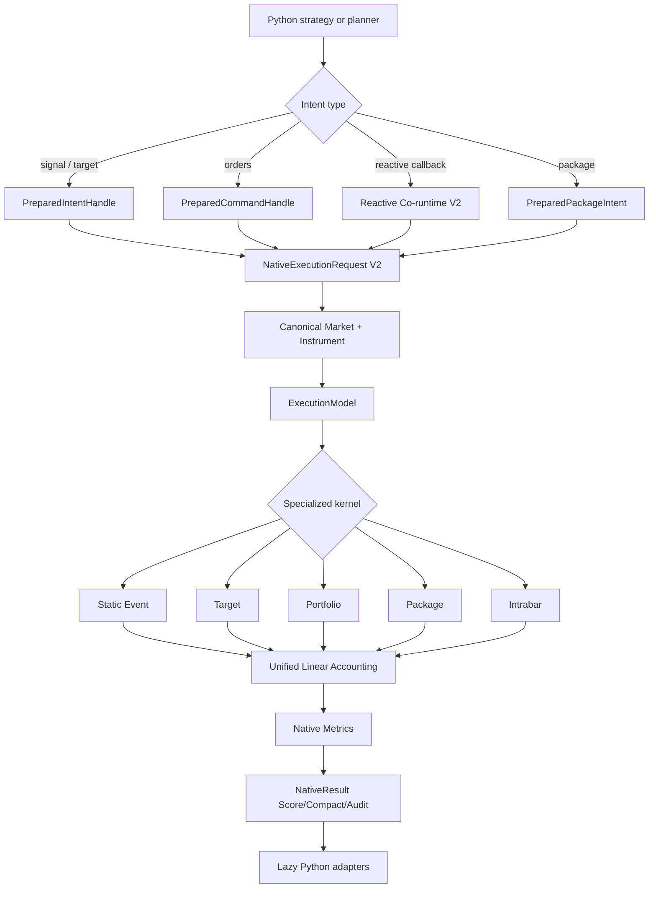
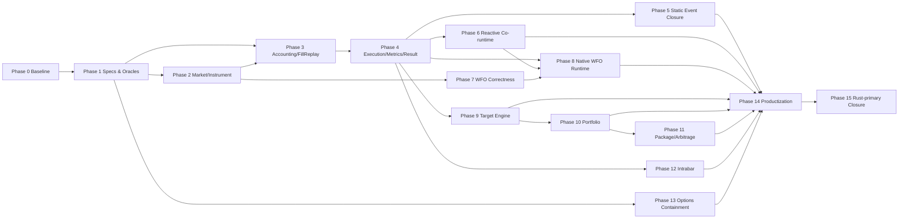

# QuantBT Rust-Primary, Correctness-Certified Backtest Runtime V1.1

> **Trạng thái:** Đã phê duyệt phạm vi kiến trúc; tài liệu này là implementation guide chính thức cho V1.1.
> **Baseline codebase:** nhánh `main` được rà soát ngày 2026-08-31; package contract hiện tại `quantbt-engine==1.1.0`, native companion `quantbt-native==0.4.1` trên Linux x86-64 / CPython 3.11–3.13.
> **Thay thế:** `QUANTBT_RUST_AUTHORITY_V1_UPGRADE_PLAN_VI.md`.
> **Ưu tiên tuyệt đối:** domain correctness và causal correctness trước parity; parity trước performance; performance trước auto-promotion; auto-promotion trước xóa implementation Python/Numba production cũ.
> **Ranh giới đã khóa:** QuantBT không sở hữu feature/indicator/alpha research. Strategy vẫn tạo signal, target, hedge ratio và package intent; QuantBT sở hữu simulation từ typed intent đến deterministic result.

---

## 0. Executive summary

V1.1 không phải một đợt “port thêm vài loop sang Rust”. Mục tiêu là biến QuantBT thành:

> **Một Python-facing backtest and simulation SDK với Rust-primary core cho các workload đã được domain-certify, đồng thời có Python–Rust co-runtime được tối ưu cho reactive strategy và Rust-primary evaluation runtime cho WFO.**

Kiến trúc đích:

```text
Python strategy / research layer
    ├── features
    ├── indicators
    ├── signals
    ├── targets
    ├── hedge ratios
    └── package intents
              │
              │ typed intent / prepared handle
              ▼
Rust simulation runtime
    ├── canonical market and calendar
    ├── instrument constraints
    ├── execution clock
    ├── order lifecycle and matching
    ├── accounting / fees / funding
    ├── margin / liquidation
    ├── portfolio / package transactions
    ├── WFO candidate × fold × scenario runtime
    ├── metrics
    └── native result buffers
              │
              ▼
Python lazy adapters
    ├── pandas
    ├── reports
    ├── charts
    └── external validation adapters
```

### 0.1 Các kết quả bắt buộc của V1.1

1. Một market, calendar, instrument, execution, accounting và metric authority duy nhất cho linear simulation.
2. `FillReplay` trở thành correctness anchor cho account state transitions.
3. Static order/event route đóng trên public ABI mới và trở thành anchor Rust-primary.
4. Reactive strategy Python là first-class optimized route, không còn chỉ là compatibility route.
5. WFO dùng một persistent Rust evaluation runtime cho prepared signal/target/order/portfolio intent.
6. Target/vectorized, portfolio, bounded package và intrabar lần lượt chuyển thành Rust-primary theo capability contract.
7. Options được khóa P0 correctness và fail-fast; full options Rust authority để V1.2.
8. `backend="auto"` quyết định theo workload contract và end-to-end benchmark, không chỉ theo việc native wheel có tồn tại.
9. Python/Numba production duplicate chỉ được xóa sau domain certification, shadow release và stable soak; independent Python oracle vẫn được giữ trong test-only tree.

### 0.2 V1.1 không làm gì

```text
- Không thêm quantbt-features.
- Không đưa indicator hoặc alpha logic vào QuantBT.
- Không tự động dịch arbitrary Python strategy sang Rust.
- Không bắt strategy MRS/Grid/DCA động phải viết lại bằng Rust.
- Không dựng synthetic L2 cho toàn bộ WFO.
- Không tuyên bố true order-book reconstruction từ OHLCV.
- Không biến QuantBT thành live trading platform hoặc brokerage runtime.
- Không full-port American/Quanto/physical-settlement options trong V1.1.
- Không rewrite toàn bộ f64 core sang fixed point trong cùng một phase.
- Không xóa Python oracle sau khi parity pass.
```

### 0.3 Câu positioning chính thức

> **QuantBT is a Python-facing, Rust-primary backtesting and simulation runtime for high-throughput walk-forward research, causal order execution, reactive strategies, portfolio/package simulation, and audit-grade result certification. Strategy research remains external; QuantBT owns simulation from typed intent to deterministic result.**

Bản ngắn:

> **Rust-primary backtest runtime for Python quant research.**

---

# Phần I — Baseline, phạm vi và các gap đã xác nhận

## 1. Baseline codebase hiện tại

### 1.1 Rust substrate đã tồn tại và phải được tái sử dụng

Workspace hiện đã có:

```text
rust/crates/quantbt-domain
rust/crates/quantbt-engine
rust/crates/quantbt-execution
rust/crates/quantbt-strategy-ir
rust/crates/quantbt-batch
rust/crates/quantbt-portfolio
rust/crates/quantbt-package
rust/native_event
```

Các substrate đã tồn tại:

- `FullSession` là mutable execution owner chính.
- `NativeExecutionRequestV1` và typed workloads đã có.
- Immutable market được share qua `Arc` và fold windows không cần copy OHLCV.
- `OrderArena`, free-list và lifecycle indexes đã có trong Rust engine.
- Strategy IR, batch scorer, portfolio target helper và atomic package helper đã có contract hẹp.
- `Score`, `Compact`, `Audit` output profiles và flat numeric sinks đã có nền.
- Release profile Rust đã bật `opt-level=3`, thin LTO, một codegen unit và forbid unsafe ở workspace.

Vì vậy V1.1 dùng nguyên tắc:

```text
complete → generalize → integrate → certify → promote → retire compatibility
```

Không dùng nguyên tắc:

```text
rewrite everything from scratch
```

### 1.2 Public runtime hiện vẫn là multi-authority

```text
Endpoint / domain                 Production authority hiện tại
--------------------------------------------------------------------------
static order tape                 Rust có route được certify theo threshold
bounded Strategy IR              Rust whole-run / batch
reactive Python strategy          Python callback + Rust/Python execution bridge
signal_notional                   Python facade + NumPy/Numba target kernel
pct_equity / DCA legacy           Python/Numba legacy paths
portfolio                         Python/Numba general route; Rust helper hẹp
intrabar / fill replay            Numba specialized kernels + Python oracle
WFO                               Python orchestration; Rust batch substrate hẹp
package/arbitrage                 Python planning/general route; Rust atomic helper hẹp
options                           Python package/ledger/margin/lifecycle orchestration
metrics/result/report             Python/NumPy/pandas còn nặng ở public route
```

Mục tiêu của V1.1 không phải ép mọi route vào cùng một universal event loop. Mục tiêu là cho các specialized kernels dùng chung domain authorities và result contracts.

## 2. Các gap correctness và architecture đã xác nhận

### 2.1 WFO multi-symbol calendar relabel risk

Current WFO có thể lấy index của symbol đầu tiên làm canonical index rồi gán index đó cho frame khác nếu số hàng bằng nhau. Hai symbol có cùng `len` nhưng timestamp khác nhau vì thế có nguy cơ bị relabel sai.

Ví dụ không hợp lệ:

```text
BTC: 09:00, 09:01, 09:02
ETH: 09:00, 09:02, 09:03
```

Không được phép biến ETH thành:

```text
ETH: 09:00, 09:01, 09:02
```

chỉ vì cả hai có ba hàng.

Đây là P0 time-corruption risk. V1.1 bắt buộc có explicit `CalendarPolicy` và per-symbol mapping.

### 2.2 WFO timing/proxy contract còn mơ hồ

Proxy hiện dùng dạng:

```text
position[t] × close_return[t]
```

Trong khi event contract có thể cho signal quan sát tại close `t` và fill ở open `t+1`. Nếu strategy output chưa được lag đúng, proxy có thể ghi nhận return trước khi position có hiệu lực.

Multi-symbol proxy còn có thể dùng arithmetic mean, không đại diện cho units/notional/weights, contract multiplier, leverage, fees, funding hoặc shared margin.

V1.1 phải version hóa:

```text
SignalObservationPhase
IntentEffectivePhase
IntentKind
FoldAccountPolicy
ProxyContract
```

### 2.3 Reactive route vẫn chuyển boundary theo bar

Current reactive Rust adapter được mô tả là Python callbacks quanh một Rust state transition theo từng bar. Case MRS 5.000 bar cho thấy:

```text
Python strategy callback
→ command conversion
→ Rust step
→ state/fill projection
→ Python callback tiếp theo
```

Rust có thể parity chính xác nhưng chậm hơn Python vì số callback/PyO3/GIL transitions quá lớn.

V1.1 không hứa loại Python callback khi strategy thật sự cần quyết định mỗi bar. V1.1 loại tối đa overhead xung quanh callback và cung cấp sparse/block/batched protocols.

### 2.4 Native batch chưa phải WFO runtime tổng quát

Current Rust batch có những điểm tốt:

- share market qua `Arc`;
- isolate worker/session state;
- scalar score rows;
- deterministic scenario ordering.

Nhưng vẫn còn:

```text
- bounded Strategy IR only;
- signal.to_vec() hoặc ownership copy theo scenario;
- scoped thread creation theo score_batch;
- metric row hẹp;
- error String allocation;
- top-K thiên về final equity;
- public WFO vẫn trial-by-trial Python orchestration.
```

V1.1 phải nâng substrate này thành `NativeWfoRuntimeV2`.

### 2.5 Account, execution cost và instrument constraints đang lẫn authority

Current execution request có account fields nhưng còn chứa slippage; slippage là execution assumption, không phải account property. Instrument metadata giữa workload/table/session cũng chưa hợp nhất hoàn toàn cho tick size, quantity step và venue minima.

V1.1 tách rõ:

```text
AccountModel
ExecutionModel
InstrumentRegistry
```

### 2.6 Metrics và result adaptation làm mất lợi ích Rust

Kernel Rust có thể rất nhanh nhưng public compact/audit route vẫn tốn thời gian ở:

```text
- Python object construction;
- nested rows conversion;
- pandas Series/DataFrame;
- Python metrics recomputation;
- fill/order dataclasses;
- report materialization.
```

V1.1 hoàn thiện native metrics + native result envelope + lazy adapters.

### 2.7 Package policy vocabulary rộng hơn executable authority

Rust package crate đã có enum/state machine cho `Sequential`, `BestEffort`, `AtomicBarSimulation`, `HedgeAfterPrimary`, nhưng executable market helper hiện chỉ certify atomic same-bar contract hẹp.

V1.1 promote từng policy riêng. Có enum không đồng nghĩa domain đã executable/certified.

### 2.8 Options hiện có correctness gaps phải containment

Các gap chính:

- schema có thể nhận American nhưng lifecycle chưa có early-exercise/assignment authority đầy đủ;
- Quanto có schema nhưng expiry payoff chưa hoàn thiện;
- package execution state và authoritative option ledger có thể là hai cash/fee authorities;
- margin trong main path có thể được tính sau package processing thay vì admission trước commit;
- liquidation chưa phải first-class main-loop state;
- auto settlement có thể dựa trên last tape timestamp/mark thay vì explicit settlement event;
- maker-touch chỉ là approximation.

V1.1 không full-port options nhưng bắt buộc fail-fast và khóa một authoritative ledger/margin sequence.

### 2.9 Source-tree duplication gây maintenance debt

Repo vẫn có root package mirror và canonical `src/quantbt`. Điều này làm Python LOC trên GitHub lớn và tạo drift risk. Root mirror nên được xóa sau khi installed-wheel/source-layout compatibility đã được đóng, độc lập với việc giữ Python facade và test oracle.

---

## 3. Phạm vi domain V1.1

### 3.1 Financial scope được certify trong V1.1

```text
- Spot linear.
- Linear quote-settled futures/perpetuals.
- Một settlement currency trong mỗi linear account contract.
- Gross cross-margin account contract V1.
- Fees và scheduled funding.
- Long/short, scale-in, reduce, reverse.
- Initial/maintenance margin và deterministic liquidation.
- Multi-symbol shared account.
- Same-account package execution.
```

### 3.2 Domain được hỗ trợ có giới hạn

```text
Cross-exchange arbitrage:
    contract/fail-fast foundation; không auto-promote nếu chưa có multi-venue ledger.

Triangular arbitrage:
    schema/conservation foundation; không gọi Rust-primary nếu dependent currency fills chưa complete.

Options:
    P0 containment; full Rust lifecycle/margin/assignment để V1.2.

Latent L1/depth:
    optional post-WFO execution fidelity; không phải default WFO.
```

### 3.3 Strategy/engine ownership boundary

Strategy sở hữu:

```text
feature
indicator
signal
forecast
parameter logic
target generation
risk parity / covariance / beta estimation
hedge ratio
alpha state machine
package intent
```

QuantBT sở hữu:

```text
causal timing
market/instrument validation
order acceptance
order lifecycle
matching/fill
fees/funding
accounting
margin/liquidation
portfolio admission
package execution
metrics
result/provenance
```

---

# Phần II — Product positioning và authority model

## 4. Positioning sau V1.1

### 4.1 So với NautilusTrader

NautilusTrader là full trading infrastructure với event runtime dùng cho backtest/sandbox/live, order books, adapters, execution/risk/reconciliation và strategy ecosystem.

QuantBT V1.1 không thay thế Nautilus. QuantBT tập trung vào:

```text
- embeddable backtest runtime;
- WFO-first candidate/fold/scenario evaluation;
- Python reactive strategy co-runtime;
- typed intent → execution simulation;
- multi-profile score/compact/audit;
- canonical Python/Rust oracle certification;
- post-selection external Nautilus validation.
```

Nautilus tiếp tục là independent trustee, đặc biệt cho execution/accounting reference ở các contract phù hợp.

### 4.2 So với LEAN

LEAN là platform + engine rộng, gồm research, backtest, live, brokerages và cloud/local workflows. QuantBT là composable simulation SDK gắn vào data layer, alpha pool, portal và trading system riêng.

### 4.3 So với vectorbt

Vectorbt tối ưu array-first research và massive parameter exploration. QuantBT không cạnh tranh bằng indicator ecosystem. QuantBT định vị ở causal order lifecycle, reactive strategies, margin/liquidation, portfolio/package execution và audit trail.

### 4.4 So với PyBroker/Backtrader/Zipline

QuantBT V1.1 khác biệt nhờ Rust-owned simulation state, typed workload contracts, persistent WFO runtime, capability-aware promotion và parity program; vẫn giữ Python UX cho strategy/research.

## 5. Định nghĩa Rust-primary

Một route chỉ được gọi là Rust-primary khi đạt đủ các authority dimensions sau.

### 5.1 State authority

Rust sở hữu toàn bộ mutable simulation state:

```text
orders
fills
positions
cash
PnL
fees
funding
margin
liquidation
reservations
package lifecycle
```

### 5.2 Control-flow authority

Rust điều khiển simulation timeline. Python callback có thể tham gia decision points, nhưng không được duy trì execution/account shadow state.

### 5.3 Data authority

Market, calendar, instrument, workload và execution plan được canonicalize/validate một lần và tái sử dụng qua native handles.

### 5.4 Metrics authority

Rust tính standard metrics trong score/compact route. Python chỉ làm custom research metrics hoặc reporting khi caller yêu cầu.

### 5.5 Result authority

Rust sở hữu flat numeric result buffers; Python materialize lazily.

### 5.6 Routing authority

`backend="auto"` chọn Rust chỉ khi exact workload capability, installed wheel, parity và end-to-end performance gate đều pass.

### 5.7 Correctness authority

Rust được chứng minh bởi written spec + independent oracle + invariants + canonical trace + property/fuzz/mutation + external fixtures; không chỉ bởi final equity parity.

## 6. Runtime classes

```rust
pub enum RuntimeClassV1 {
    WholeRunNative,
    RustPrimaryPythonCallback,
    SparsePythonCallback,
    BlockIntentHybrid,
    PythonCompatibility,
    ExternalValidator,
}
```

Metadata tối thiểu:

```json
{
  "strategy_authority": "python_callback",
  "control_flow_authority": "rust_runtime",
  "execution_authority": "rust",
  "accounting_authority": "rust",
  "metrics_authority": "rust",
  "result_authority": "rust",
  "runtime_class": "rust_primary_python_callback",
  "native_entry_calls": 1,
  "python_callback_calls": 5000,
  "gil_acquisitions": 1,
  "bars_processed_without_callback": 0,
  "fully_native": false
}
```

Không được gộp `native_entry_calls`, `Python callback calls` và `GIL acquisitions` thành một metric mơ hồ.

## 7. Promotion maturity ladder

```text
A0 — Rust module exists
    unit tests only; no public claim.

A1 — Differential parity
    Rust matches old Python route on bounded corpus.

A2 — Domain certified
    spec, oracle, canonical trace, invariants, property/fuzz/mutation pass.

A3 — Explicit native
    backend="rust" available; fail-fast outside capability.

A4 — Auto eligible
    clean-wheel, RSS, determinism and end-to-end speed gates pass.

A5 — Rust primary / old production path removable
    stable shadow release, no unexplained mismatch, rollback by package version.
```

Python production implementation chỉ được xóa ở A5. Independent Python oracle không bị xóa.

---

# Phần III — Kiến trúc đích và versioned contracts

## 8. Target architecture



## 9. Dependency direction

Recommended logical boundaries:

```text
quantbt-domain
    ↓
market / instruments / timing contracts
    ↓
accounting primitives
    ↓
execution model + engine
    ↓
target / portfolio / package / intrabar specialized kernels
    ↓
metrics + result sinks
    ↓
quantbt-execution request/template/runtime
    ↓
PyO3 facade
```

V1.1 không bắt buộc extract mọi boundary thành crate ngay. Trình tự đúng:

```text
freeze behavior in current module
→ add invariants/tests
→ migrate all consumers
→ extract crate in behavior-preserving PR if useful
```

Không combine crate move + numeric rewrite + semantic change + ABI change trong cùng PR.

## 10. Contract bundle V1.1

```rust
pub struct SimulationContractBundleV1 {
    pub market_contract: MarketContractV2,
    pub calendar_contract: CalendarContractV2,
    pub instrument_contract: InstrumentContractV2,
    pub timing_contract: TimingContractV2,
    pub account_contract: LinearAccountContractV1,
    pub execution_model: ExecutionModelV1,
    pub metric_contract: MetricContractV2,
    pub result_profile: ResultProfileV2,
    pub determinism_contract: DeterminismContractV1,
    pub authority_descriptor: WorkloadAuthorityDescriptorV1,
}
```

Contract bundle phải được fingerprint cùng workload.

## 11. Timing contracts

```rust
pub enum ObservationPhaseV1 {
    BeforeOpen,
    AtOpen,
    AtClose,
    ExternalTimestamp,
}

pub enum EffectivePhaseV1 {
    SameOpen,
    SameClose,
    NextOpen,
    NextClose,
    ExplicitTimestamp,
}

pub enum IntentKindV1 {
    Signal,
    TargetUnits,
    TargetNotional,
    TargetWeight,
    EquityFraction,
    OrderCommand,
    PackageIntent,
    AlreadyEffectivePosition,
}
```

Backward-compatible timing IDs phải được giữ, ví dụ:

```text
event_lifecycle_v2_next_bar_close
event_lifecycle_v3_next_open
close_target_v2_same_close
target_next_open_v1
target_next_close_v1
intrabar_bracket_v1
```

Không silent reinterpret một tape cũ bằng timing mới.

## 12. Numeric policy

V1.1 giữ `f64` trong linear simulation hot path để giảm migration risk, nhưng bắt buộc:

```text
- typed wrappers cho SymbolId, OrderId, BarIndex, TimestampNs;
- centralized price/quantity quantization;
- explicit rounding mode;
- explicit comparison tolerance;
- no hidden epsilon;
- no String IDs trong hot loop;
- integer enums/codes cho action/status/error.
```

Fixed-point `MoneyAtoms`, currency conservation và exact lot/tick arithmetic được ưu tiên ở triangular, multi-currency options và multi-venue ledger phase sau.

## 13. Determinism contract

Kết quả deterministic không được phụ thuộc vào:

```text
worker count
chunk size
candidate input order khi candidate ID giữ nguyên
thread scheduling
Python hash randomization
unordered map iteration
process pool start method
```

Seed policy:

```text
seed = H(run_seed, workload_id, candidate_id, fold_id, scenario_id, bar_id, order_id)
```

Stochastic execution scenarios phải dùng common random numbers khi so candidate.

## 14. Capability key

Không promote theo tên endpoint thô. Capability key tối thiểu:

```rust
pub struct CapabilityKeyV1 {
    pub endpoint: EndpointKind,
    pub input_mode: InputMode,
    pub intent_contract: IntentContractId,
    pub strategy_authority: StrategyAuthority,
    pub account_contract: AccountContractId,
    pub timing_contract: TimingContractId,
    pub execution_model: ExecutionModelId,
    pub output_profile: ResultProfile,
    pub instrument_contract: InstrumentContractId,
}
```

Ví dụ `event_driven(strategy)` và `event_driven(orders)` là hai capabilities khác nhau.

## 15. Endpoint capability target matrix

| Endpoint/workload | V1.1 target | Runtime class | Ghi chú |
|---|---|---|---|
| Static `OrderCommand` tape | Rust-primary | `WholeRunNative` | Anchor route |
| Fill replay | Rust-primary | `WholeRunNative` | Accounting anchor |
| Bounded Strategy IR | Rust-primary | `WholeRunNative` | Existing substrate |
| Signal/target units | Rust-primary | `WholeRunNative` | Direct target kernel |
| Target notional/weight/equity fraction | Rust-primary theo contract | `WholeRunNative` | Staged promotion |
| Reactive Python every-bar | Rust execution/accounting primary | `RustPrimaryPythonCallback` | Python decision remains |
| Reactive sparse wake | Rust-led hybrid | `SparsePythonCallback` | Dynamic wake plan |
| Block intent provider | Rust-led hybrid | `BlockIntentHybrid` | Chunk execution |
| WFO prepared intent | Rust-primary evaluation | `WholeRunNative` per batch | Strategy generation external |
| Reactive WFO | Optimized hybrid | callback/process/batch | Not falsely labeled fully native |
| Linear portfolio | Rust-primary | `WholeRunNative` | Shared account |
| Same-account package policies | Rust-primary per policy | `WholeRunNative` | Actual-fill dependencies |
| Intrabar bracket/session | Rust-primary after parity | `WholeRunNative` | Specialized kernel |
| Cross-exchange/triangular | Foundation only | explicit unsupported/experimental | No blanket promotion |
| Options full lifecycle | P0 containment only | Python authority in V1.1 | Rust V1.2 |
| Nautilus validation | External trustee | `ExternalValidator` | Independent by design |

---
# Phần IV — Correctness certification program

## 16. Correctness doctrine

Performance work chỉ được merge vào promoted path sau khi có bằng chứng ở bốn lớp độc lập:

```text
1. Written domain specification
2. Mathematical/accounting invariants
3. Independent executable oracle
4. External or venue fixtures where applicable
```

Old Python production code là comparator, không phải specification duy nhất. Hai implementations cùng copy một bug vẫn có thể parity.

## 17. Canonical trace V2

Canonical trace phải là typed, stable và backend-neutral.

```rust
pub enum CanonicalEventKindV2 {
    MarketObserved,
    FundingApplied,
    CommandSubmitted,
    CommandAccepted,
    CommandRejected,
    OrderActivated,
    OrderAmended,
    OrderCanceled,
    OrderExpired,
    OrderTriggered,
    FillCommitted,
    FeeCharged,
    PositionChanged,
    CashChanged,
    MarginChanged,
    LiquidationStarted,
    LiquidationFill,
    LiquidationCompleted,
    PackageStateChanged,
    ReservationCreated,
    ReservationConsumed,
    ReservationReleased,
    SettlementApplied,
    RunCompleted,
}
```

Mỗi trace row tối thiểu:

```text
sequence
bar index
event timestamp
effective timestamp
symbol/account/package/order IDs
event kind
reason code
quantity
price
fee
cash before/after
position before/after
realized PnL before/after
margin before/after
state hash
```

Parity không chỉ so final equity. So canonical trace theo event sequence và terminal fingerprint.

## 18. Independent Python oracle tree

Target tree:

```text
reference/python/
├── market_calendar_oracle.py
├── linear_accounting_oracle.py
├── fill_replay_oracle.py
├── event_lifecycle_oracle.py
├── target_oracle.py
├── portfolio_oracle.py
├── package_oracle.py
├── intrabar_oracle.py
└── options_oracle.py
```

Oracle requirements:

```text
- pure Python;
- single-threaded;
- no Rust import;
- no production implementation import;
- no Numba;
- intentionally small/readable;
- test-only, not packaged in production wheel;
- suitable for small fixtures and randomized traces;
- optionally Decimal/integer arithmetic for selected accounting fixtures.
```

## 19. Test layers

### 19.1 Specification examples

Hand-computable fixtures:

```text
open one long
scale-in
partial reduce
full close
reverse long-to-short
fee in quote currency
funding positive/negative
margin reject
liquidation
OCO cancel sibling
partial package
same-price round trip
```

### 19.2 Differential tests

```text
Rust vs independent Python oracle
Rust vs old production Python/Numba
Rust score vs Rust compact vs Rust audit
installed wheel vs source tree
single worker vs multi-worker
```

### 19.3 Property-based tests

Generate bounded valid/invalid sequences of:

```text
bars
commands
fills
fees
funding
cancel/amend
partial fills
stale/missing state
margin changes
package failures
```

### 19.4 Metamorphic tests

Examples:

```text
- add a zero-quantity ignored command → no result change;
- split one fill into two fills at same price/fee total → same accounting;
- buy then sell same quantity at same price → loss equals explicit fees/costs;
- worker count change → same canonical trace;
- stable permutation of independent scenario inputs → same per-ID outputs;
- duplicate rejected order → no account mutation;
- score/compact/audit → same terminal fingerprint;
- adding future bars after causal cutoff → no pre-cutoff change.
```

### 19.5 Fuzzing

Rust fuzz targets:

```text
command tape decoder
order lifecycle state machine
account preview/commit
reservation ledger
package state transitions
market/calendar mapping
result buffer offsets
```

### 19.6 Mutation testing

Intentional mutations that tests must kill:

```text
funding sign
fee side
fill/accounting ordering
next-open vs same-close
quantity rounding direction
maintenance comparison
OCO sibling cancellation
hedge requested vs actual fill
settlement timestamp
calendar row relabel
```

## 20. Terminal fingerprint

```rust
pub struct TerminalFingerprintV2 {
    pub final_cash_hash: u128,
    pub final_position_hash: u128,
    pub final_order_hash: u128,
    pub final_margin_hash: u128,
    pub final_package_hash: u128,
    pub trace_hash: u128,
    pub metrics_hash: u128,
}
```

Floating values được normalized theo metric/financial tolerance policy trước hash. Audit and score paths phải có cùng financial fingerprint dù retention khác nhau.

## 21. Tolerance policy

Tolerances được version hóa theo field:

```text
IDs/status/timestamps/order state: exact
quantity after quantization: exact or one declared lot tolerance
cash/fees/funding: strict absolute + relative tolerance
price: tick-aware tolerance
PnL/equity: derived tolerance from input precision
metrics: separate metric tolerance
```

Không dùng một global `1e-6` cho mọi field.

---

# Phần V — Detailed domain upgrades

## 22. Upgrade A — Canonical Market & Calendar V2

### 22.1 Mục tiêu

Rust hoặc canonical preparation layer phải sở hữu một explicit mapping giữa global simulation clock và từng symbol. Không có relabel dựa trên độ dài.

### 22.2 Contract

```rust
pub enum CalendarPolicyV2 {
    Exact,
    Intersection,
    Union,
    PrimaryClock { primary_symbol: SymbolId },
}

pub struct SymbolCalendarMapV2 {
    pub canonical_to_local: Box<[Option<u32>]>,
    pub local_to_canonical: Box<[u32]>,
    pub observed: BitSet,
    pub stale: BitSet,
    pub tradable: BitSet,
}

pub struct CalendarPlanV2 {
    pub canonical_timestamps_ns: Arc<[i64]>,
    pub policy: CalendarPolicyV2,
    pub symbol_maps: Box<[SymbolCalendarMapV2]>,
    pub fingerprint: MarketFingerprint,
}
```

### 22.3 Policy semantics

#### `Exact`

- Timestamps, order and length phải giống tuyệt đối.
- Certified WFO/portfolio default.
- Mismatch fail-fast với first divergent index/timestamp.

#### `Intersection`

- Chỉ giữ timestamps xuất hiện ở tất cả symbols.
- Metadata ghi số rows bị drop per symbol.
- Không forward-fill price qua missing observation.

#### `Union`

- Giữ mọi timestamp.
- Missing bar được biểu diễn bằng flags, không bằng fabricated OHLC.
- Marking/execution policy phải khai báo rõ.

#### `PrimaryClock`

- Clock theo một symbol primary.
- Symbols khác map hoặc missing; không relabel value.

### 22.4 Missing/stale semantics

```rust
pub enum MissingObservationPolicyV1 {
    NoObservation,
    MarkToLastNoExecution,
    ForwardFillQuoteNoVolume,
    RejectIntent,
}
```

Price, volume, funding và tradability không dùng chung một generic `fillna` policy.

### 22.5 Validation

```text
- strictly increasing timestamps;
- no duplicate timestamp unless explicitly aggregated;
- finite OHLC for observed bar;
- low <= open/close <= high;
- volume >= 0;
- symbol count and layout match instrument registry;
- funding timestamps mapped explicitly;
- no timestamp relabel based only on length.
```

### 22.6 Prepared handle

```python
market = QuantBTEndpoint.prepare_market(
    data,
    symbols=symbols,
    calendar_policy="exact",
)
```

Handle properties:

```text
- immutable;
- owns or pins one native market allocation;
- fingerprinted;
- reusable across endpoint runs, candidates and folds;
- invalidates mismatched intent/instrument handles;
- bounded cache with explicit close/release.
```

### 22.7 Codebase integration targets

```text
src/quantbt/core/preprocessor.py
src/quantbt/core/market_tape.py
src/quantbt/walkforward.py
src/quantbt/backends/native_portfolio.py
rust/crates/quantbt-engine/src/market.rs
rust/crates/quantbt-execution/src/lib.rs
```

### 22.8 Correctness gates

```text
- equal-length/different-timestamp fixture fails under Exact;
- Intersection/Union mappings match Python oracle;
- future rows after cutoff do not alter prior map;
- multi-symbol reordered dict input produces same result;
- missing/stale/tradable flags preserved through native request;
- prepared and unprepared routes have identical trace.
```

### 22.9 Performance gates

```text
- one canonical timestamp allocation per prepared market;
- zero market copies per WFO candidate;
- zero market copies per fold window;
- mapping lookup O(1) per symbol/bar;
- prepared repeated-run path does not re-normalize pandas.
```

---

## 23. Upgrade B — Instrument Registry V2

### 23.1 Mục tiêu

Một source of truth cho mọi price/quantity/contract constraint. Không để target workload, portfolio helper và `FullSession` nhận các constraint khác nhau.

### 23.2 Contract

```rust
pub struct InstrumentSpecV2 {
    pub symbol_id: SymbolId,
    pub venue_id: VenueId,
    pub instrument_kind: InstrumentKind,
    pub price_tick: f64,
    pub quantity_step: f64,
    pub min_quantity: f64,
    pub max_quantity: Option<f64>,
    pub min_notional: f64,
    pub contract_multiplier: f64,
    pub leverage_limit: f64,
    pub settlement_currency: CurrencyId,
    pub fee_schedule_id: FeeScheduleId,
    pub funding_schedule_id: Option<FundingScheduleId>,
    pub rounding_policy: RoundingPolicyV1,
}
```

### 23.3 Operations authority

```rust
trait InstrumentRulesV2 {
    fn quantize_price(&self, raw: f64, side: Side, purpose: PricePurpose) -> Price;
    fn quantize_quantity(&self, raw: f64, purpose: QuantityPurpose) -> Quantity;
    fn validate_notional(&self, price: Price, qty: Quantity) -> ValidationCode;
    fn cash_notional(&self, price: Price, qty: Quantity) -> f64;
    fn pnl(&self, entry: Price, exit: Price, qty: Quantity, side: Side) -> f64;
}
```

### 23.4 Rounding policy

Rounding must be explicit per purpose:

```text
limit price buy/sell
stop trigger
risk-reducing quantity
risk-increasing quantity
liquidation quantity
hedge quantity
```

Risk-increasing quantity defaults round-down; risk-reducing close may clamp to exact remaining position.

### 23.5 Migration rule

- Add registry adapter around current instrument tables first.
- Make current Rust helpers read registry.
- Remove duplicate per-workload min_qty/min_notional fields after parity.
- Do not change all public config names in the same PR.

### 23.6 Tests

```text
- tick/lot boundary table tests;
- min quantity/notional exact boundary;
- long/short symmetry where expected;
- reduce-only exact close;
- no accidental reverse due rounding;
- contract multiplier parity;
- Python/Rust quantization parity;
- same instrument fingerprint across prepared endpoints.
```

---

## 24. Upgrade C — Linear Rust Accounting Authority

### 24.1 Scope

```text
spot + linear quote-settled futures/perpetuals
one settlement currency/account
gross cross-margin V1
fees + scheduled funding
long/short scale/reduce/reverse
initial/maintenance margin
liquidation
```

### 24.2 Account types

Do not create one universal state for all future domains.

```rust
pub struct LinearGrossCrossAccountV1 { /* V1.1 */ }
pub struct PackageReservationLedgerV1 { /* V1.1 */ }
pub struct MultiVenueAccountV1 { /* future */ }
pub struct OptionMultiCurrencyAccountV1 { /* V1.2 */ }
```

Shared protocols, not shared giant structs.

### 24.3 Core state

```rust
pub struct LinearGrossCrossAccountV1 {
    pub cash: f64,
    pub realized_pnl: f64,
    pub fees_paid: f64,
    pub funding_paid: f64,
    pub positions: PositionBookV2,
    pub initial_margin: f64,
    pub maintenance_margin: f64,
    pub reserved_margin: f64,
    pub equity: f64,
    pub available_equity: f64,
    pub liquidation_state: LiquidationStateV1,
}
```

### 24.4 Preview–reserve–commit

```rust
pub trait LinearAccountTransactionV1 {
    fn preview_fill(
        &self,
        fill: &CandidateFill,
        market: &MarketMark,
        instruments: &InstrumentRegistryV2,
    ) -> FillPreviewV1;

    fn reserve(&mut self, preview: &FillPreviewV1) -> Result<ReservationToken, RejectCode>;

    fn commit_fill(
        &mut self,
        token: Option<&ReservationToken>,
        fill: &CommittedFill,
    ) -> Result<AccountDeltaV1, AccountingErrorCode>;

    fn release(&mut self, token: ReservationToken);
}
```

Preview does not mutate state. Reject must leave account fingerprint unchanged.

### 24.5 Deterministic accounting sequence

Version the event order. Example V1:

```text
1. Observe market and update marks.
2. Apply scheduled funding to positions held at funding effective time.
3. Recompute pre-command equity and maintenance requirement.
4. Trigger required pre-command liquidation.
5. Activate eligible commands.
6. Match orders through ExecutionModel.
7. Preview and admit fills.
8. Commit quantity, average entry, realized PnL, fee and cash.
9. Recompute margin/equity.
10. Trigger post-fill liquidation if required.
11. Emit canonical account events.
```

Changing this ordering requires new contract ID.

### 24.6 Position arithmetic cases

Explicitly specify and test:

```text
flat → long
flat → short
long scale-in
short scale-in
long partial reduce
short partial reduce
long close
short close
long reverse to short
short reverse to long
zero/dust clamp
```

### 24.7 Incremental accounting

Maintain deltas rather than scan full portfolio when possible:

```text
position notional delta
realized PnL delta
fee delta
funding delta
margin delta
turnover delta
```

Audit mode may recompute invariants periodically to catch drift.

### 24.8 Liquidation state machine

```rust
pub enum LiquidationStateV1 {
    Healthy,
    Breached,
    CancelingOrders,
    ReducingPositions,
    Rechecking,
    Liquidated,
    Bankrupt,
}
```

Liquidation must be executable fills with explicit cost/fee assumptions, not a final boolean.

### 24.9 Accounting invariants

```text
cash_after = cash_before + realized_cashflows - fees - funding
position quantity equals sum of committed signed fills
closed position has zero average entry
realized + unrealized + cash components reconcile to equity contract
reserved margin >= 0
available equity = equity - initial margin - reservations
reject/abort does not mutate account
funding applied exactly once per schedule event
liquidation leaves no hidden active risk outside terminal state
```

### 24.10 Codebase integration

Start from current `quantbt-engine` account modules. Do not create a second account engine. Introduce a stable internal trait and migrate:

```text
FullSession event path
FillReplay
Target kernel
Portfolio
Package
Intrabar
```

in that order.

---

## 25. Upgrade D — Rust FillReplay Authority

### 25.1 Why first

Fill replay removes matching ambiguity. It proves accounting before event/order complexity.

### 25.2 Input

```rust
pub struct FillReplayRowV2 {
    pub sequence: u64,
    pub timestamp_ns: i64,
    pub symbol_id: SymbolId,
    pub side: Side,
    pub quantity: f64,
    pub price: f64,
    pub liquidity_role: LiquidityRole,
    pub explicit_fee: Option<f64>,
    pub source_order_id: Option<OrderId>,
}
```

Funding and mark events are separate typed rows.

### 25.3 Output

- terminal score;
- compact account path;
- audit account deltas;
- canonical fingerprint.

### 25.4 Certification corpus

```text
single fill
split fill
partial reduce
reverse
fee variants
funding before/after position
multi-symbol shared margin
margin reject fixture
liquidation fixture
randomized fill streams
```

### 25.5 Exit gate

No event/target/portfolio/package route may adopt the new account authority until FillReplay Rust vs independent oracle trace parity passes.

---

## 26. Upgrade E — Unified ExecutionModel V1

### 26.1 Separation of concerns

```text
AccountModel:
    capital, collateral, leverage, margin, funding behavior

ExecutionModel:
    fill eligibility, spread, slippage, impact, participation, partial fill

InstrumentRegistry:
    tick/lot/minimum/multiplier/fee metadata
```

### 26.2 Interface

```rust
pub trait ExecutionModelV1 {
    fn begin_bar(&mut self, market: &MarketBarView, ledger: &mut LiquidityLedgerV1);

    fn evaluate_order(
        &mut self,
        order: &OrderView,
        market: &MarketBarView,
        clock: &ExecutionClockState,
        ledger: &mut LiquidityLedgerV1,
    ) -> FillDecisionV1;

    fn commit_fill(&mut self, decision: &FillDecisionV1, ledger: &mut LiquidityLedgerV1);

    fn end_bar(&mut self, ledger: &mut LiquidityLedgerV1);
}
```

### 26.3 V1.1 implementations

#### `BarTouchV1`

- frozen current touch/gap semantics;
- deterministic;
- infinite or explicitly capped liquidity contract;
- main parity anchor.

#### `CostModelV1`

```text
fee
spread
fixed/proportional slippage
participation cap
simple impact
optional shared per-bar liquidity ledger
```

No latent book required.

### 26.4 Future variants, not default V1.1

```text
LatentL1V1
LatentDepth8V1
ReplayL2V1
```

WFO default remains `BarTouchV1` or `CostModelV1`, one scenario. Deep simulation only after params selection.

### 26.5 Shared liquidity invariant

If participation cap is enabled, a unit of synthetic liquidity cannot be consumed more than once across active orders/package legs.

### 26.6 Tests

```text
market/limit/stop gap fixtures
favorable limit gap
adverse stop gap
stop-limit ambiguity flag
participation conservation
partial fill lifecycle
fee/slippage separation from account
same execution model across event/target/portfolio/package
```

---

## 27. Upgrade F — MetricContract V2 and NativeResult V2

### 27.1 Metrics authority boundary

Rust standard metrics:

```text
final equity
total return
CAGR
mean/variance
Sharpe
Sortino
max drawdown
Calmar
Omega (where contract defines it)
turnover
fill/trade/reject/cancel counts
fees
funding
exposure
liquidation status
```

Python remains authority for arbitrary custom research metrics and presentation.

### 27.2 Metric contract

```rust
pub struct MetricContractV2 {
    pub return_frequency: ReturnFrequency,
    pub annualization_factor: f64,
    pub risk_free_rate: f64,
    pub variance_ddof: u8,
    pub zero_variance_policy: ZeroVariancePolicy,
    pub short_run_policy: ShortRunMetricPolicy,
    pub trade_count_definition: TradeCountDefinition,
}
```

### 27.3 Online reducers

```rust
OnlineMomentsV1
OnlineSharpeV1
OnlineSortinoV1
OnlineDrawdownV1
OnlineTurnoverV1
OnlineTradeStatsV1
OnlineExposureV1
OnlineExecutionCostV1
FoldDistributionReducerV1
```

### 27.4 Native result envelope

```rust
pub struct NativeResultHeaderV2 {
    pub run_id: RunId,
    pub request_fingerprint: RequestFingerprint,
    pub contract_bundle_hash: u128,
    pub authority: WorkloadAuthorityDescriptorV1,
    pub retention: ResultProfileV2,
    pub detail_truncated: bool,
    pub retained_rows: u64,
    pub dropped_rows: u64,
}
```

Payloads stay domain-specific:

```text
NativeScorePayloadV2
NativeEventCompactPayloadV2
NativeEventAuditPayloadV2
NativePortfolioAttributionPayloadV2
NativePackageTracePayloadV2
NativeIntrabarPayloadV2
```

Avoid a universal mega-result full of optional fields.

### 27.5 Retention profiles

#### Score

- scalar metrics only;
- no pandas;
- no fill/order objects;
- optimizer/service default.

#### Compact

- equity/position/margin summaries;
- optional per-symbol attribution;
- bounded arrays.

#### Audit

- flat SoA fills/events/account path;
- chunked sink;
- explicit limits/truncation.

### 27.6 Python compatibility

```python
result.metrics
result.to_pandas()
result.fills_dataframe()
result.orders_dataframe()
result.audit_events()
```

Materialization happens on demand and is cached with bounded ownership.

### 27.7 Gates

```text
score/compact/audit terminal fingerprint exact
score path pandas allocations = 0
nested Python fill/event objects in native core = 0
metric parity against independent contract fixtures
RSS plateaus for repeated score runs
```

---

## 28. Upgrade G — Static Event Rust Closure

### 28.1 Objective

Static command tape is the anchor route for proving the full native slice:

```text
prepared market
→ prepared command tape
→ one native execution request
→ FullSession
→ native accounting/metrics/result
```

### 28.2 Work items

```text
- Finish public ABI 0.5 integration.
- Migrate remaining public path to existing OrderArena/lifecycle indexes.
- Remove compatibility scans from certified path.
- Route instrument constraints through InstrumentRegistryV2.
- Route fills through ExecutionModelV1.
- Route account state through certified linear accounting.
- Use NativeResultV2 directly.
- Keep API 0.4 only behind explicit compatibility flag until removal gate.
```

### 28.3 Lifecycle indexes to use

```text
symbol active index
market/limit/stop partitions
expiry buckets/wheel
parent → children
OCO group → active members
generation-safe order handles
```

Do not scan historical terminal orders per bar.

### 28.4 Specialized output

Active-order projections must iterate active indexes, not full arena. Score profile should not project active orders at all unless metric needs them.

### 28.5 Certification

```text
market/limit/stop/stop-limit
IOC/FOK/GTD
cancel/amend/replace
reduce-only
parent/OCO
funding
margin/liquidation
multi-symbol
V2/V3 timing
low/high churn
```

### 28.6 Performance gates

```text
one Python→Rust main entry per run
GIL released for whole native run
zero market copy per replay
zero command tape copy after prepared handle
no full-arena scan on normal active-order path
public score faster than Python on promoted workloads
public compact/audit within declared adaptation budget
```

---
## 29. Upgrade H — Reactive Python–Rust Co-runtime V2

### 29.1 Objective

Reactive strategy written in Python remains a first-class workload. QuantBT must minimize the cost of communication without moving feature/alpha logic into core.

Current anti-pattern:

```text
for every bar in Python:
    call Rust process_bar
    build/project context
    call Python strategy
    build Python OrderCommand objects
    compile/convert commands
    call Rust again
```

Target:

```text
one public run entry
Rust owns timeline and execution state
Python is invoked only for strategy decisions
context and command buffers are persistent numeric views
optional sparse/block/batched protocols reduce callback count
```

### 29.2 Runtime levels

```rust
pub enum ReactiveRuntimeLevelV2 {
    LegacyObjectCallback,       // R0
    NumericEveryBar,            // R1
    SparseWake,                 // R2
    BlockIntent,                // R3
    CandidateBatchCallback,     // R3B
    CompiledNumericCallback,    // R4 experimental
}
```

#### R0 — Legacy object callback

- Existing public compatibility behavior.
- Python objects/dataclasses allowed.
- Not auto-selected for performance claim.
- Used as oracle/comparator during migration.

#### R1 — Numeric every-bar

- Callback still occurs every required bar.
- Persistent numeric context and command buffer.
- No pandas/dict/dataclass materialization in hot loop.
- Rust owns outer timeline.

#### R2 — Sparse wake

- Python called only when declared engine-level wake condition fires.
- Strategy stays Python.
- Rust processes bars and execution events between wakes.

#### R3 — Block intent

- Python produces intent for a bar range/chunk.
- Rust simulates chunk; can interrupt on invalidation/wake.

#### R3B — Candidate-batch callback

- One Python callback handles multiple candidate states.
- Designed for reactive WFO/parameter sweeps.

#### R4 — Compiled numeric callback

- Optional future C-ABI/Numba-cfunc/Cython callback.
- No arbitrary Python objects.
- Proof-of-concept only in V1.1; no public auto-promotion.

### 29.3 Persistent ReactiveContextBuffer

```rust
pub struct ReactiveContextBufferV1 {
    pub generation: u64,
    pub bar_index: u32,
    pub timestamp_ns: i64,
    pub market_row_offset: u32,
    pub account_scalar_offset: u32,
    pub position_range: Range<u32>,
    pub new_fill_range: Range<u32>,
    pub new_order_event_range: Range<u32>,
    pub active_order_range: Range<u32>,
    pub wake_reason: WakeReasonCode,
}
```

Python receives a stable wrapper object whose underlying numeric buffers are updated in-place. Every method checks generation/session lifetime in debug/certification mode.

Context projection is declared before run:

```python
requirements = StrategyRequirements.numeric(
    market=("open", "high", "low", "close"),
    account=("equity", "available_equity", "maintenance_margin"),
    positions=True,
    fills="new_only",
    order_events="new_only",
    active_orders="delta_or_snapshot_on_demand",
)
```

No projection means no data construction/copy.

### 29.4 Delta-only event views

Default reactive context includes only events since previous callback:

```text
new fills
new order events
position/account deltas
active-order adds/removes/changes
```

Full active-order snapshot requires explicit request and is cached only for that callback generation.

### 29.5 Rust-owned primitive command buffer

```rust
pub struct ReactiveCommandBufferV2 {
    pub action: Vec<u8>,
    pub symbol_id: Vec<u32>,
    pub side: Vec<i8>,
    pub order_type: Vec<u8>,
    pub quantity: Vec<f64>,
    pub limit_price: Vec<f64>,
    pub trigger_price: Vec<f64>,
    pub order_handle: Vec<u64>,
    pub parent_handle: Vec<u64>,
    pub oco_group: Vec<u64>,
    pub flags: Vec<u32>,
    pub valid_len: usize,
}
```

Requirements:

```text
- allocated once per reactive session;
- fixed initial capacity + bounded growth;
- Python writes primitive rows through CommandWriter;
- no strings in hot loop;
- no concatenate/ascontiguousarray per callback;
- Rust validates valid prefix and consumes it immediately;
- stale generation/capacity misuse fails deterministically.
```

Python API remains ergonomic:

```python
def on_bar_close(self, ctx, out):
    if self.should_place(ctx):
        out.limit(
            symbol_id=0,
            side=1,
            quantity=self.qty(ctx.equity),
            price=self.level,
            client_tag_id=3,
        )
```

### 29.6 Rust-driven outer loop

Public call:

```python
result = endpoint.simulate(data=market, strategy=strategy)
```

Native implementation concept:

```rust
loop {
    session.advance_until_callback_boundary();
    project_required_context();
    call_python_strategy();
    validate_and_ingest_command_buffer();
    if terminal { break; }
}
```

Important diagnostics:

```text
native_entry_calls             // public Python→Rust entries
python_callback_calls          // Rust→Python decisions
python_callback_ns
gil_acquisitions
bars_processed_in_rust
bars_processed_without_callback
context_projection_ns
context_copy_bytes
command_rows
command_ingest_ns
engine_ns
result_materialization_ns
```

A run with one native entry but 5,000 Python callbacks is not `fully_native`.

### 29.7 GIL policies

```rust
pub enum ReactiveGilPolicyV1 {
    HeldForSession,
    ReleaseBetweenCallbacks,
}
```

#### HeldForSession

- Acquire once; Rust↔Python callbacks under one held GIL.
- Likely best for one lightweight-callback run.
- Blocks other Python threads.

#### ReleaseBetweenCallbacks

- Rust computation detached; reacquire only for decision callback.
- Better for service concurrency and multiple sessions.
- More GIL transitions.

Both must be benchmarked on representative workloads. `auto` may choose by workload/runtime environment, but choice must be included in provenance.

### 29.8 Dynamic sparse wake protocol

```rust
pub struct WakePlanV1 {
    pub next_bar: Option<u32>,
    pub next_timestamp_ns: Option<i64>,
    pub on_fill: bool,
    pub on_order_event: bool,
    pub on_liquidation: bool,
    pub on_funding: bool,
    pub price_crosses: SmallVec<[PriceCrossCondition; 8]>,
    pub position_thresholds: SmallVec<[PositionThreshold; 4]>,
    pub equity_thresholds: SmallVec<[EquityThreshold; 4]>,
    pub margin_thresholds: SmallVec<[MarginThreshold; 4]>,
}
```

Engine-level wake conditions only. No RSI/EMA/z-score computation inside QuantBT.

Python example:

```python
def on_wake(self, ctx, out):
    self.reconcile_campaign(ctx, out)
    return NextWake(
        next_bar=ctx.bar_index + 20,
        on_fill=True,
        on_order_event=True,
        price_crosses=[
            PriceCross(symbol_id=0, level=self.upper, direction="up"),
            PriceCross(symbol_id=0, level=self.lower, direction="down"),
        ],
    )
```

### 29.9 Wake semantics

Wake ordering must be versioned when multiple conditions fire on the same bar:

```text
1. market observation
2. funding event
3. activation/matching/fills
4. liquidation/order lifecycle events
5. evaluate wake conditions
6. construct one coalesced WakeReasonSet
7. call Python once
```

No duplicate callback for fill + order event on same boundary unless contract explicitly requests per-event callbacks.

### 29.10 Sparse certification

For each sparse-capable strategy:

```text
Oracle run: callback every bar
Optimized run: callback only on declared wake
```

Compare:

```text
strategy input at all actual decision boundaries
command trace
execution trace
account trace
terminal strategy-state fingerprint
```

Sparse mode is invalid if omitted callback would have emitted a different command.

### 29.11 Block intent provider

Protocol:

```python
class BlockIntentProvider:
    def prepare(self, market, config): ...

    def next_block(self, ctx, start_bar, max_stop_bar, out):
        """Write typed intents for [start_bar, stop_bar)."""
        return BlockPlan(
            stop_bar=...,
            invalidate_on_fill=True,
            invalidate_on_reject=True,
            invalidate_on_margin_change=False,
        )
```

Rust can stop before block end when an invalidation condition fires and request a new block.

Suitable workloads:

```text
periodic rebalance
signal target
DCA schedule
grid planned levels with fill invalidation
strategy that only changes after fills/rejections
```

### 29.12 Candidate-batch callback

Reactive WFO optimized protocol:

```python
def on_wake_batch(self, ctx_batch, out_batch):
    # numeric arrays indexed by candidate
    ...
```

Context layout:

```text
shared market row
candidate IDs
candidate equity[]
candidate position matrix / sparse ranges
candidate fill/event offsets
candidate wake reason masks
```

Command buffer includes `candidate_id` per row.

Benefits:

```text
candidate_count × bar callback dispatches
→ bar/wake × candidate_batch callback dispatches
```

### 29.13 Error model

Hot path uses typed codes:

```rust
pub enum ReactiveErrorCodeV1 {
    CallbackException,
    InvalidCommandLength,
    InvalidSymbol,
    StaleContextGeneration,
    CommandCapacityExceeded,
    UnsupportedWakeCondition,
    StrategyStateCorrupt,
    Canceled,
    BudgetExceeded,
}
```

Detailed Python traceback is captured once in a side channel, not allocated per row.

### 29.14 Strategy state ownership

Python owns strategy state. QuantBT owns simulation state. Strategy state can optionally expose:

```python
state_fingerprint()
snapshot_state()
restore_state(snapshot)
```

for certification, retry and fold boundaries.

### 29.15 Reactive four-way oracle

Run identical fixture through:

```text
A. Python strategy + independent Python execution oracle
B. Python strategy + current Rust per-bar bridge
C. Python strategy + Reactive Co-runtime V2
D. Captured command tape + static Rust replay
```

Compare:

1. callback input trace;
2. command output trace;
3. execution/account trace;
4. strategy-state fingerprint;
5. final result.

D proves whether discrepancy comes from strategy/control plane or execution/accounting.

### 29.16 Reactive performance gates

No speed gate until four-way parity passes.

Minimum targets:

```text
R1 numeric every-bar:
    zero pandas/dict/dataclass allocations in callback context
    persistent context object
    persistent command buffer
    no per-bar command-array allocation
    public native entry count O(1)
    end-to-end no slower than Python route before auto eligibility

R2 sparse wake:
    callback count proportional to actual wake count
    bars without wake remain inside Rust
    every-bar shadow parity exact

R3 block/batch:
    one command/intent buffer per block or candidate batch
    no O(T) tape copy after ingestion
    bounded memory and deterministic interruption
```

### 29.17 Auto-routing policy

`backend="auto"` may choose Python for a reactive workload if:

```text
- callback is every-bar and hybrid Rust benchmark is slower;
- required context projection is unsupported;
- sparse wake contract is not certified;
- native companion protocol mismatch exists.
```

Metadata must state reason. Explicit `backend="rust"` must fail-fast or run the exact declared hybrid class; no silent Python fallback.

---

## 30. Upgrade I — Strategy Lifecycle Contract V1

### 30.1 Problem

Current strategy can be passed as class or mutable instance. Without lifecycle contract, state/cache/RNG may leak across trials/folds/runs.

### 30.2 Contract

```python
class StrategyLifecycleV1(Protocol):
    def spawn(self, *, run_id, candidate_id, fold_id): ...
    def reset(self, *, seed, market_fingerprint, cutoff): ...
    def state_fingerprint(self) -> str: ...
    def snapshot_state(self): ...              # optional
    def restore_state(self, snapshot): ...     # optional
    def close(self): ...
```

### 30.3 Prepared cache contract

Strategy preparation cache key includes:

```text
strategy code/version
market fingerprint
causal cutoff
parameter-independent config
calendar policy
instrument registry fingerprint
```

A cache prepared with future data cannot be reused inside earlier causal fold unless explicitly proven cutoff-safe.

### 30.4 RNG

Strategy seed derives from stable identifiers, not process/thread order.

### 30.5 Gates

```text
class vs instance semantics documented
same run seed → same strategy trace
fold order change does not change per-fold result
worker count does not change strategy state/result
no mutable instance reused concurrently unless strategy declares thread safety
```

---

## 31. Upgrade J — WFO Correctness Closure

### 31.1 Objective

Before WFO performance work, close time alignment, causality, strategy lifecycle, fold state and objective semantics.

### 31.2 Fold plan

```rust
pub struct FoldPlanV2 {
    pub fold_id: u32,
    pub train_range: Range<u32>,
    pub validation_range: Option<Range<u32>>,
    pub test_range: Range<u32>,
    pub warmup_range: Option<Range<u32>>,
    pub purge_range: Option<Range<u32>>,
    pub embargo_range: Option<Range<u32>>,
    pub cutoff_timestamp_ns: i64,
    pub account_policy: FoldAccountPolicyV1,
}
```

### 31.3 Optimization schedule names

```rust
pub enum WfoCausalityScheduleV2 {
    RetrospectiveGlobal,
    TrustedStrategyGlobal,
    EngineEnforcedPerFold,
    EngineEnforcedNested,
}
```

`global` legacy alias may remain but output metadata must resolve to exact new name.

### 31.4 Purge and embargo

Config:

```text
label_horizon_bars
purge_bars
embargo_bars
```

Default may be zero for backward compatibility, but certification report must show values.

### 31.5 Warmup policy

```rust
pub enum FoldWarmupPolicyV1 {
    None,
    PreTrainOnly,
    PreTestFromTrainTail,
    ExplicitBars(u32),
}
```

Warmup data can update strategy indicators/state only according to declared semantics; warmup trades/PnL must be excluded or explicitly included by contract.

### 31.6 Fold account policy

```rust
pub enum FoldAccountPolicyV1 {
    ResetFlat,
    CarryPosition,
    CloseAtBoundary,
    ReplayPriorState,
}
```

#### ResetFlat

Fresh account per fold; clean OOS comparison.

#### CarryPosition

Carry actual position/account state; must define train→test command/order handling.

#### CloseAtBoundary

Synthetic close at declared execution time/cost; auditable event.

#### ReplayPriorState

Reconstruct state by replaying pre-test intent/fills; expensive but causal.

### 31.7 Intent semantics

Every strategy adapter declares:

```text
output kind
observation phase
effective phase
whether output already shifted
whether output is target or desired order
```

No generic assumption that a Series is effective position.

### 31.8 Multi-symbol calendar

WFO must consume `CalendarPlanV2`; no local relabel helper based on length.

### 31.9 Strategy isolation

Each trial/fold receives a new/reset strategy instance according to Lifecycle V1. Reusing a mutable caller instance without reset is forbidden in certified mode.

### 31.10 Proxy scoring role

Proxy is screening only.

Pipeline:

```text
many candidates → cheap proxy
selected fraction → native accounting score
Top-K → event execution
champions → audit / optional deep execution model
```

Metrics:

```text
Spearman rank correlation(proxy, native)
top-K overlap
winner regret
false-positive rate
```

A proxy contract is disabled for workload if gates fail.

### 31.11 Causal mutation tests

```text
modify all data after cutoff → no pre-cutoff signal/score change
shift one symbol calendar → Exact fails, no silent relabel
change test labels → train parameter selection unchanged
change future funding → prior fold unchanged
change fold execution order → fold results unchanged
```

### 31.12 WFO result provenance

Each selected parameter record stores:

```text
candidate ID
sampler/seed
train/validation/test ranges
cutoff
strategy version/fingerprint
intent contract
execution/account/metric contracts
proxy/native/audit scores
selection reason
all rejection/pruning reasons
```

---

## 32. Upgrade K — Native WFO Runtime V2

### 32.1 Objective

Rust owns repeated simulation work:

```text
candidate × fold × execution scenario
```

Python owns feature/strategy generation and optimizer control.

### 32.2 Strategy adapter levels

#### W0 — Legacy pandas adapter

```text
one Python strategy call per trial/fold
Series/DataFrame output
compatibility + oracle
```

#### W1 — Prepared Python strategy

```python
prepared = strategy.prepare_wfo(data, folds, static_config)
intent = prepared.generate(params=params, fold_id=fold_id)
```

Strategy caches only parameter-independent, causally valid work.

#### W2 — Batched intent generator

```python
intent_batch = prepared.generate_batch(
    params_matrix=params_matrix,
    fold_id=fold_id,
)
```

Produces typed `SignalBatch`, `TargetBatch`, `OrderTapeBatch` or `PortfolioTargetBatch`.

#### W3 — Reactive candidate-batch adapter

Uses `on_wake_batch` and candidate-indexed state/command buffers.

### 32.3 NativeWfoPlanV2

```rust
pub struct NativeWfoPlanV2 {
    pub market: Arc<PreparedMarketV2>,
    pub instruments: Arc<InstrumentRegistryV2>,
    pub folds: Arc<[FoldPlanV2]>,
    pub execution_plan: Arc<ExecutionPlanV2>,
    pub account_contract: Arc<LinearAccountContractV1>,
    pub metric_contract: Arc<MetricContractV2>,
    pub optimizer_schedule: OptimizerScheduleContractV1,
    pub scenario_plan: ScenarioPlanV1,
    pub resource_budget: RuntimeBudgetV1,
}
```

### 32.4 Generic prepared workload inputs

```rust
pub enum PreparedWfoIntentV2 {
    SignalTarget(PreparedSignalHandle),
    TargetUnits(PreparedTargetHandle),
    TargetNotional(PreparedTargetHandle),
    TargetWeight(PreparedTargetHandle),
    EquityFraction(PreparedTargetHandle),
    StaticOrders(PreparedCommandHandle),
    PortfolioTargets(PreparedPortfolioTargetHandle),
    StrategyIr(PreparedStrategyIrHandle),
}
```

No feature graph inside QuantBT.

### 32.5 Parameter matrix

```rust
pub struct ParameterMatrixV1 {
    pub candidate_ids: Box<[u64]>,
    pub float_columns: Box<[AlignedColumn<f64>]>,
    pub int_columns: Box<[AlignedColumn<i64>]>,
    pub categorical_columns: Box<[AlignedColumn<u16>]>,
    pub rows: usize,
}
```

Used only when native workload/adapter can bind params without Python per-candidate object construction.

### 32.6 Persistent worker pool

```rust
pub struct NativeWfoRuntimeV2 {
    workers: Vec<WfoWorker>,
    queues: WorkQueues,
    shared_plan: Arc<NativeWfoPlanV2>,
    cancellation: CancellationToken,
}
```

Each worker retains:

```text
FullSession or specialized runner
account scratch
order arena
metric reducers
result row
command/target scratch
RNG state derived by IDs
```

No worker creation per `score_batch`.

### 32.7 Scheduling

Use work stealing/cost estimates. Candidate cost can vary by:

```text
trade density
active-order count
portfolio symbol count
package leg count
retention profile
scenario count
```

Static equal partition is not sufficient for high-churn strategy batches.

### 32.8 No-copy contract

```text
market physical allocations per WFO run: 1
instrument registry allocations: 1
fold market copy: 0
candidate market copy: 0
scenario market copy: 0
prepared intent O(T) copy per execution: 0
```

A controlled one-time Python→Rust ingestion copy for a batch is acceptable. Lifetime-safe reuse is preferred over unsafe zero-copy complexity.

### 32.9 Native candidate metric row

```rust
pub struct WfoCandidateMetricRowV2 {
    pub candidate_id: u64,
    pub fold_id: u32,
    pub scenario_id: u32,
    pub status: CandidateStatusCode,
    pub objective_inputs: NativeScorePayloadV2,
    pub fold_return: f64,
    pub fold_sharpe: f64,
    pub fold_sortino: f64,
    pub max_drawdown: f64,
    pub turnover: f64,
    pub fees: f64,
    pub funding: f64,
    pub fill_rate: f64,
    pub liquidation: bool,
    pub trace_hash: u128,
}
```

Python can compose custom objective from this small matrix without receiving equity paths for all candidates.

### 32.10 Fold reducers

Rust provides standard robust summaries:

```text
mean
median
standard deviation
lower quantile
minimum
positive-fold ratio
fold decay
subperiod minimum
turnover/cost aggregate
```

Custom selection formulas remain Python-side.

### 32.11 Top-K audit rerun

Score pass selects candidate IDs; audit rerun uses identical:

```text
market
fold
intent
execution/account contracts
seed/scenario
```

Terminal fingerprint must match score path.

### 32.12 Error model

```rust
pub enum CandidateStatusCode {
    Success,
    InvalidParameters,
    InvalidIntent,
    UnsupportedCapability,
    MarginRejected,
    Liquidated,
    StrategyError,
    RuntimeCanceled,
    BudgetExceeded,
    InternalInvariantFailure,
}
```

Detailed error text lives in bounded side table only for failed rows requested by caller.

### 32.13 Optimizer schedules

#### `certified_sequential_v1`

```text
ask 1
prepare/evaluate 1
return/tell 1
```

Gates:

```text
same seed
same candidate sequence
same objective values
same pruning decisions
same selected params
same stitched OOS
```

It still benefits from prepared handles, persistent runtime and native metrics.

#### `throughput_batch_v1`

```text
ask B
prepare/evaluate B
return/tell B
```

This is a distinct algorithmic contract for adaptive samplers. It does not promise same candidate sequence as sequential TPE.

Gates:

```text
deterministic by seed + batch size + sampler contract
fixed candidate matrix scores exact
worker-count invariant
quality/regret within declared threshold
batch-size sensitivity reported
```

#### Fixed grid/random matrix

Can batch without altering candidate set; order semantics still versioned.

### 32.14 Reactive WFO paths

#### Persistent Python process workers

For heavy Python strategy logic:

```text
worker process
    loads strategy once
    maps shared immutable market
    owns reusable native session/runtime
    evaluates many candidates
```

Use shared memory/mmap/copy-on-write depending platform. No repeated imports/market copies.

#### Candidate-batch Python callback

One callback handles multiple active candidates. Rust batches wakes by bar/reason.

#### Sparse candidate wake

Rust maintains candidate wake queues. Only candidate IDs that need decisions enter Python batch.

### 32.15 Parallelism coordinator

Prevent oversubscription:

```text
python_processes × rust_threads_per_process × BLAS_threads <= configured budget
```

Runtime sets/records effective worker counts and warns/fails when budget exceeded.

### 32.16 Multi-fidelity execution in WFO

Default:

```text
all candidates: BarTouchV1 or CostModelV1, scenarios=1
```

Optional:

```text
top fraction: deterministic richer cost model
Top-K: latent L1 scenarios
champion: latent depth / external validation
```

Deep execution does not run for all candidates by default.

### 32.17 WFO parity program

#### Fixed candidate matrix parity

Compare old Python/Numba vs native runtime for every candidate/fold metric and trace hash.

#### Sequential optimizer parity

Exact candidate and selection sequence.

#### Batch optimizer certification

Quality and determinism, not false sequential equivalence.

#### Causal fold parity

Same cutoff/mapping/warmup/account policy.

#### Score/audit parity

Same terminal accounting and selected candidate.

### 32.18 WFO performance gates

```text
worker pool creations per WFO run = 1
worker pool creations per batch = 0
market copies per candidate/fold/scenario = 0
pandas allocations in native score loop = 0
signal/target O(T) copy per candidate execution = 0
one main native entry per prepared candidate batch
RSS plateaus with trial count after caches warm
result memory proportional to retained metric rows, not full paths
```

Performance is reported as phases:

```text
strategy_prepare
strategy_generate
intent_ingest
native_execution
native_metrics
optimizer
report
peak/steady RSS
```

No headline speedup without phase breakdown.

---
## 33. Upgrade L — Rust Target/Vectorized Engine

### 33.1 Objective

Move production target simulation from Python/NumPy/Numba into specialized Rust kernels without creating generic order objects unnecessarily.

### 33.2 Intent ladder

```rust
pub enum TargetIntentV2 {
    Units(PreparedTargetUnits),
    Notional(PreparedTargetNotional),
    Weight(PreparedTargetWeight),
    EquityFraction(PreparedEquityFraction),
}
```

Static DCA becomes a schedule/target intent; dynamic fill-dependent DCA uses reactive runtime.

### 33.3 Timing contracts

```text
close_target_v2_same_close       // frozen legacy
next_open_target_v1
next_close_target_v1
explicit_timestamp_target_v1
```

Do not silently move current vectorized strategy from same-close to next-open.

### 33.4 Direct delta flow

```text
read target
→ resolve target units
→ quantize quantity
→ calculate delta from actual position
→ validate stale/tradable/instrument constraints
→ apply ExecutionModel
→ account preview
→ commit
→ update native metrics
```

No `OrderCommand` allocation for simple target delta.

### 33.5 Target semantics

#### Units

Exact desired signed position quantity.

#### Notional

Convert using declared price source and contract multiplier.

#### Weight

Convert against declared account equity snapshot and allocation denominator.

#### Equity fraction

Explicitly version leverage/gross semantics; do not overload weight.

### 33.6 Missing/invalid target policies

```rust
pub enum InvalidTargetPolicyV1 {
    RejectRun,
    HoldPrior,
    Flatten,
    SkipBar,
}
```

Default certified route should reject non-finite values unless contract explicitly says otherwise.

### 33.7 Migration

1. Freeze current Numba output on corpus.
2. Implement Rust units kernel using certified accounting/execution.
3. Add explicit Rust endpoint, no auto.
4. Differential trace parity.
5. Add notional, weight, equity fraction one by one.
6. Shadow run and benchmark.
7. Auto-promote capability rows.
8. Remove Numba production route after A5.

### 33.8 Performance gates

```text
no JIT/warmup dependency
no pandas allocation in score path
one market pass
one native entry per run/batch
no generic order arena for direct targets unless audit contract requires order trace
warm end-to-end faster than Numba route on promoted workload
cold/service route within declared latency budget
```

---

## 34. Upgrade M — Rust Portfolio Executor

### 34.1 Boundary

Strategy/planner produces targets. QuantBT executes them on a shared account.

Not in core:

```text
risk parity calculation
covariance model
beta estimation
optimizer objective
alpha combination
```

In Rust executor:

```text
target validation
target delta
quantization
reduce-first
margin/cash allocation
execution
accounting
liquidation
attribution
```

### 34.2 Input contracts

```rust
pub enum PortfolioTargetIntentV2 {
    Units(TargetMatrix),
    Notional(TargetMatrix),
    Weight(TargetMatrix),
    EquityFraction(TargetMatrix),
}
```

Rows align to canonical calendar; columns map to `InstrumentRegistryV2` symbol IDs.

### 34.3 Admission policies

```rust
pub enum PortfolioAdmissionPolicyV2 {
    SequentialLegacy,
    ReduceFirstThenIncrease,
    ProRataToAvailableMargin,
    AllOrNoneRebalance,
}
```

### 34.4 Rebalance protocol

```text
1. Resolve desired executable targets.
2. Quantize and validate each symbol.
3. Separate risk reductions from increases.
4. Preview all reductions.
5. Commit reductions according policy.
6. Recompute available equity/margin.
7. Preview increases.
8. Allocate/admit according policy.
9. Execute through shared ExecutionModel/liquidity.
10. Commit account deltas.
11. Emit per-symbol and portfolio attribution.
```

### 34.5 All-or-none

All-or-none means simulation transaction contract, not venue-native atomic execution. Reject must leave:

```text
cash
positions
fees
margin
reservations
```

unchanged.

### 34.6 Pro-rata

Scale only risk-increasing deltas. Reductions retain priority. Quantize after scale, then deterministically allocate residual lots by stable symbol order or declared policy.

### 34.7 Shared account invariants

```text
cash/margin not duplicated per symbol
portfolio equity equals account equity
per-symbol attribution sums to portfolio totals within tolerance
reductions cannot be blocked by increases that should occur later
liquidation considers entire account
```

### 34.8 Stale/missing symbols

Policy must distinguish:

```text
no observation
mark-to-last but no execution
halted/non-tradable
stale beyond threshold
```

### 34.9 Portfolio WFO

`NativeWfoRuntimeV2` consumes prepared portfolio target matrices and uses the same executor. No separate WFO accounting formula.

### 34.10 Migration

- Start with current Rust `target_units` helper behavior.
- Rewire to certified account/instrument/execution.
- Add admission policies already represented in crate.
- Add notional/weight/equity fraction.
- Route generic endpoint by capability.
- Keep planner features Python-side.

### 34.11 Performance gates

```text
one pass over canonical market
shared account state, no per-symbol DataFrame result in score mode
native attribution reducers
zero repeated market normalization
1.5x+ target budget is not mandatory; route must at least beat/meet old end-to-end before auto
```

Correctness outweighs speed for first promotion.

---

## 35. Upgrade N — Bounded Package and Arbitrage Authority

### 35.1 Objective

Rust owns execution of a typed package. Strategy owns why/when to create it and its hedge ratio.

### 35.2 Package aggregate

```rust
pub struct PackageIntentV2 {
    pub package_id: PackageId,
    pub account_id: AccountId,
    pub legs: Box<[PackageLegIntentV2]>,
    pub execution_policy: PackageExecutionPolicyV2,
    pub residual_policy: ResidualRiskPolicyV1,
    pub time_policy: PackageTimePolicyV1,
}
```

### 35.3 Leg contract

```rust
pub struct PackageLegIntentV2 {
    pub leg_id: LegId,
    pub symbol_id: SymbolId,
    pub side: Side,
    pub quantity_source: LegQuantitySourceV1,
    pub order_type: OrderType,
    pub price: Option<f64>,
    pub role: LegRole,
    pub dependency: LegDependencyV1,
}
```

### 35.4 Quantity dependencies

```rust
pub enum LegQuantitySourceV1 {
    Fixed(f64),
    ProportionOfRequested { source_leg: LegId, ratio: f64 },
    ProportionOfActualFill { source_leg: LegId, ratio: f64 },
    ConsumePreviousOutput { source_leg: LegId },
}
```

`HedgeAfterPrimary` uses actual filled quantity.

### 35.5 Execution policies staged

```rust
pub enum PackageExecutionPolicyV2 {
    AtomicBarSimulation,
    Sequential,
    BestEffort,
    HedgeAfterPrimary,
}
```

Promotion order:

1. `AtomicBarSimulation` same-account market package.
2. `Sequential` with explicit leg order.
3. `BestEffort` with residual ledger.
4. `HedgeAfterPrimary` based on actual fill.
5. Partial package and compensation/unwind.

### 35.6 State machine

```rust
pub enum PackageStateV2 {
    Planned,
    Validated,
    PreflightRejected,
    Reserved,
    Submitting,
    PartiallyFilled,
    Filled,
    ResidualDetected,
    Compensating,
    Unwinding,
    CompletedHedged,
    CompletedWithResidual,
    Aborted,
    Closed,
}
```

### 35.7 Preview–reserve–execute–reconcile

```text
Validate instruments/calendars
→ Preview account/margin
→ Reserve cash/margin/inventory
→ Submit eligible legs
→ Commit actual fills
→ Recalculate dependent leg quantities
→ Reconcile residual exposure
→ Hedge/compensate/unwind
→ Release unused reservations
→ Close package
```

### 35.8 Same-account V1.1 scope

```text
linear instruments
same settlement currency
one shared account
canonical shared clock
BarTouchV1/CostModelV1
```

### 35.9 Residual exposure

Residual must be explicit:

```rust
pub struct ResidualExposureV1 {
    pub symbol_id: SymbolId,
    pub quantity: f64,
    pub notional: f64,
    pub source_leg: LegId,
    pub reason: ResidualReasonCode,
}
```

No silent orphan leg.

### 35.10 Arbitrage subtype contracts

#### Basis / spot-perp carry

Strategy computes basis/entry. Engine handles actual legs, funding, fees and same-account accounting. Borrow cost/expiry/roll need explicit inputs.

#### Statistical pair

Strategy owns spread/hedge ratio. Contract states whether hedge ratio is frozen, threshold-rebalanced or recomputed. Engine uses actual fills.

#### Calendar spread

Requires explicit expiry/last-trading/settlement events before certification.

#### Index basket

Uses portfolio/package admission, residual tracking and pro-rata rules.

#### Triangular

Foundation only in V1.1 unless dependent currency flow and exact conservation are implemented. Must not treat three legs as independent targets.

#### Cross-exchange

Foundation only. Requires venue-separated accounts, clocks, latency, prefunding and no fake atomicity.

### 35.11 Package invariants

```text
reservation created - consumed - released = 0
atomic reject does not mutate account
filled quantity <= requested quantity
filled quantity <= execution liquidity
actual-fill hedge dependency exact
all residuals recorded
closed package has no reservation
package PnL reconciles with sum leg PnL/costs
```

### 35.12 Performance

No micro-optimization before state machine parity. After correctness:

```text
flat leg arrays
stable IDs
no Python object per leg/fill in score mode
batch packages/scenarios on persistent workers
shared market/account primitives
```

---

## 36. Upgrade O — Rust Intrabar Authority

### 36.1 Objective

Port the frozen bounded Numba intrabar contract to a specialized Rust kernel using common market/instrument/execution/account/result authorities.

### 36.2 Scope

```text
entry timing
SL/TP bracket
same-bar ambiguity
stop gap
take-profit gap
trailing updates
technical exits
session entry window
EOD force-flat
stale signal cancellation
re-entry suppression
funding/liquidation where contract applies
```

### 36.3 Specialized, not universal

```rust
BracketIntrabarKernelV1
SessionIntrabarKernelV1
```

Do not force bracket simulation through every branch of generic event engine.

### 36.4 Freeze semantics first

Corpus generated from current Numba + Python reference. Any known bug must be resolved in written spec before port; do not blindly preserve bug for parity.

### 36.5 Path ambiguity

Deterministic policy ID required for bars touching multiple levels. Audit output flags ambiguous bars and chosen policy.

### 36.6 Integration

- Fill/accounting through certified account authority.
- Cost through `ExecutionModelV1`.
- Instruments through registry.
- Metrics/result through native contracts.
- FillReplay no longer embedded as only intrabar concern; it remains separate accounting anchor.

### 36.7 Promotion gates

```text
Python reference parity
Numba production parity after resolved spec differences
same timing/gap/trailing state trace
no JIT cold-start dependency
warm end-to-end not slower beyond approved budget
```

---

## 37. Upgrade P — Options P0 Correctness Containment

### 37.1 Objective

Do not full-port options in V1.1. Prevent unsupported or internally inconsistent semantics from being presented as certified backtests.

### 37.2 Capability matrix

Example:

```text
European + linear premium + cash settlement       supported if tests pass
European + inverse premium + cash settlement      explicit capability
American                                           fail unless exercise model supplied
Quanto                                              fail in V1.1
Physical settlement                                fail unless lifecycle implemented
Future-then-cash                                    explicit contract only
Venue-exact portfolio margin                       false unless external validator pass
Maker-touch passive fill                           approximation label required
```

### 37.3 One fee and ledger authority

Package guard, fill ledger and final result must use the same fee schedule and cash/position ledger. Remove parallel execution cash authority.

### 37.4 Admission before commit

```text
preview fills
→ premium cashflows
→ fees
→ post-fill positions
→ initial margin
→ available collateral
→ max-debit/min-credit guard
→ commit or reject atomically
```

### 37.5 Maintenance/liquidation sequence

Margin must be checked after market mark and fills, not only final snapshot. Result `liquidated` must derive from actual state machine.

### 37.6 Settlement

Use explicit:

```text
last trading timestamp
expiry timestamp
settlement timestamp
settlement price source
settlement event
```

Last tape row is only an explicitly labeled research fallback, not certified default.

### 37.7 Exercise style

American option cannot silently run as European. It requires observed exercise/assignment events or an explicit approximation model.

### 37.8 Margin naming

Approximation models must say approximation. `venue_exact=true` requires venue fixtures/external validation.

### 37.9 V1.1 exit criteria

```text
unsupported contracts fail at request construction
one authoritative ledger/fee path
margin admission before fill commit
maintenance checks in timeline
explicit settlement provenance
no silent American/Quanto behavior
```

Full Rust option ledger/lifecycle/margin remains V1.2.

---

## 38. Upgrade Q — Runtime Reliability and Resource Governance

### 38.1 Runtime budget

```rust
pub struct RuntimeBudgetV1 {
    pub max_bars: Option<u64>,
    pub max_wall_time_ms: Option<u64>,
    pub max_commands: Option<u64>,
    pub max_orders: Option<u64>,
    pub max_active_orders: Option<u64>,
    pub max_fills: Option<u64>,
    pub max_audit_rows: Option<u64>,
    pub max_native_memory_bytes: Option<u64>,
    pub max_workers: Option<u16>,
}
```

### 38.2 Cancellation

Cancellation checked at safe points:

```text
bar boundary
candidate boundary
fold boundary
package state transition
audit chunk boundary
```

Canceled run returns typed partial/canceled status, never a normal success result.

### 38.3 Handle lifetime

Prepared handles use generation/session ownership. Use-after-close and cross-runtime mismatch fail deterministically.

### 38.4 Poison recovery

Invariant failure poisons session/worker. Runtime discards/recreates worker state; never silently reuse corrupted scratch.

### 38.5 Deterministic teardown

Release:

```text
worker threads/processes
native buffers
shared-memory handles
mmap files
callbacks/strategy references
```

in defined order.

### 38.6 Cache budgets

Caches have explicit max bytes/entries and LRU or run-scoped ownership. No unbounded retention of strategies, results or market tapes.

### 38.7 Audit truncation

Result header includes truncation counts. Terminal accounting is still complete; only detail retention may truncate.

### 38.8 Parallelism

One coordinator resolves:

```text
Python processes
Rust threads
BLAS/OpenMP/Numba threads
```

and records effective values.

---

## 39. Upgrade R — Observability and Performance Governance

### 39.1 Common phase timings

```text
input_adaptation_ns
market_prepare_ns
instrument_prepare_ns
strategy_prepare_ns
strategy_generate_ns
intent_ingest_ns
native_execution_ns
native_metrics_ns
native_result_ns
python_materialization_ns
report_ns
```

### 39.2 Boundary counters

```text
native_entry_calls
python_callback_calls
gil_acquisitions
context_projection_bytes
command_ingest_bytes
market_copy_bytes
intent_copy_bytes
result_copy_bytes
```

### 39.3 Engine counters

```text
bars
orders_created
active_order_peak
order_arena_capacity
order_slot_reuse
expiry_index_hits
parent/OCO index hits
margin_previews
margin_recomputes
liquidations
reservations
package transitions
```

### 39.4 Memory

Report:

```text
cold peak RSS
warm steady RSS
native allocated bytes
Python allocated bytes
cache bytes
result retained bytes
```

### 39.5 Benchmark families

```text
single-symbol low churn
single-symbol high churn Grid/MRS
multi-symbol portfolio
static 10k/100k bars
reactive 5k/50k bars
WFO candidate × fold matrices
package 2/4/20 legs
intrabar low/high fill density
score/compact/audit
cold/warm/prepared/installed-wheel
```

### 39.6 Performance review rule

A Rust route is not auto-eligible if it is slower end-to-end than Python on its intended workload, even if the kernel is faster. It may remain explicit certification route.

---

## 40. Upgrade S — Packaging, Promotion and Cleanup

### 40.1 Current baseline

```text
quantbt-engine 1.1.0
quantbt-native 0.4.1
Linux x86-64 / CPython 3.11–3.13 direct companion contract
```

V1.1 packaging work is expansion/certification, not first publication.

### 40.2 Protocol compatibility

Core/native pair negotiates:

```text
protocol version
capability registry hash
contract bundle versions
result ABI
build target/features
```

Mismatch fails clearly.

### 40.3 Wheel matrix

Target:

```text
Linux manylinux x86-64
Linux aarch64 where supported
macOS arm64
macOS x86-64 if retained
Windows x86-64
CPython 3.11 / 3.12 / 3.13
```

### 40.4 Installed-wheel certification

Tests run after installing built wheels into clean environments, not by importing source tree.

### 40.5 Generated capability registry

One machine-readable source generates/validates:

```text
Rust capability table
Python routing table
docs matrix
installed-wheel tests
promotion report
```

### 40.6 Shadow release

For selected production/research runs:

```text
Rust primary result
sampled Python oracle replay
canonical trace comparison
mismatch telemetry
```

No performance claim includes full shadow cost unless stated.

### 40.7 Root mirror removal

Prerequisites:

```text
installed/source layout tests pass
all imports use src/quantbt
notebooks/examples validated
root mirror deprecation complete
```

Then remove duplicate root package tree and sync test.

### 40.8 Python/Numba production cleanup

Remove route by route only after A5:

```text
Numba target kernel
Numba portfolio execution
Numba intrabar production kernel
Python accounting duplicate
Python package execution duplicate
```

Keep:

```text
Python public API
strategy callbacks
adapters/reports
independent test oracle
Nautilus validator
```

### 40.9 Dependency cleanup

`numba` can leave base dependency only after no promoted production route requires it. It may remain a dev/legacy extra during transition.

---
# Phần VI — Implementation roadmap theo phase và PR boundary

## 41. Dependency map



## 42. Phase 0 — Baseline, repository hygiene and measurement contract

### Outcome

A reproducible baseline with no semantic change. Every later PR can prove what changed.

### RP-000 — Freeze V1.1 ADR set

**Files:**

```text
docs/adr/ADR-RP-001-rust-primary-authority.md
docs/adr/ADR-RP-002-strategy-engine-boundary.md
docs/adr/ADR-RP-003-correctness-before-performance.md
docs/adr/ADR-RP-004-runtime-classes.md
docs/adr/ADR-RP-005-wfo-optimizer-schedules.md
```

**Required decisions:**

- no `quantbt-features`;
- typed-intent boundary;
- linear financial scope;
- reactive Python is first-class optimized route;
- WFO Rust-primary evaluation;
- options containment only;
- no silent fallback;
- A0–A5 promotion ladder.

**Exit:** docs review approved; no code behavior change.

### RP-001 — Current endpoint/capability inventory generator

**Objective:** Produce a machine-readable inventory of all public endpoint/input/profile/backend combinations and the actual authority path.

**Output:**

```text
benchmarks/baselines/v1_1_endpoint_inventory.json
docs/generated/v1_1_endpoint_inventory.md
```

**Fields:** strategy/control/execution/accounting/metrics/result authority, runtime class, fallback, package version.

**Tests:** inventory generation deterministic; docs and JSON agree.

### RP-002 — Baseline canonical corpus snapshot

**Objective:** Freeze representative fixtures and current outputs before semantic changes.

**Corpus:**

```text
static V2/V3 orders
reactive Grid/MRS-like
signal_notional
pct_equity
portfolio
WFO global/causal/nested
intrabar
fill replay
atomic package
options basic European
```

Store config, canonical trace where available, metrics, artifacts and known deviations.

### RP-003 — Phase timing and counter schema

Add a common diagnostics schema without optimizing anything.

**Counters:** native entries, callbacks, GIL, copies, allocations, worker starts, session resets, phase timings, RSS.

**Exit:** every benchmark route emits a comparable diagnostics record.

### RP-004 — Clean installed-wheel baseline

Build/install core/native wheels in clean environment and record:

```text
import behavior
capability negotiation
endpoint routing
full test subset
platform/Python version
```

**Rollback:** none; test/CI only.

---

## 43. Phase 1 — Domain specifications, oracle and canonical trace

### Outcome

A trusted specification layer independent of both old production code and new Rust code.

### RP-005 — Execution clock and intent timing specification

Define all existing timing contracts, lifecycle sequence, gap rules, first-bar behavior, same-bar ambiguity and effective timestamps.

**Tests:** hand-computable timelines and mutation tests.

### RP-006 — Linear accounting specification

Write formulas and state transitions for scale/reduce/reverse, fee, funding, margin and liquidation.

**Deliverables:**

```text
specs/linear_accounting_v1.md
specs/linear_margin_v1.md
specs/liquidation_sequence_v1.md
```

### RP-007 — Canonical trace V2 schema

Implement backend-neutral trace models in Python and Rust domain layer. Add serializer/hash and schema version.

**Gate:** old Python event route and current Rust route can both emit normalized trace for bounded corpus.

### RP-008 — Independent Python linear oracle

Create `reference/python/linear_accounting_oracle.py` and fill replay oracle. No production imports.

**Gate:** specification examples exact.

### RP-009 — Property/metamorphic test harness

Add Hypothesis/random generators and cross-backend test harness. Include worker-count and score/compact/audit properties.

### RP-010 — Mutation testing gate

Automate a bounded mutation suite or explicit mutation fixtures. CI must demonstrate key mutations are caught.

**Phase exit:** no Rust authority migration until this phase is green.

---

## 44. Phase 2 — Canonical Market, Calendar and Instrument V2

### Outcome

No endpoint performs independent timestamp relabel or uses divergent instrument constraints.

### RP-011 — WFO calendar corruption regression test

Add failing fixture for equal-length/different-timestamp symbols. Lock expected fail under `Exact`.

### RP-012 — `CalendarPlanV2` and policies

Implement Exact/Intersection/Union/PrimaryClock in canonical preparation layer and Rust domain representation.

**Files likely affected:**

```text
src/quantbt/core/preprocessor.py
src/quantbt/core/market_tape.py
src/quantbt/walkforward.py
rust/crates/quantbt-engine/src/market.rs
rust/crates/quantbt-execution/src/lib.rs
```

**Rollback:** feature flag `calendar_contract="legacy_v1"` for historical reproduction only.

### RP-013 — Per-symbol observed/missing/stale/tradable maps

Replace implicit fill behavior with flags and mappings. Add compact bitset/native layout.

### RP-014 — `PreparedMarketHandleV2`

Expose immutable fingerprinted handle, explicit close/lifetime and cache budget.

**Gate:** repeated endpoint/WFO runs reuse one native market allocation.

### RP-015 — `InstrumentRegistryV2`

Consolidate tick, lot, minima, multiplier, fees and settlement metadata. Add centralized quantization API.

### RP-016 — Migrate existing Rust helpers to registry

Static event, target-units helper and atomic package helper consume registry. Keep old fields only as compatibility adapters.

### RP-017 — Market/instrument differential and fuzz suite

Validate random calendars, duplicate/out-of-order timestamps, OHLC invariants and rounding boundaries.

**Phase exit:** all certified multi-symbol routes consume `CalendarPlanV2`; no `len`-based relabel remains.

---

## 45. Phase 3 — Linear accounting authority and FillReplay

### Outcome

One certified linear account state transition authority is available before matching engines migrate.

### RP-018 — Stable internal account transaction trait

Wrap current Rust account behavior behind preview/commit interfaces without changing semantics.

### RP-019 — FillPreview and reject immutability

Implement fill preview, typed reject codes and account fingerprint before/after reject.

### RP-020 — Reservation ledger V1

Add reservation tokens, consumption/release accounting and leak invariant.

### RP-021 — Funding and fee event sequencing

Move to explicit scheduled events and canonical trace. Add apply-once IDs.

### RP-022 — Liquidation state machine V1

Replace terminal-only flags with transitions and executable liquidation fills for linear contract.

### RP-023 — Rust FillReplay V2 explicit route

Build whole-run native FillReplay using the new account authority.

### RP-024 — FillReplay three-way certification

```text
independent oracle
old Numba/Python production
new Rust
```

Compare full account trace and terminal fingerprint.

### RP-025 — Randomized accounting streams

Property/fuzz thousands of small fill/funding/mark sequences. Run invariant checker after every transition in debug/certification mode.

**Phase exit:** FillReplay domain certified A2; no downstream migration if unresolved discrepancy exists.

---

## 46. Phase 4 — ExecutionModel, metrics and NativeResult closure

### Outcome

Common execution-cost contract and result/metric authority are ready for all kernels.

### RP-026 — Remove slippage from account contract

Introduce `ExecutionModelV1`; compatibility adapter maps old config to new plan. Provenance records resolved values.

### RP-027 — `BarTouchV1` implementation and parity

Freeze current event touch/gap semantics and certify against V2/V3 corpus.

### RP-028 — `CostModelV1`

Implement spread/slippage/participation/simple impact with shared liquidity ledger. Keep off by default unless selected.

### RP-029 — `MetricContractV2` and online reducers

Port standard metrics with explicit annualization/ddof/edge policies.

### RP-030 — NativeResult header and score payload

Use existing score sink substrate; add common envelope, authority metadata and fingerprints.

### RP-031 — Compact/audit domain payloads

Generalize existing flat sinks; remove nested row conversion in new explicit route.

### RP-032 — Lazy Python result adapter

Maintain `BacktestResultV2` compatibility while delaying pandas/report construction.

### RP-033 — Score/compact/audit parity and memory gates

Same terminal fingerprint; no pandas in score; bounded audit/truncation metadata.

**Phase exit:** common execution/metric/result contracts usable by static event and specialized kernels.

---

## 47. Phase 5 — Static event Rust-primary closure

### Outcome

Static orders become the reference whole-run native public route using all new authorities.

### RP-034 — Public request ABI 0.5 closure

Migrate static public path to typed request/arena/index structures already in workspace.

### RP-035 — Instrument/account/execution integration

Remove local duplicate constraints/cost/account logic from certified static path.

### RP-036 — Lifecycle index closure

Ensure expiry, parent/OCO, active projections and matching use existing indexes; benchmark scan counts.

### RP-037 — Static score/compact/audit NativeResult V2

No compatibility nested output in new route.

### RP-038 — Full static domain corpus

V2/V3, order types, TIF, cancel/amend, parent/OCO, multi-symbol, funding, liquidation.

### RP-039 — Static public performance closure

Separate preparation, kernel and adaptation. Rust must beat Python end-to-end on promoted score workload; compact/audit budgets documented.

### RP-040 — Retire API 0.4 from auto path

Keep explicit compatibility path and rollback flag until stable release.

**Phase exit:** static order capability A4 on supported installed wheels.

---

## 48. Phase 6 — Reactive Co-runtime V2 foundation

### Outcome

Every-bar Python strategy route eliminates avoidable object/copy/entry overhead while preserving exact callback semantics.

### RP-041 — Reactive diagnostics truth model

Add separate native entries, callback calls, GIL, context and command counters to current adapter. Reproduce MRS-like baseline.

### RP-042 — Persistent `ReactiveContextBufferV1`

Extend existing numeric context view; one wrapper per session, in-place updates, generation checks.

### RP-043 — Rust-owned `ReactiveCommandBufferV2`

Extend existing `CommandWriter`; shared primitive storage, no per-callback array concatenation/copy.

### RP-044 — Delta-only fills/events/order projection

Make `new_only` the optimized default; full snapshot opt-in. Add projection cost counters.

### RP-045 — Rust-driven outer loop prototype

One public native entry; Rust invokes Python callback. Keep current bridge as comparator.

### RP-046 — GIL policy benchmark and contract

Implement HeldForSession and ReleaseBetweenCallbacks. Test single-run, multi-session, lightweight and MRS-like callbacks.

### RP-047 — Reactive four-way parity

A/B/C/D traces including strategy state fingerprint.

### RP-048 — Numeric every-bar explicit route

Expose optimized route behind explicit capability. No auto until end-to-end speed gate.

**Phase exit:** R1 parity exact and at least not slower than Python on intended benchmark before A4.

---

## 49. Phase 7 — Dynamic sparse wake, block intent and reactive batching

### Outcome

Python strategy can remain Python while callback frequency drops according to declared decision boundaries.

### RP-049 — `WakePlanV1` schema and engine indexes

Time/fill/order/liquidation/funding/price-cross/position/equity/margin conditions.

### RP-050 — Dynamic `run_until_next_wake`

Unlike current immutable command-tape continuation, allow callback to append commands and replace wake plan after each wake.

### RP-051 — Wake coalescing and ordering contract

One callback for same-boundary reason set; trace exact wake reasons.

### RP-052 — Sparse every-bar shadow oracle

Dual-run certification harness; detect missed decisions.

### RP-053 — BlockIntentProvider V1

Chunked intent production with fill/reject/margin invalidation.

### RP-054 — Candidate-batch context and command writer

Numeric arrays indexed by candidate. Add bounded batch sizes and per-candidate error isolation.

### RP-055 — Sparse candidate wake batching

Group candidates by bar/wake reason before Python callback.

### RP-056 — Reactive auto-routing policy

Auto chooses Python, R1, R2 or block/batch based on capability and benchmark evidence; no silent semantic change.

**Phase exit:** R2/R3 explicit routes A3; only certified strategies may opt into sparse semantics.

---

## 50. Phase 8 — WFO correctness closure and lifecycle

### Outcome

WFO timing, causality and fold state are explicit before native throughput work.

### RP-057 — Remove `len`-based WFO alignment

Consume `CalendarPlanV2`; migrate legacy behavior behind explicit ID only.

### RP-058 — Intent timing declarations in WFO adapters

Signal/target/effective phases and already-shifted semantics.

### RP-059 — Purge/embargo/label horizon

Add config, manifests and regression tests.

### RP-060 — Warmup and fold account policies

Implement ResetFlat, CarryPosition, CloseAtBoundary, ReplayPriorState with auditable events.

### RP-061 — StrategyLifecycleV1

Spawn/reset/seed/fingerprint/snapshot hooks; prohibit unsafe shared mutable strategy in parallel certified runs.

### RP-062 — Causality schedule rename/metadata

Resolve legacy `global` to `retrospective_global`; distinguish trusted vs engine-enforced causal.

### RP-063 — Proxy ranking certification

Compute rank correlation/top-K overlap/winner regret against native scorer. Disable proxy contract when gate fails.

### RP-064 — WFO causal mutation suite

Future-data modifications, calendar shifts, fold order and strategy cache cutoff tests.

**Phase exit:** WFO correctness A2 independent of performance runtime.

---
## 51. Phase 9 — Native WFO Runtime V2

### Outcome

Prepared simulation work is executed by a persistent Rust runtime; public WFO no longer invokes a fresh native session/thread set per trial.

### RP-065 — `NativeWfoPlanV2` and prepared intent interfaces

Add generic handles for signal, target, command, portfolio and existing Strategy IR workloads.

### RP-066 — Persistent worker pool

Create once per WFO run. Workers retain sessions/scratch/metrics. Add cancel/poison recovery.

### RP-067 — Remove per-scenario tape copies

Replace `signal.to_vec()` and repeated workload ownership with immutable handles/views or one batch-ingestion copy.

### RP-068 — Cost-aware work stealing

Use candidate cost hints and actual work feedback. Verify stable output order by candidate ID.

### RP-069 — Native metric matrix and typed errors

Return compact rows; remove per-error `String` from hot result path.

### RP-070 — Prepared Python strategy W1 adapter

Parameter-independent strategy preparation with causal cache key.

### RP-071 — Batched intent generator W2 adapter

One Python call for candidate matrix/fold; validate shape/fingerprint and ingest once.

### RP-072 — Top-K audit rerun

Guarantee score/audit terminal fingerprint and selection provenance.

### RP-073 — `certified_sequential_v1`

Integrate ask/evaluate/tell one-by-one while reusing persistent runtime. Exact Optuna sequence parity.

### RP-074 — `throughput_batch_v1`

Versioned batch ask/tell. Add batch-size/seed determinism and quality/regret report.

### RP-075 — Reactive WFO persistent process path

Shared market, reusable native runtime, strategy initialization once, nested parallelism controls.

### RP-076 — Reactive candidate-batch WFO

Integrate Phase 7 candidate-batch callback and sparse wake queues.

### RP-077 — WFO performance and RSS closure

Benchmark strategy generation separately from native simulation. No broad speed claim unless phase breakdown is published.

**Phase exit:** prepared signal/target/order WFO A4 where capability passes; reactive WFO remains exact declared hybrid class.

---

## 52. Phase 10 — Rust target/vectorized authority

### Outcome

Common target backtests use a whole-run Rust direct-delta kernel.

### RP-078 — Freeze target timing and Numba corpus

Document `close_target_v2_same_close` and all rounding/cost semantics.

### RP-079 — TargetUnits Rust kernel

Use common market/instrument/execution/account/metrics/result authorities.

### RP-080 — TargetUnits three-way parity

Independent target oracle + Numba production + Rust canonical accounting trace.

### RP-081 — TargetNotional contract and kernel

Explicit price source/multiplier and invalid-price policy.

### RP-082 — TargetWeight and EquityFraction

Explicit denominator/equity snapshot/leverage semantics. Do not conflate weight and equity fraction.

### RP-083 — Static DCA intent compiler

Compile scheduled DCA to target/order tape. Dynamic fill-dependent DCA stays reactive.

### RP-084 — WFO target adapter

Native WFO consumes target handles without event-command conversion.

### RP-085 — Explicit then auto promotion

A3 explicit route first; A4 only after installed-wheel and end-to-end speed evidence.

### RP-086 — Numba deprecation marker

Keep reproducibility flag/package version; do not delete before Phase 15.

**Phase exit:** units/notional/weight capabilities promoted separately.

---

## 53. Phase 11 — Rust portfolio authority

### Outcome

Linear multi-symbol target execution uses one shared Rust account and deterministic admission policies.

### RP-087 — Migrate current Rust target-units helper

Rewire current helper to new calendar/instrument/account/execution/result contracts.

### RP-088 — ReduceFirstThenIncrease

Full preview/commit trace and margin invariants.

### RP-089 — ProRataToAvailableMargin

Deterministic lot residual allocation; stable symbol order.

### RP-090 — AllOrNoneRebalance

Reservation-backed atomic simulation; no account mutation on reject.

### RP-091 — Notional/weight/equity-fraction matrices

Use shared target resolution from Phase 10.

### RP-092 — Native attribution

Per-symbol realized/unrealized/fees/funding/turnover/exposure with sum invariants.

### RP-093 — Portfolio liquidation

Account-wide liquidation state and deterministic symbol reduction policy.

### RP-094 — Portfolio WFO integration

Prepared target matrices use `NativeWfoRuntimeV2`.

### RP-095 — Generic endpoint routing by capability

Do not auto-route planner features that lack execution contract. Record planning authority separately.

### RP-096 — Portfolio performance and memory closure

Benchmark many symbols, sparse rebalances, high turnover, score/compact/audit.

**Phase exit:** target-units first, then notional/weight; old Numba route retained until A5.

---

## 54. Phase 12 — Bounded package and arbitrage authority

### Outcome

Same-account linear package policies are executable, not only represented by enums/plans.

### RP-097 — Package contract V2 and residual schema

Freeze state machine, leg dependencies, reservation and terminal statuses.

### RP-098 — AtomicBarSimulation migration

Rewire existing atomic helper to common authorities and canonical trace.

### RP-099 — Sequential execution

Actual bar/timestamp progression and per-leg fill/reject state.

### RP-100 — BestEffort execution

Residual ledger and no hidden orphan exposure.

### RP-101 — HedgeAfterPrimary actual-fill dependency

Hedge quantity derived from committed primary fill and quantized by hedge instrument.

### RP-102 — Partial package reconciliation

Compensation/unwind policy, reservations, account invariants.

### RP-103 — Same-account basis/stat-pair/calendar/index adapters

Strategy keeps spread/ratio; engine gets typed package intent. Capability per subtype.

### RP-104 — Triangular foundation

Schema, currency flow types, fail-fast unless `ConsumePreviousOutput` conservation implementation is enabled and certified.

### RP-105 — Cross-exchange foundation

Venue/account/clock/prefunding models and explicit unsupported result for missing authority. Never call package atomic.

### RP-106 — Package scenario/WFO batch integration

Batch same-account packages after correctness. Native metric includes residual/legging cost.

### RP-107 — Package mutation/fuzz suite

Requested-vs-actual hedge mutation, reservation leak, orphan residual, cancel/fill ordering.

**Phase exit:** policies promoted one by one; generic `arbitrage` endpoint is not blanket-promoted.

---

## 55. Phase 13 — Rust intrabar authority

### Outcome

Frozen intrabar semantics run in specialized Rust kernels with common authorities.

### RP-108 — Intrabar contract manifest

Document every entry/SL/TP/gap/trailing/session ordering and known approximation.

### RP-109 — Rust bracket prototype

No public routing. Compare state trace to Python reference and Numba.

### RP-110 — Session kernel

Entry windows, EOD flat, quota, stale signal, re-entry suppression.

### RP-111 — Execution/account/result integration

Use `ExecutionModelV1`, account authority and NativeResult.

### RP-112 — Ambiguity audit fields

Chosen path policy and ambiguous bars retained in audit.

### RP-113 — Explicit Rust route and benchmark

No auto until warm/cold performance and installed-wheel parity pass.

### RP-114 — Numba deprecation marker

Retain old route for one stable release after A4.

**Phase exit:** bounded intrabar A4; FillReplay remains separate certified route.

---

## 56. Phase 14 — Options P0 containment

### Outcome

Options results stop accepting unsupported semantics silently and use one authoritative transaction sequence.

### RP-115 — Options capability registry

Exercise style, premium convention, settlement style, margin model, execution model.

### RP-116 — Fail-fast American/Quanto/physical gaps

Requests rejected at plan construction unless explicit model/capability exists.

### RP-117 — Consolidate fee and ledger preview

Package max-debit/min-credit uses the same fee schedule and ledger that commits fills.

### RP-118 — Pre-fill margin admission

Atomic preview before package commit. Reject immutability tests.

### RP-119 — Maintenance and liquidation sequence

Integrate checks into timeline; result status derived from state.

### RP-120 — Explicit expiry/settlement events

Official/configured settlement source and timestamp provenance. Last-row fallback explicitly labeled non-certified.

### RP-121 — Options oracle/corpus expansion

European linear/inverse, package fee/margin, expiry ITM/OTM, unsupported capability tests.

### RP-122 — V1.2 handoff document

Define Rust options scope: multi-currency ledger, lifecycle, exercise/assignment, portfolio margin, hedge execution.

**Phase exit:** options remains Python-primary but correctness-contained; no false Rust-primary claim.

---

## 57. Phase 15 — Runtime reliability, productization and Rust-primary closure

### Outcome

Certified routes work as installed products, survive long-running service/WFO workloads and can safely retire production duplicates.

### RP-123 — Runtime budgets and cancellation

Implement common budget/cancel/status across reactive and WFO runtimes.

### RP-124 — Handle lifetime and poison recovery

Generation IDs, explicit close, worker recreation, deterministic teardown.

### RP-125 — Parallelism coordinator

Resolve process/thread/BLAS budgets and expose provenance.

### RP-126 — Audit chunking/truncation

Bounded sinks, retained/dropped counts and streamed export hook.

### RP-127 — Capability registry generation

Single source for Rust/Python/docs/tests. CI rejects drift.

### RP-128 — Protocol negotiation

Core/native exact compatibility and actionable error messages.

### RP-129 — Platform wheel expansion

macOS/Windows/aarch64 as supported, clean tests and benchmark subset.

### RP-130 — Workload-aware auto router

Uses capability + runtime class + installed-wheel + measured performance. No silent fallback.

### RP-131 — Shadow-oracle release

Sampled dual runs, mismatch bundle and kill switch.

### RP-132 — Stable soak and A5 review

At least one stable release cycle per route, fallback usage measured, no unexplained mismatch.

### RP-133 — Remove root Python mirror

Source-layout cleanup after compatibility evidence.

### RP-134 — Remove promoted Python/Numba production duplicates

Route-by-route; independent oracle retained.

### RP-135 — Dependency and docs cleanup

Move/remove Numba from base only when safe; update positioning/capability matrices/examples.

**Final exit:** QuantBT can truthfully claim Rust-primary simulation core for certified linear workloads, optimized Python reactive co-runtime and Rust-primary WFO evaluation runtime.

---

## 58. Suggested phase concurrency

Safe parallel tracks after Phase 1:

```text
Track A: Market/Instrument
Track B: Accounting/FillReplay (depends partly on A contracts)
Track C: Options containment specs
Track D: Observability/test infrastructure
```

After Phase 4:

```text
Track E: Static event closure
Track F: Reactive co-runtime
Track G: WFO correctness/runtime
Track H: Target kernel
```

Portfolio waits for target/account. Package waits for portfolio/reservation. Intrabar waits for execution/account/result. Productization follows each route but final cleanup waits for all desired A5 gates.

## 59. PR rules

Every semantic PR must include:

```text
- contract ID or ADR reference;
- current and proposed authority map;
- corpus additions;
- canonical trace comparison;
- explicit migration/fallback;
- performance counters even if performance is not optimized;
- rollback boundary;
- changelog/capability registry update.
```

Forbidden PR combinations:

```text
crate move + semantic rewrite + numeric rewrite + public auto-promotion
new performance path + deletion of oracle
batch optimizer change + claim of sequential parity
new fill model + accounting change without independent fixture
```

---
# Phần VII — Certification matrices and performance governance

## 60. Certification matrix by domain

### 60.1 Market/calendar

| Test family | Exact | Intersection | Union | PrimaryClock |
|---|---:|---:|---:|---:|
| Identical calendars | required | required | required | required |
| Same length, different timestamps | fail | mapped | mapped | mapped |
| Missing first/last bar | fail | mapped | mapped | mapped |
| Duplicate timestamps | fail/aggregate contract | fail/aggregate | fail/aggregate | fail/aggregate |
| Dict symbol order permutation | invariant | invariant | invariant | invariant |
| Future append after cutoff | prior mapping invariant | invariant | invariant | invariant |

### 60.2 Linear accounting

| Case | Oracle | Rust FillReplay | Static event | Target | Portfolio | Package |
|---|---:|---:|---:|---:|---:|---:|
| Open/close long | required | exact | exact | exact | exact | exact |
| Open/close short | required | exact | exact | exact | exact | exact |
| Scale/reduce/reverse | required | exact | exact | exact | exact | exact |
| Fee/funding | required | exact | exact | exact | exact | exact |
| Margin reject | required | exact | exact | exact | exact | exact |
| Liquidation | required | exact | exact | exact | exact | exact |
| Multi-symbol shared equity | required | exact | exact | n/a/single | exact | exact |

### 60.3 Event lifecycle

Required combinations:

```text
market buy/sell
resting limit buy/sell
favorable limit gap
stop-market normal/gap
stop-limit trigger/ambiguous
IOC/FOK/GTD
cancel before/after activation
amend quantity/price
replace
reduce-only
parent activation
OCO sibling cancel
partial fill
funding boundary
liquidation boundary
```

### 60.4 Reactive

| Runtime | Callback semantics | Required comparison | Auto eligibility |
|---|---|---|---|
| R0 legacy | legacy object | baseline/oracle | no performance auto |
| R1 numeric | every declared bar | four-way exact | only if end-to-end faster |
| R2 sparse | declared wakes | every-bar shadow exact | strategy capability required |
| R3 block | chunk + invalidation | block vs every-bar exact | contract-specific |
| R3B batch | candidate batch | per-candidate exact | workload-specific |
| R4 compiled | fixed ABI | Python numeric oracle | experimental V1.1 |

### 60.5 WFO

| Mode | Exact parity required | Different semantics allowed |
|---|---|---|
| fixed candidate matrix | every candidate/fold score | no |
| certified sequential | candidate sequence, scores, winner | no |
| throughput batch | fixed-candidate scores | adaptive candidate sequence may differ |
| causal fold | cutoff/timing/account state | no |
| proxy screening | native Top-K/rank gates | proxy values may differ by design |

### 60.6 Portfolio

Test across:

```text
1, 2, 8, 20 symbols
long-only, long/short, market-neutral targets
sufficient/insufficient margin
reduce-first with simultaneous increases
pro-rata residual lot allocation
all-or-none reject
missing/stale symbols
portfolio liquidation
```

### 60.7 Package

```text
all legs fill
primary partial
hedge partial
secondary reject
reservation failure
best-effort residual
compensation success/failure
same-bar and sequential timing
actual-fill-dependent quantity
```

### 60.8 Intrabar

```text
only stop touched
only target touched
both touched
open gap through stop
gap beyond target
trailing update before/after extreme
session boundary
EOD force flat
technical exit + bracket conflict
```

### 60.9 Options containment

```text
European linear supported
European inverse supported only if capability exact
American rejected without model
Quanto rejected
physical rejected unless explicit
fee schedule consistent across guard/ledger
margin reject before commit
settlement event exact once
maintenance breach reflected in result
```

---

## 61. Reactive benchmark protocol

### 61.1 Workloads

```text
R-A: empty/minimal callback every bar
R-B: read close/equity, no commands
R-C: low-churn directional commands
R-D: dynamic Grid/MRS-like campaign
R-E: high active-order count
R-F: sparse event-driven strategy
R-G: batched 16/32/64 candidates
```

### 61.2 Measurements

```text
callback dispatch ns
context projection ns
command write/ingest ns
engine ns
GIL transitions
native entries
bytes copied
object allocations
RSS
terminal parity
```

### 61.3 Comparison routes

```text
Python execution baseline
current per-bar Rust bridge
R1 held-GIL
R1 release-between-callbacks
R2 sparse
R3 block
R3B candidate batch
```

### 61.4 Promotion rule

R1 does not auto-promote unless it beats Python end-to-end for the declared workload. R2/R3 do not promote unless semantic certification proves no missed decision.

---

## 62. WFO benchmark protocol

### 62.1 Dimensions

```text
bars: 1k / 10k / 100k
symbols: 1 / 8 / 20
candidates: 16 / 64 / 256 / 1k
folds: 3 / 6 / 12
intent type: signal / target / orders / portfolio
trade density: low / medium / high
output: score / selected audit
```

### 62.2 Routes

```text
legacy public WFO
prepared Python/scalar current route
NativeWfoRuntime sequential
NativeWfoRuntime batch
reactive persistent process
reactive candidate-batch
```

### 62.3 Required reporting

```text
strategy preparation
intent generation
intent ingestion
native simulation
metrics
optimizer
selected audit
cold/warm RSS
worker utilization
copy bytes
```

### 62.4 No misleading benchmark

- Do not compare a scalar Rust score with a Python full report without separating profiles.
- Do not report bars/s without candidate/fold/scenario definition.
- Do not hide strategy generation time from end-to-end result.
- Do not call batch TPE result parity if candidate sequence changed.

---

## 63. Performance budgets

These are review budgets, not correctness overrides or guaranteed marketing claims.

### 63.1 Boundary budgets

```text
WholeRunNative:
    native_entry_calls <= 2
    python_callback_calls = 0

R1 every-bar:
    native_entry_calls <= 2
    python_callback_calls = declared callback count
    context object allocations per callback = 0 after warmup
    command buffer allocations per callback = 0 after warmup

R2 sparse:
    callbacks approximately wake count
    bar-by-bar Python step calls = 0

Native WFO:
    worker pool starts per run = 1
    market copies per candidate/fold/scenario = 0
    tape copy per candidate execution = 0
```

### 63.2 Route review budgets

```text
Static score:
    Rust end-to-end must be faster on promoted threshold/workload.

Reactive R1:
    target no slower than Python; otherwise auto remains Python.

Reactive sparse:
    speedup should scale with skipped callback ratio.

WFO prepared native:
    target 2–5x end-to-end where simulation/metrics dominate;
    no fixed claim when Python strategy generation dominates.

Target/vectorized:
    warm target 1.2–2.5x is plausible but not mandatory;
    cold/service latency and authority consolidation matter.

Portfolio:
    correctness first; target 1.5–4x on multi-symbol prepared workloads.

Package:
    no performance gate before policy certification.

Intrabar:
    no regression beyond approved budget vs warm Numba; no JIT improves cold path.
```

### 63.3 Advanced Rust optimization order

Only after architecture gates:

```text
1. Remove boundary/object/copy overhead.
2. Persistent buffers and worker pools.
3. Specialized kernels and indexes.
4. Incremental accounting/metrics.
5. Data layout/cache locality.
6. PGO.
7. CPU feature multiversioning.
8. SIMD where profiler proves benefit.
9. Allocator experiments.
10. Unsafe only with separate safety proof; default remains forbidden.
```

---

# Phần VIII — Backward compatibility, migration and cleanup

## 64. Public API compatibility

Maintain current façade where possible:

```python
QuantBTEndpoint.event_driven(...)
QuantBTEndpoint.signal_notional(...)
QuantBTEndpoint.portfolio(...)
QuantBTEndpoint.walk_forward(...)
```

Add explicit contract selection, prepared handles and result laziness without breaking default historical contracts.

### 64.1 Config resolution

Legacy fields resolve into typed plans and are recorded:

```json
{
  "requested": {"slippage_bps": 2.0},
  "resolved_execution_model": "cost_model_v1",
  "resolved_account_contract": "linear_gross_cross_v1",
  "resolved_timing_contract": "event_lifecycle_v3_next_open"
}
```

### 64.2 Historical reproduction

Keep explicit legacy contract IDs and package version pinning. Do not keep hidden branches forever; document deprecation dates.

## 65. Backend semantics

```text
backend="python"
    exact Python production/oracle route where still supported.

backend="rust"
    explicit requested capability; fail-fast if unavailable/unsupported.

backend="auto"
    workload-aware policy; may select Python for reactive callback if faster or more complete.
```

Metadata always records requested and resolved backend/runtime class.

## 66. Python removal policy

### 66.1 Remove early

Root source mirror can be removed once src-layout/import tests pass. This does not affect oracle retention.

### 66.2 Remove after A5

```text
production accounting duplicate
Numba target kernel
Numba portfolio execution
Numba intrabar production
Python package execution duplicate
```

### 66.3 Keep permanently/long-term

```text
Python façade
strategy protocol
pandas adapters
reports/charts
optimization control
independent oracle
Nautilus validator
```

### 66.4 Why oracle remains

If all engines share one Rust accounting bug, Rust-vs-Rust parity cannot reveal it. Independent readable oracle remains a scientific control.

## 67. Migration manifests

Each deprecated route emits:

```text
deprecation code
replacement capability
semantic differences
last supported release
how to pin historical behavior
```

No warning in tight inner loops; warning once per endpoint construction/run.

---

# Phần IX — Risk register and anti-patterns

## 68. Risk register

| Risk | Severity | Mitigation |
|---|---:|---|
| WFO calendar corruption | Critical | CalendarPlanV2, regression, Exact default |
| Porting an old Python bug into Rust | Critical | written spec + independent oracle + mutation tests |
| Reactive callback still slower | High | R1/R2/R3 routes, honest auto policy, phase timings |
| Sparse wake misses decisions | Critical | every-bar shadow certification |
| Batch optimizer changes algorithm | High | versioned schedules, no false parity claim |
| Account semantics drift across kernels | Critical | FillReplay anchor + shared account authority |
| Result adaptation hides kernel gain | High | NativeResult/lazy materialization |
| Package enum mistaken for execution support | High | per-policy capability/promotion |
| Options unsupported semantics silently run | Critical | P0 capability/fail-fast containment |
| Persistent runtime memory leak | High | budgets, handle lifetime, soak/RSS plateau |
| Nested parallel oversubscription | High | parallelism coordinator |
| Wheel/source capability drift | High | clean installed-wheel tests + generated registry |
| Removing Python too early | High | A5/stable soak/rollback by version |
| Universal engine becomes branch-heavy | Medium | specialized kernels on shared primitives |
| Premature fixed-point rewrite blocks diagnosis | Medium | typed wrappers now, domain-specific exact types later |

## 69. Anti-patterns forbidden by V1.1

```text
- Add a Rust kernel while Python still reconstructs the entire workload every bar/trial.
- Call a hybrid route fully native because public entry count is one.
- Use final equity as the only parity assertion.
- Reuse a mutable strategy instance across folds without lifecycle contract.
- Align symbols by row count.
- Use one global tolerance for IDs, price, quantity, cash and metrics.
- Put slippage in account model.
- Add latent depth as a second matching authority.
- Treat all package policies as supported because enum variants exist.
- Accept American/Quanto/physical options without lifecycle capability.
- Use current Python code as the only truth source.
- Delete Python oracle after Rust parity.
- Optimize report-heavy Python and pure Rust kernel as if they were the same profile.
- Merge semantics change and auto-promotion in one PR.
```

---

# Phần X — Target repository structure

## 70. Logical target tree

Exact crate extraction may vary, but responsibilities should converge to:

```text
quantbt/
├── rust/
│   ├── crates/
│   │   ├── quantbt-domain/
│   │   ├── quantbt-engine/
│   │   ├── quantbt-execution/
│   │   ├── quantbt-strategy-ir/
│   │   ├── quantbt-batch/
│   │   ├── quantbt-portfolio/
│   │   ├── quantbt-package/
│   │   └── [optional later extractions]
│   │       ├── quantbt-market/
│   │       ├── quantbt-instruments/
│   │       ├── quantbt-accounting/
│   │       └── quantbt-metrics/
│   └── native_event/
│
├── src/quantbt/
│   ├── endpoint.py
│   ├── api/
│   ├── adapters/
│   ├── optimization/
│   ├── strategies/
│   ├── reporting/
│   ├── results/
│   └── _native/
│
├── reference/python/
│   ├── market_calendar_oracle.py
│   ├── linear_accounting_oracle.py
│   ├── event_oracle.py
│   ├── target_oracle.py
│   ├── portfolio_oracle.py
│   ├── package_oracle.py
│   ├── intrabar_oracle.py
│   └── options_oracle.py
│
├── specs/
│   ├── timing/
│   ├── accounting/
│   ├── execution/
│   ├── wfo/
│   ├── portfolio/
│   ├── package/
│   └── options/
│
└── tests/
    ├── corpus/
    ├── differential/
    ├── invariants/
    ├── property/
    ├── mutation/
    ├── installed_wheel/
    └── performance/
```

Root Python mirror is removed after source-layout closure.

## 71. Crate extraction rule

Extract a new crate only if at least two of these hold:

```text
- three or more engines consume the module;
- independent versioned contract exists;
- compile/test boundary improves ownership;
- PyO3-free reuse is needed;
- module has stable behavior and adequate tests.
```

Do not optimize GitHub language percentage by creating artificial crates.

---
# Phần XI — API sketches and implementation contracts

## 72. Prepared market and execution plan API

```python
market = QuantBTEndpoint.prepare_market(
    data=data,
    symbols=["BTCUSDT", "ETHUSDT"],
    calendar_policy="exact",
    missing_policy="no_observation",
)

instruments = QuantBTEndpoint.prepare_instruments(
    specs=instrument_specs,
)

plan = QuantBTEndpoint.prepare_execution_plan(
    market=market,
    instruments=instruments,
    account_contract="linear_gross_cross_v1",
    timing_contract="event_lifecycle_v3_next_open",
    execution_model={
        "kind": "cost_model_v1",
        "slippage_bps": 2.0,
        "participation_rate": 0.05,
    },
    metric_contract="standard_daily_v2",
)
```

Rules:

```text
- handles are immutable;
- plan fingerprint references market/instrument fingerprints;
- mismatched intent handle fails;
- plan can be reused across runs/trials;
- explicit close/context-manager supported;
- runtime cache is bounded.
```

## 73. Static orders API

```python
commands = QuantBTEndpoint.prepare_commands(
    order_commands,
    timing_contract="event_lifecycle_v3_next_open",
    instruments=instruments,
)

result = QuantBTEndpoint.event_driven(
    input_mode="orders",
    profile="optimize",
    backend="auto",
).simulate_prepared(
    plan=plan,
    commands=commands,
)
```

## 74. Reactive R1 API

```python
class MyReactiveStrategy:
    requirements = StrategyRequirements.numeric(
        market=("open", "high", "low", "close"),
        account=("equity", "available_equity"),
        positions=True,
        fills="new_only",
        order_events="new_only",
    )

    def on_bar_close(self, ctx, out):
        # feature logic remains strategy-owned
        ...

result = endpoint.simulate(
    data=market,
    strategy=MyReactiveStrategy(),
    reactive_runtime="numeric_every_bar_v1",
    gil_policy="auto",
)
```

## 75. Reactive sparse API

```python
class SparseGrid:
    requirements = StrategyRequirements.numeric(...)

    def on_wake(self, ctx, out):
        self.reconcile(ctx, out)
        return NextWake(
            next_bar=ctx.bar_index + 10,
            on_fill=True,
            on_order_event=True,
            price_crosses=self.current_grid_crosses(),
        )

result = endpoint.simulate(
    data=market,
    strategy=SparseGrid(),
    reactive_runtime="sparse_wake_v1",
    sparse_certification="required",
)
```

## 76. Block intent API

```python
provider = strategy.prepare_block_intents(
    market=market,
    config=config,
)

result = endpoint.simulate_block_provider(
    plan=plan,
    provider=provider,
    max_block_bars=512,
)
```

## 77. WFO prepared API

```python
prepared_strategy = strategy.prepare_wfo(
    market=market,
    folds=folds,
    static_config=static_config,
)

wfo = QuantBTEndpoint.walk_forward(
    optimization_schedule="engine_enforced_nested",
    optimizer_schedule="certified_sequential_v1",
    scoring_backend="native_accounting",
    profile="optimize",
)

result = wfo.optimize_prepared(
    plan=plan,
    prepared_strategy=prepared_strategy,
    search_space=search_space,
)
```

## 78. WFO batched intent API

```python
result = wfo.optimize_prepared(
    plan=plan,
    prepared_strategy=prepared_strategy,
    optimizer_schedule={
        "kind": "throughput_batch_v1",
        "batch_size": 32,
    },
    strategy_generation="batch_v1",
)
```

Provenance records that candidate sequence is not sequential-TPE equivalent.

## 79. Result API

```python
score = result.metrics
metadata = result.metadata

# Lazy only when requested
curve = result.equity_series()
fills = result.fills_dataframe()
events = result.events_dataframe()
report = result.build_report()
```

Native buffers may be released only after dependent views are released or copied; lifetime rules must be explicit.

## 80. Authority descriptor example

```json
{
  "endpoint": "walk_forward",
  "input_mode": "target_units",
  "intent_contract": "target_units_v1",
  "strategy_authority": "prepared_python_strategy",
  "control_flow_authority": "rust_wfo_runtime_v2",
  "execution_authority": "rust_target_kernel_v1",
  "accounting_authority": "rust_linear_gross_cross_v1",
  "metrics_authority": "rust_metric_contract_v2",
  "result_authority": "rust_native_result_v2",
  "runtime_class": "whole_run_native_per_candidate_batch",
  "optimizer_schedule": "throughput_batch_v1",
  "fully_native_strategy": false,
  "rust_primary_simulation": true
}
```

---

# Phần XII — Phase exit checklists

## 81. Phase 0–1 checklist

- [ ] ADRs approved.
- [ ] Endpoint inventory generated.
- [ ] Baseline corpus archived.
- [ ] Installed-wheel baseline passes.
- [ ] Execution/accounting specs reviewed.
- [ ] Independent oracle does not import production code.
- [ ] Canonical trace schema versioned.
- [ ] Mutation suite catches required defects.

## 82. Market/instrument checklist

- [ ] Equal-length calendar bug has a regression test.
- [ ] `Exact` is certified default.
- [ ] Per-symbol mappings and flags exist.
- [ ] No route relabels by length.
- [ ] One instrument registry feeds all certified Rust paths.
- [ ] Tick/lot/minimum rounding tests pass.
- [ ] Prepared market reuse shows zero per-candidate copies.

## 83. Accounting/FillReplay checklist

- [ ] Preview is side-effect free.
- [ ] Reject/abort leaves account fingerprint unchanged.
- [ ] Reservation ledger reconciles to zero.
- [ ] Funding apply-once IDs work.
- [ ] Liquidation is a state machine with fills.
- [ ] FillReplay oracle/Rust/old production traces agree or differences are specified.
- [ ] Randomized invariant suite passes.

## 84. Execution/metrics/result checklist

- [ ] Slippage removed from account contract.
- [ ] BarTouch and CostModel IDs/versioning exist.
- [ ] Shared liquidity cannot be double-consumed.
- [ ] Standard metric semantics are versioned.
- [ ] Score path creates no pandas objects.
- [ ] Score/compact/audit share terminal fingerprint.
- [ ] Audit truncation metadata is explicit.

## 85. Static event checklist

- [ ] Public path uses ABI 0.5 typed request.
- [ ] Existing arena/index substrate used.
- [ ] No compatibility full scans on certified path.
- [ ] Full lifecycle corpus passes.
- [ ] Installed wheel passes.
- [ ] End-to-end promoted workload faster than Python.
- [ ] Old API path remains explicit rollback only.

## 86. Reactive checklist

- [ ] Context wrapper allocated once/session.
- [ ] Command buffer allocated once/session.
- [ ] Delta-only projection default.
- [ ] Native entries, callbacks and GIL counters separated.
- [ ] Four-way trace parity passes.
- [ ] GIL policies benchmarked.
- [ ] Sparse wake shadow parity passes.
- [ ] Block invalidation semantics pass.
- [ ] Candidate-batch per-candidate isolation passes.
- [ ] Auto chooses Python when optimized Rust hybrid is slower.

## 87. WFO checklist

- [ ] CalendarPlanV2 used.
- [ ] Intent timing declared.
- [ ] Purge/embargo/warmup/account policy recorded.
- [ ] Strategy lifecycle/reset/seed works.
- [ ] Retrospective global is labeled correctly.
- [ ] Proxy ranking gates exist.
- [ ] Persistent worker pool starts once.
- [ ] No market/tape copies per candidate/fold.
- [ ] Sequential optimizer exact parity passes.
- [ ] Batch optimizer deterministic/quality gates pass.
- [ ] Top-K score/audit fingerprint matches.

## 88. Target/portfolio/package checklist

- [ ] Target timing IDs frozen.
- [ ] Units/notional/weight/equity fraction are separate contracts.
- [ ] Portfolio reductions happen before increases where configured.
- [ ] Pro-rata residual lots deterministic.
- [ ] All-or-none reject is immutable.
- [ ] Package actual-fill hedge implemented.
- [ ] Residual exposure always recorded.
- [ ] Generic endpoint only promotes exact subtype/policy.

## 89. Intrabar/options checklist

- [ ] Intrabar semantics frozen before Rust port.
- [ ] Ambiguous bars flagged.
- [ ] Rust/Numba/Python trace parity passes.
- [ ] American/Quanto/physical option requests fail-fast when unsupported.
- [ ] Option fee/ledger authority is singular.
- [ ] Margin admission occurs before commit.
- [ ] Settlement event is explicit.

## 90. Productization checklist

- [ ] Core/native protocol negotiation works.
- [ ] Capability registry is generated.
- [ ] Clean wheel matrix passes.
- [ ] Runtime budgets/cancellation work.
- [ ] RSS soak plateaus.
- [ ] Shadow release has no unexplained mismatch.
- [ ] Stable release cycle completed.
- [ ] Production duplicate deletion has rollback package version.
- [ ] Independent oracle remains.

---

# Phần XIII — Definition of Done

## 91. V1.1 is complete when

### Domain correctness

```text
- Linear accounting is proven through FillReplay and canonical traces.
- Static event, target, portfolio, package and intrabar use the same certified account/instrument/execution authorities.
- WFO calendar/timing/causality contracts are explicit and tested.
- Reactive optimized routes produce the same decision/execution trace as their oracle contracts.
- Unsupported options/advanced arbitrage contracts fail before simulation.
```

### Rust-primary architecture

```text
- Certified whole-run routes have O(1) public native entries and no Python callbacks.
- Reactive Python routes use persistent numeric buffers and Rust-owned simulation state/control.
- WFO candidate × fold × scenario execution is owned by persistent Rust runtime.
- Standard metrics/results are Rust-owned and lazily adapted.
- backend="auto" is workload-aware and truthful.
```

### Performance

```text
- No auto-promoted Rust route is slower end-to-end than its intended Python route without an approved correctness-first exception.
- WFO avoids per-candidate market/tape copies and per-batch worker creation.
- Reactive routes expose actual callback/GIL/boundary costs.
- RSS plateaus under repeated service/WFO runs.
```

### Product quality

```text
- Installed wheel behavior matches source behavior.
- Platform matrix and capability registry are current.
- Shadow oracle release completed.
- Root mirror and eligible production duplicates removed safely.
- Documentation states exact supported/unsupported contracts.
```

## 92. Expected positioning after completion

QuantBT can truthfully state:

> QuantBT is a Python-facing SDK with a Rust-primary, correctness-certified simulation core for static orders, linear targets, portfolio execution, bounded same-account packages, intrabar contracts and high-throughput WFO evaluation. Reactive Python strategies use an optimized Rust-led co-runtime rather than being forced into Rust. Options and advanced cross-venue domains are capability-gated until their lifecycle/accounting models are independently certified.

It must not state:

```text
- every strategy is fully native;
- all endpoints are Rust-primary;
- OHLCV recreates the real order book;
- package simulation is venue-native atomic;
- options margin is venue-exact without validation;
- QuantBT replaces a full live trading platform.
```

---

# Phần XIV — Codebase reference map

## 93. Current files that anchor V1.1

```text
Public facade and routing
    src/quantbt/endpoint.py
    docs/endpoint.md

Reactive event path
    src/quantbt/backends/native_event.py
    src/quantbt/backends/_native_event_rust.py
    src/quantbt/strategies/commands.py
    src/quantbt/strategies/requirements.py

WFO
    src/quantbt/walkforward.py
    rust/crates/quantbt-batch/src/lib.rs

Rust execution substrate
    rust/crates/quantbt-domain/
    rust/crates/quantbt-engine/
    rust/crates/quantbt-execution/src/lib.rs
    rust/crates/quantbt-strategy-ir/

Portfolio/package
    rust/crates/quantbt-portfolio/src/lib.rs
    rust/crates/quantbt-package/src/lib.rs
    src/quantbt/backends/native_portfolio_package.py

Vectorized/intrabar
    src/quantbt/backends/native_vectorized.py
    src/quantbt/core/intrabar_kernel.py

Metrics/results
    src/quantbt/metrics/performance.py
    src/quantbt/core/results.py

Options/arbitrage
    src/quantbt/backends/native_option.py
    src/quantbt/options/
    src/quantbt/core/arbitrage.py

Packaging and history
    pyproject.toml
    CHANGELOG.md
    rust/Cargo.toml
    upgrade/implement.md
```

## 94. Online references used for this plan

- <https://github.com/BobbyAxerol/quantbt/tree/main>
- <https://raw.githubusercontent.com/BobbyAxerol/quantbt/main/upgrade/implement.md>
- <https://raw.githubusercontent.com/BobbyAxerol/quantbt/main/pyproject.toml>
- <https://raw.githubusercontent.com/BobbyAxerol/quantbt/main/src/quantbt/walkforward.py>
- <https://raw.githubusercontent.com/BobbyAxerol/quantbt/main/src/quantbt/backends/native_event.py>
- <https://raw.githubusercontent.com/BobbyAxerol/quantbt/main/src/quantbt/backends/_native_event_rust.py>
- <https://raw.githubusercontent.com/BobbyAxerol/quantbt/main/rust/crates/quantbt-execution/src/lib.rs>
- <https://raw.githubusercontent.com/BobbyAxerol/quantbt/main/rust/crates/quantbt-batch/src/lib.rs>
- <https://raw.githubusercontent.com/BobbyAxerol/quantbt/main/rust/crates/quantbt-portfolio/src/lib.rs>
- <https://raw.githubusercontent.com/BobbyAxerol/quantbt/main/rust/crates/quantbt-package/src/lib.rs>
- <https://raw.githubusercontent.com/BobbyAxerol/quantbt/main/src/quantbt/backends/native_option.py>

The guide is path/symbol oriented rather than line-number oriented because line positions will change during implementation.

---

# Phần XV — Implementation agent rules

## 95. Rules for coding agents

1. Read `upgrade/implement.md`, this V1.1 guide, relevant domain spec and current tests before editing.
2. Do not create a new Rust authority if one already exists in `FullSession`/engine substrate.
3. Do not change domain timing to gain performance.
4. Do not widen capability or `auto` routing in the same PR that introduces the implementation.
5. Add canonical trace evidence before benchmark claims.
6. Keep Python oracle independent.
7. Preserve legacy contract IDs for historical reproduction.
8. Fail-fast on unsupported domain combinations.
9. Record requested/resolved contracts and authority descriptor in every result.
10. Benchmark end-to-end and by phase; never report only pure kernel numbers as public endpoint performance.
11. Keep feature/indicator logic outside QuantBT.
12. Use typed numeric IDs and bounded buffers in hot loops.
13. Do not introduce unsafe Rust without a separate ADR, proof, fuzz target and safe fallback.
14. Do not delete old production path until A5.
15. Every PR must have a rollback boundary.

## 96. Required PR evidence template

```markdown
## Contract
- Contract IDs:
- Authority before:
- Authority after:

## Correctness
- Spec examples:
- Oracle comparison:
- Canonical trace:
- Invariants/property/fuzz:
- Known differences:

## Performance
- Workload manifest:
- Phase timings:
- Boundary/copy counters:
- RSS:
- End-to-end comparison:

## Compatibility
- Public API impact:
- Legacy contract:
- Capability registry:
- Installed-wheel result:

## Rollback
- Feature flag / explicit backend / package pin:
```

---

# Final decision

V1.1 is approved as a **correctness-certified Rust-primary simulation-core program**, not merely a Rust optimization program.

The implementation order is intentionally:

```text
specification and oracle
→ market/instrument correctness
→ accounting and FillReplay
→ execution/metrics/result
→ static event closure
→ reactive co-runtime
→ WFO correctness and native runtime
→ target
→ portfolio
→ package/arbitrage
→ intrabar
→ options containment
→ productization and cleanup
```

This ordering prevents QuantBT from becoming “faster but harder to trust.” It also ensures the largest performance opportunities—reactive Python/Rust communication and WFO repeated evaluation—are solved as first-class architecture, while preserving Python as the strategy/research language.
