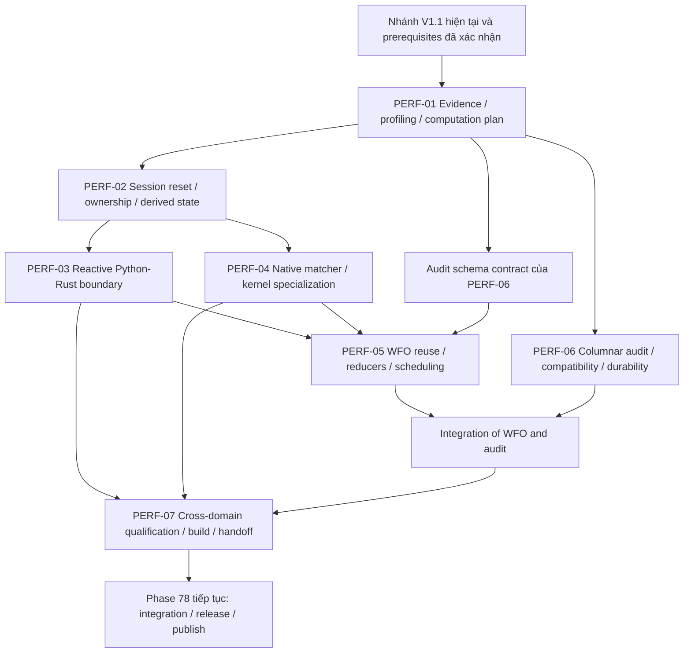

# QuantBT V1.1 — Additional Performance Closure trước Phase 78

**Phiên bản tài liệu:** APC-1.0  
**Ngày:** 2026-09-06  
**Nhánh mục tiêu:** `feat/rust-primary-v1_1`  
**Vị trí tích hợp:** thêm một chương trong `upgrade/implement.md`, trước Phase 78 hiện hữu.  
**Phase bổ sung:** `PERF-01` đến `PERF-07`; đây là ID đề xuất mới, không phải các phase đã tồn tại trong repository.  
**Trạng thái:** kế hoạch triển khai và nghiệm thu; chưa phải source audit, test certificate, benchmark result hoặc quyết định publish.

> Mục tiêu: hoàn thiện hiệu năng trên đường public của V1.1 — reactive strategy Python, WFO, native simulation và audit — bằng cách loại công việc lặp, giảm giao tiếp, tái sử dụng state an toàn và cải thiện data layout. Không thay bài toán backtest để lấy speedup.

## 0. Phạm vi bằng chứng và cách đọc

### 0.1 Những gì đã được đối chiếu

Kế hoạch này nối tiếp ba tài liệu có trong hội thoại:

| ID | Tài liệu | SHA-256 |
|---|---|---|
| D1 | `QUANTBT_RUST_PRIMARY_V1_1_UPGRADE_GUIDE_VI.md` | `3302edb075db544f511f9ed46927987621f245b1a4a3dfb1b32cdc2829966178` |
| D2 | `QUANTBT_V1_1_PRE_RELEASE_REVIEW_PARTIAL_VI.md` | `ea193ac48e126656dc001d889bea596a2f52f63b2761e57de4f3dafd63739265` |
| D3 | `QUANTBT_V1_1_ADDITIONAL_PERFORMANCE_OPPORTUNITIES_VI.md` | `716e084c672a75f91fb3f491fb29215c7e4825fee00e4076e0ffc88a9ccbfd43` |

D3 chứa 12 proposal IDs `AP-01`…`AP-12`. Tài liệu này biến chúng thành bảy phase có dependency, implementation tasks, adversarial tests, benchmark và release handoff.

Trong lần lập kế hoạch này, truy cập branch/raw GitHub tiếp tục thất bại; container không resolve được hostname. GitHub connector được tìm thấy nhưng chưa installed. Do đó chưa pin được HEAD mới, chưa đọc trực tiếp source tree/Phase 78 mới, và chưa chạy tests/benchmarks của nhánh. Không lấy nhận xét về `main` cũ để kết luận code hiện tại còn cùng lỗi.

Người dùng xác nhận đã implement đợt V1.1 và còn Phase 78 để nối/release/publish. Ta dùng thông tin đó để đặt **vị trí triển khai**, không thay nó bằng một certificate chưa có bằng chứng. PERF-01 chịu trách nhiệm pin source và xác định những hạng mục đã được giải quyết để không làm lại.

Các API/type/artifact IDs mới dưới đây là **contract đề xuất**. Các đường dẫn source là điểm bắt đầu tra cứu từ kiến trúc đã thảo luận, không phải khẳng định symbols hiện nằm đúng tại đó. Implementation phải cập nhật mapping bằng file/function thực tế của commit đã pin.

### 0.2 Định nghĩa “triệt để” trong đợt này

Hoàn thành cả đường đi:

```text
Public request
  → prepared data / resolved contracts
  → reactive hoặc WFO runtime
  → execution + accounting
  → metrics / analysis
  → trial ledger / result / export
  → candidate wheel qualification
```

Không chấp nhận chỉ thêm helper Rust, chỉ microbenchmark, hoặc chỉ giảm callback counter. Một optimization phải được public endpoint sử dụng đúng, giữ domain/transparency, và có evidence cho workload áp dụng.

“Triệt để” cũng không có nghĩa bắt buộc merge một thuật toán chậm hơn hay kém an toàn hơn. Mỗi AP phải được kiểm tra và có disposition; không có hạng mục biến mất khỏi roadmap vì khó đo.

### 0.3 Ranh giới giữ nguyên

- Strategy sở hữu feature, indicator, signal, forecast, allocation research và decision logic. Không thêm `quantbt-features`.
- Strategy Python vẫn là first-class. Không yêu cầu MRS hoặc strategy tương lai phải viết Rust.
- QuantBT sở hữu simulation, execution, accounting, chuẩn hóa intent, metrics chuẩn và runtime đánh giá.
- Không bỏ callback cần thiết; callback không phát order vẫn có thể thay đổi strategy state.
- Không giảm trial count, thay sampling/pruning, cắt audit, đổi fill model hoặc nới tolerance để đạt tốc độ.
- WFO tiếp tục dùng execution fidelity nhẹ theo contract đã chọn; không thêm latent depth cho mọi trial.
- Không mở rộng đợt này thành full options lifecycle, cross-exchange/triangular authority, live execution, GPU hoặc distributed runtime.
- Không xóa independent Python oracle. Không gọi production Python backend là independent oracle.
- Không viết lại pool, arena, prepared handles hoặc result substrate chỉ vì tài liệu cũ từng đề xuất chúng.

## 1. Tích hợp vào `upgrade/implement.md`

### 1.1 Cách chèn

Chèn nguyên chương này hoặc nội dung phase tương ứng dưới heading:

```markdown
## Additional Performance Closure — PERF-01 đến PERF-07

Mục tiêu: hoàn thiện hiệu năng V1.1 trước Phase 78.
Status khởi tạo: PLANNED.
Source of truth: commit/evidence manifest do PERF-01 tạo.
Phase 78 tiếp tục sau khi PERF-07 cấp release-candidate handoff hợp lệ.
```

Giữ nguyên số, trạng thái và evidence của các phase đã hoàn thành. Không đổi tên Phase 78 thành một phase performance khác. Không tạo các số 79–85 rồi bắt một Phase 78 trước đó phụ thuộc ngược vào chúng.

Trước khi chèn, maintainer kiểm tra `PERF-*` chưa trùng ID trong nhánh. Nếu có, đổi namespace của **cả nhóm**, không đổi từng ID rời rạc.

### 1.2 Quan hệ với Phase 78 đang làm dở

Phase 78 vẫn giữ nhiệm vụ integration/release/publish mà plan repository đã định nghĩa. Bổ sung dependency vào nó:

```text
Original Phase 78 prerequisites
AND AdditionalPerformanceClosure = READY_FOR_PHASE78
AND evidence matches the current source/build candidate
```

Các việc review/source/test đã làm trước đó không bị xóa. Nhưng wheel, benchmark hoặc certification gắn với commit cũ không được dùng như bằng chứng cho code mới có semantic/performance changes. Build candidate mới phải được định danh lại; không upload đè artifact cũ dưới cùng một identity bất biến.

PERF-07 chỉ cấp **đủ điều kiện tiếp tục Phase 78**, không tự publish, không tự bật Rust cho mọi route, không xóa thêm Python production code ngoài gate gốc.

### 1.3 Dependency và thứ tự



Thứ tự đọc/đóng phase là PERF-01 → PERF-07. Có thể làm song song PERF-03/PERF-04; schema của PERF-06 được khóa trong PERF-01 và writer implementation có thể chạy song song với PERF-05. Không chờ đến cuối mới quyết định audit retention hoặc callback safety.

### 1.4 Mapping 12 AP sang bảy phase

| Proposal gốc | Phase thực hiện chính | Điểm tích hợp bắt buộc |
|---|---|---|
| AP-01 Metric/output dependency plan | PERF-01 | PERF-05 WFO modes; PERF-06 exports |
| AP-02 Touched-state reset | PERF-02 | PERF-03 reactive; PERF-05 worker reuse |
| AP-03 Hidden callback crossings | PERF-03 | Public reactive + reactive WFO |
| AP-04 Derived-account cache | PERF-02 | PERF-04 target/portfolio/package |
| AP-05 Matcher prefilter/hot-cold | PERF-04 | High-churn reactive, package priority |
| AP-06 Runtime specialization | PERF-04 | Prepared public request and result contract |
| AP-07 Execution–analysis DAG | PERF-05 | PERF-06 trial/evaluation identity |
| AP-08 Streaming statistical reducers | PERF-05 | WFO mode matrix and retained paths |
| AP-09 Tiling/locality scheduling | PERF-05 | Existing pool, not a second scheduler |
| AP-10 Columnar audit | PERF-06 | All trials, legacy export, selected replay |
| AP-11 Observer/cold-path overhead | PERF-01 | Worker-local counters; PERF-07 final profiling |
| AP-12 PGO/build tuning | PERF-07 | Held-out workload + exact candidate wheels |

Prefix checkpoint reuse và inert-block acceleration ở D3 chưa trở thành production deliverables của nhóm này. PERF-07 phải ghi quyết định riêng về chúng; không đưa vào hot path để tạo thêm scope không được certify.

## 2. Chuẩn nghiệm thu dùng chung

### 2.1 Requirement disposition

Mỗi AP/work package phải có một trong các kết quả:

| Status | Ý nghĩa | Evidence tối thiểu |
|---|---|---|
| `IMPLEMENTED_VERIFIED` | Có change mới, public route sử dụng đúng | Source mapping, oracle, compatibility, benchmark, wheel |
| `VERIFIED_EXISTING` | Nhánh đã đáp ứng, không cần viết lại | Symbols/tests thực, profile/counters và public-path proof |
| `NOT_BENEFICIAL` | Đã thử hoặc phân tích có đo; cách mới không có lợi | So sánh có kiểm soát, quyết định giữ baseline, không claim speedup |
| `BLOCKED_CORRECTNESS` | Có mismatch/domain gap chưa xử lý | Reproducer và owner; chặn capability liên quan |
| `DEFERRED_APPROVED` | Hạng mục trong scope được lùi có chấp thuận | Lý do, ảnh hưởng, người phê duyệt; không tự chuyển vì sắp release |

`PLANNED`, `UNKNOWN`, `BENCHMARK_ONLY`, `HELPER_ONLY` không phải trạng thái hoàn thành. Một capability không có oracle/negative tests không được đổi thành verified chỉ vì performance tốt.

### 2.2 Evidence order

```text
Frozen economic contract
 → Independent oracle / mathematical invariants
 → Public-path equivalence
 → Audit/schema/selection equivalence
 → Memory/concurrency/fault safety
 → Candidate-wheel tests
 → Performance qualification
 → Route-specific enablement
```

Nếu phát hiện baseline có lỗi domain, mở correctness repair độc lập, ghi rõ spec delta và bổ sung fixture. Không tái tạo bug chỉ để giữ parity; cũng không gộp bug fix âm thầm vào PR performance. Sau repair phải pin baseline mới cho các so sánh liên quan.

### 2.3 Economic contract và performance plan là hai thứ khác nhau

`EconomicContractFingerprint` bao phủ market/calendar/instrument, account/initial state, timing, fills/liquidity, fee/funding, strategy inputs/state, RNG/scenario và các numeric semantics có tác động kết quả.

`PerformancePlanFingerprint` bao phủ kernel choice, tile/chunk sizes, worker topology, cache policy, projection plan, physical result encoding và build profile.

Thay performance plan không được ngầm thay economic contract. Nhưng build/numeric compatibility phải được xét khi reuse cached results; mặc định cache không reuse qua engine semantic build khác chưa được chứng minh tương đương.

API public, internal command ABI, request schema, result schema và package version phải được version độc lập. Nhóm PERF không tự gọi mọi thay đổi là “ABI 0.5”.

### 2.4 Exactness và floating-point policy

IDs, timestamps, ordering, accepted/rejected statuses, activation phases, quantities ở lot/tick representation, funding counts, pruning/checkpoint sequence và selected candidate theo tie-break đã chốt phải được kiểm tra exact khi contract yêu cầu.

Giá trị floating point dùng comparator/tolerance đã pin trước. Không tăng tolerance sau khi xem mismatch. Nếu thay reduction order làm đổi objective ranking, pruning hoặc margin decision, không coi đó là regression nhỏ vì final equity gần nhau. Phải giữ đường ordered-compatible hoặc version semantics và không promote như optimization tương đương.

Không bật fast-math; không thay RNG bằng một generator “cùng seed” nhưng khác sequence; không làm parallel reduction phụ thuộc thread completion order.

### 2.5 Performance measurement

Mọi benchmark phải ghi riêng:

- Public end-to-end, native core, preparation, analysis và export.
- Cold import/build effects, warm prepared run, cache miss, cache hit và mixed realistic reuse.
- Same data/candidates/folds/initial state/retention/economic contracts.
- Actual visited candidate-fold-bars, executed commands/fills, Python callbacks và emitted audit rows.
- Worker count, CPU budget, Python/Rust/BLAS topology, memory budget và toolchain.

Cache hit không được tính như engine đã xử lý lại toàn bộ bars để quảng cáo bars/s. Pruned/canceled evaluation ghi visited prefix thực, không dùng tổng bars dự kiến làm denominator.

Baseline và optimized chạy luân phiên theo paired samples. Dùng ít nhất 30 cặp cho warm macrobenchmark p50; muốn công bố p95 đủ tin cậy thì tăng sample count, mặc định đề xuất từ 100 quan sát phù hợp trở lên hoặc báo rõ p95 chỉ thăm dò. Đây là policy đo của dự án, không phải bảo đảm thống kê cho mọi workload.

PERF-01 khóa regression budgets theo noise đo được. Gợi ý điểm xuất phát để xem xét: warm public p50 không tăng quá 3%, p95 không tăng quá 5%, memory không vượt budget được duyệt. Không dùng ngưỡng này để ép số đo nhiễu thành pass; CI không đủ evidence phải ghi `INCONCLUSIVE`.

Chỉ claim speedup khi độ cải thiện vượt measurement noise và đường public được lợi. Fast path thua ở small shapes phải có deterministic threshold/fallback cùng semantics, không blanket-enable.

## 3. PERF-01 — Source traceability, profiling và computation/output plan

**Mục tiêu:** biết chính xác cái gì còn tốn thời gian; loại duplicate metric/output work và observer overhead mà không giảm thông tin hoặc đổi semantics.  
**Proposal:** AP-01, AP-11.  
**Phụ thuộc:** truy cập snapshot nhánh đúng và các prerequisites V1.1 hiện có.  
**Không làm:** viết lại market/account engine, tự tuyên bố phase cũ pass, hoặc dự đoán speedup chưa đo.

### 3.1 PF-01.1 — Pin baseline và map public workloads

Ghi commit SHA, dirty state, lockfile digests, compiler/Python/native versions, source/module paths thực, wheel/build hashes nếu đã có. Pin workload data/strategy/parameter/corpus bằng hash; secrets và credentials không thuộc manifest.

Inventory từ public API của branch, không chỉ từ README. Ít nhất tìm các family đã thảo luận: static orders, fill replay, target/signal/pct-equity/static DCA, event strategy/reactive, portfolio/basket, bounded package/arbitrage, intrabar, WFO từng mode và options containment. Factory nào đã rename/remove thì ghi replacement thực.

Mỗi row:

```text
public_factory → resolved_request → runtime/kernel → metrics/result → export
current domain contract → target optimization → oracle/tests → benchmark fixture
```

Các path lịch sử để bắt đầu tra cứu: `src/quantbt/endpoint.py`, `src/quantbt/walkforward.py`, `src/quantbt/backends/`, `rust/crates/`, `rust/native_event/`. PERF-01 phải sửa mapping theo branch thực; không tạo file mới ở đường dẫn này nếu module đã chuyển.

### 3.2 PF-01.2 — Causal profiler và workload suite

Profiler chia exclusive timings để không cộng callback time hai lần:

```text
prepare / validate / ingest
advance / match / accounting / wake-detection
projection / Python-decision / command-write / command-ingest
metrics / statistical-analysis / audit-encode / audit-flush / public-adapt
reset / cache-lookup / queue-wait
```

Wall-time và aggregate CPU-worker time là hai metrics khác nhau. `gil_attach_events` là counter về hoạt động API, không mặc định chính là số lần kernel lock đắt.

Workload tối thiểu gồm no-trade; one-order-per-bar; every-bar numeric Python; object-heavy reactive; sparse fill-dependent; high-churn cancel/amend/OCO; many resting orders; target small/large; portfolio nhiều symbol; package partial/residual; WFO fixed matrix và từng mode; error/cancel/audit-pressure.

Dùng MRS làm **một fixture đại diện**, không hard-code MRS vào runtime. Nếu source strategy/dataset chưa có, dùng fixture độc lập rõ tên và giữ MRS qualification là requirement chưa được nghiệm thu, không giả benchmark MRS.

### 3.3 PF-01.3 — RequiredComputationPlan

Tại prepare, compile hợp các requirements:

```text
objective + constraints/pruning
+ strategy context
+ financial result contract
+ research audit contract
    → observation schedule
    → required intermediate paths
    → reducers
    → output sinks
```

Reuse một stream account observations cho Sharpe/drawdown/turnover/counters đúng định nghĩa. Dùng `observation_id` để chống cùng event cập nhật reducer hai lần vì nhiều consumer đọc state. Không đồng nhất một fill event với một return observation.

Public result vẫn nhận đủ fields đã cam kết. “Không materialize equity path” chỉ hợp lệ nếu mọi consumer cần path đã được xử lý hoặc retention cho phép rerun. Arbitrary custom metric không khai báo requirements thì dùng conservative full input; không đoán nó chỉ cần scalar.

WFO statistical modes có path requirements khác score cơ bản. Pruning/reporting phải thấy đúng checkpoint và đúng giá trị trước khi sampler/pruner quyết định.

### 3.4 PF-01.4 — Hoist immutable work và giảm observer cost

Resolve contract IDs, symbol mapping, bound callbacks, schema descriptors và immutable hashes một lần tại lifecycle hợp lệ. Không cache hash trên bytes còn có writable aliases; copy-on-ingest hoặc ownership transfer trước khi coi dữ liệu immutable.

Hot success path dùng typed codes; dựng detailed text khi cần. Accumulate counters worker-local, merge theo schema. Không bỏ validation bắt buộc, status detail công khai hoặc canonical event obligations.

Coarse production measurement và detailed profiling là hai modes; chứng minh bật/tắt profiler không đổi financial result. Nếu wall-clock timeout được bật, ghi rõ faster/slower run có thể đi khác về visited prefix; không dùng fixture timeout đó để claim exact optimizer sequence.

### 3.5 PF-01.5 — Khóa cross-cutting contracts sớm

Trước khi phase sau code, khóa:

1. Borrowed view, retained snapshot và command staging ownership.
2. Reset versus carried-state semantics.
3. Cache identity, retention requirements và cache authorization theo data role/cutoff.
4. Research-audit schema của PERF-06; public backwards-compatibility fixtures.
5. Callback exception/re-entry/cancel semantics và maximum buffer budgets.
6. Numeric/tie-break/RNG contracts và mode migration matrix thực tế của WFO.

### 3.6 Gates và output

**Correctness:** metric values/checkpoint order/field cardinality không đổi; custom metric fallback đúng; no future availability leak.  
**Performance:** đo metric pass count, return allocations, observer delta, request hashing và end-to-end. Không tự claim fusion luôn có lợi.  
**Deliverables:** baseline manifest, route/AP traceability matrix, workload suite, RequiredComputationPlan ADR, safety/audit schemas, per-phase budgets và prioritized hotspot report.  
**Rollback:** bật plan cũ trên cùng contract; giữ profiler/schema evidence để diagnose. Không rollback sửa lỗi correctness đã được duyệt.

**Phase exit:** mọi AP có code owner/source mapping và một investigation plan; no unresolved baseline contamination; public economics/audit requirements đã khóa để các phase còn lại không tối ưu mù.

## 4. PERF-02 — Session reuse an toàn và shared derived-account state

**Mục tiêu:** reset chi phí thấp theo state thực sự dùng, tránh recompute cùng derived account snapshot.  
**Proposal:** AP-02, AP-04.  
**Phụ thuộc:** PERF-01; account contract hiện tại đã có independent oracle.  
**Không làm:** tạo account authority thứ hai hoặc đổi spot/derivative scope.

### 4.1 PF-02.1 — Đo reset trước khi thay data structure

Phân biệt logical `clear`, destructor cleanup, zeroing, index rebuild và allocator work. Không biến mọi `Vec::clear()` thành generation scheme. Chọn touched-list/generation cho đúng bảng đang có reset cost theo capacity hoặc lịch sử đã dùng.

Đo fresh/new, reuse normal, reuse sau outlier lớn. Workload phải có trial 100.000 order rồi trial rất nhỏ để bắt high-watermark penalty; con số này là fixture đề xuất, không phải workload đã đo trong branch.

### 4.2 PF-02.2 — Reset manifest đầy đủ

Phân loại state thành immutable shared, per-run mutable, worker scratch và retained result. Reset manifest phải enumerate:

```text
wallet / positions / fees / funding cursor / mark state
margin / reservation / liquidation / bankruptcy
active orders / parent / OCO / expiry / pending commands
order IDs and generations / command sequencing
execution-model/liquidity state / scenario RNG
wake scheduler / callback cursors / strategy lifecycle
metrics observations / path lengths / output/audit namespace
cancel token / error status / poison marker
```

Reset chỉ áp dụng fresh candidate/trial contract. Không dùng nó thay state carry tại stitched OOS boundary. Python strategy reset/factory là trách nhiệm độc lập được kiểm tra cùng runtime.

Generation wraparound phải có recreate/quarantine policy; IDs từ trial trước không được trỏ sang order mới dù slot được tái sử dụng.

### 4.3 PF-02.3 — Ownership của retained buffers

Một generation integer ở wrapper **không thể thu hồi quyền đọc của raw ndarray đã bị giữ lại**. Nếu raw view đã escape callback thì engine không được overwrite backing storage rồi hy vọng token bảo vệ.

Chọn contract thực thi được:

- Immutable snapshot sở hữu bytes riêng; hoặc
- Lease/refcount pin buffer đến khi consumer release, trong thời gian đó producer dùng buffer khác; hoặc
- Proxy không export raw view và kiểm tra generation trên mọi truy cập, với cost được benchmark.

Direct raw-buffer fast path chỉ dành cho protocol đủ ownership guarantees. Compatibility route giữ snapshot semantics. Read-only flag trên một view không tự loại bỏ mọi writable alias từ input ban đầu. Không có concurrent Python write/Rust read; không resize khi view còn sống. Nguồn kỹ thuật: NumPy thread safety [S3].

Giới hạn retained leases bằng budget; khi vượt, copy hoặc fail explicit theo contract, không reuse memory bất hợp lệ. Result đời trước phải vẫn đọc đúng sau hàng trăm reset của worker.

### 4.4 PF-02.4 — DerivedAccountSnapshot theo phase

Share equity/margin/exposure đã tính trong cùng coherent state:

```text
phase_sequence
mark_version + position_version + wallet_version
reservation_version + fee/funding_version + risk/instrument_version
    → derived account snapshot
```

Invalidation sau mark/fill/fee/funding/reserve/release/liquidation/config event. Không cache equity chỉ theo position generation. Chia sẻ snapshot để các consumer đọc, không để metric consumers tự kích hoạt account mutation.

Incremental terms chỉ áp dụng cho certified additive contract. Margin tiers, offsets, FX hoặc model nonlinear ngoài scope dùng explicit recompute; không suy luận chúng additive. Maintain/debug path có from-scratch comparator.

### 4.5 PF-02.5 — Fault/reset oracle

So fresh session với reused session cho cùng candidate, bao gồm tiền nhiệm: success, reject, liquidation, callback exception, cancel, reservation đang mở, audit queue lỗi và large-order capacity.

Property test trial permutation: với fixed independent candidate IDs/seed, kết quả candidate không phụ thuộc trial chạy trước. Không áp dụng property này cho carried simulation vốn có dependency.

Thử giữ old result/view, stale handle, forced-small generation counter, worker recreate và poison recovery. Callback fail không tự retry mutable Python strategy nếu thiếu restore contract.

### 4.6 Gates và output

**Correctness:** fresh/reuse trace equivalence; zero leaked reservations/events; old result unchanged; derived snapshot khớp recompute sau mọi event trong small corpus.  
**Performance:** `reset_ns`, `bytes_zeroed`, touched/capacity ratio, full derived recomputes, scratch growth, retained-result memory, RSS plateau.  
**Deliverables:** reset manifest, tested ownership contract, derived-state invalidation table, benchmark quyết định từng optimization.  
**Rollback:** fresh reconstruction cho candidate độc lập; full recompute derived state. Không fallback bằng cách reset một carried account.

**Phase exit:** reusable sessions là một optimization có chứng minh, không phải nguồn state contamination giữa trials.

## 5. PERF-03 — Reactive Python–Rust: giảm hidden crossings và công việc mỗi wake

**Mục tiêu:** Python giữ decision logic, Rust làm phần simulation và scheduling; chi phí mỗi callback/wake nhỏ nhất có thể mà không bỏ decision/state update.  
**Proposal:** AP-03, tích hợp AP-01/02/04.  
**Phụ thuộc:** PERF-01/02.  
**Không làm:** bắt strategy viết Rust, gọi mọi reactive strategy là pure-native, hoặc xây lại sparse runtime đã có.

### 5.1 PF-03.1 — Lập callback access plan

Theo requirements thực của strategy, chuẩn bị một context projection với fields, order handles và delta cursors cần thiết. Resolve callable/requirements một lần chỉ khi lifecycle contract cho phép; strategy có monkey-patch callback trong run phải dùng compatibility hoặc explicit mutation/invalidation protocol.

Đo cả ba chi phí:

```text
native outer entries
Rust → Python callback invocations
Python → native getters / writer methods bên trong callback
```

Đọc `ctx.equity`, `ctx.position(...)`, `ctx.active_orders(...)` nhiều lần có thể tạo hidden crossings tùy implementation. Fast path ưu tiên fixed numeric snapshot và arrays đọc tại Python, không gọi getter native cho từng scalar khi đó là hotspot. Không hứa zero Python allocation tuyệt đối: scalar boxing vẫn có thể xuất hiện và phải đo.

PyO3 0.29 có hướng dẫn giảm extract/cast overhead, attach checks thừa và dùng argument form thuận lợi cho vectorcall [S1]. Áp dụng theo version lock của branch; không đổi dependency chỉ để chạy theo docs mới.

### 5.2 PF-03.2 — Shared staged command batch

Benchmark writer hiện tại trước. Nếu một command tương ứng nhiều native method calls, thử Python writer ghi primitive rows vào buffer mapped/pinned, rồi native consume valid prefix một lần sau callback.

Commands dùng stable numeric symbol/order handles đã map. Giữ API object-friendly bằng adapter riêng. Enum/string validation bất biến được hoist, nhưng dynamic constraints/admission vẫn chạy đúng phase.

Callback transaction gồm:

1. Hoàn thành engine boundary, tạo generation/lease hợp lệ.
2. Reset staged length; Python được viết trong capacity cấp trước.
3. Callback return bình thường: validate envelope/rows theo contract, rồi ingest.
4. Callback exception: discard toàn staged commands chưa submit, đánh dấu strategy state có thể dirty.
5. Release/transfer buffer ownership đúng thứ tự; không retry implicit.

**Phân biệt hai loại atomicity:** discard staged writes khi callback exception không có nghĩa mọi command trong callback thành một all-or-none trading package. Nếu command batch thành công nhưng một order bị business rejection, preserve per-command reject/accept semantics hiện tại. Không vô tình rollback các order hợp lệ chỉ vì batch writer mới.

Nếu cần grow capacity, dùng explicit handshake tại boundary, không resize dưới exported view. Overflow phải có status; không cắt bớt commands để tiếp tục.

### 5.3 PF-03.3 — Sparse wake giảm projection, không chỉ invocation

Wake detection thực hiện trước expensive context materialization. Bar không có callback vẫn xử lý matching, funding, valuation, maintenance, metrics và orders theo contract.

Tối ưu wake index/timer/price predicates trong substrate hiện có. Hợp nhất reason codes cùng boundary chỉ khi callback contract cho phép. Không gom `on_fill` và `on_bar_close` vốn có ordering/command-effect khác thành một callback mới mà vẫn gọi là parity.

OHLC range touch chỉ đánh thức tại phase dữ liệu đã available. Không cho callback dùng high/low cuối bar để đặt lệnh ngược về open cùng bar. Gap/strict-inclusive comparison/mark source đều là wake contract, không phải chi tiết index.

Every-bar strategy có thể dùng bar để cập nhật campaign counters, RNG hoặc rolling state dù không ra lệnh. Sparse certificate phải scope theo strategy version, parameter contract, requirements, wake/timing semantics. Không suy ra sparse-safe từ việc không có commands trong một backtest.

### 5.4 PF-03.4 — Rút ngắn critical section, giữ thread/process semantics đúng

So sánh policies đã có của co-runtime trên cùng callback inputs; không thêm GIL policy thứ ba nếu branch đã có đủ. Không giữ native mutex xuyên callback rồi để callback re-enter runtime và deadlock. Waiting trên workers cần policy attach/detach đúng [S2].

Every-bar Python callback vẫn là lower bound nếu decision thực sự cần Python. Nhiều Rust workers gọi callbacks giữ GIL không tự tạo CPU parallelism. Process path chỉ dùng khi tổng callback work đủ bù IPC; initialize native pool đúng process lifecycle, không fork sau khi đã khởi tạo threads.

Không đưa free-threaded CPython, compiled Python callback hoặc external Rust plugin thành blocker của đợt này. Đó là deployment/capability khác cần certification riêng.

### 5.5 PF-03.5 — Candidate-batch và block protocols đã có

Nếu branch có candidate-batched callback, xác nhận nó thực sự có thể gọi một Python numeric decision cho nhiều candidates, không chỉ bọc vòng `for candidate.strategy()` bằng một native entry.

Fast protocol vẫn opt-in; mỗi candidate có state/RNG/namespace riêng. Một candidate exception phải tuân theo failure isolation đã pin; không hủy toàn batch ngoài policy đã công bố. Sparse grouping không thay candidate ID hoặc optimizer ordering.

Block intent phải tách exogenous precomputed tape khỏi online available data. Không đưa cho callback cả future block rồi gọi đó là causal prefix. Audit ghi rõ trust contract; changed future suffix không được đổi commands có effective time trước availability.

Các protocol chưa đủ safety evidence giữ experimental/explicit, không cản tối ưu mandatory every-bar access/writer path.

### 5.6 Four-way parity và benchmark

```text
A. Python strategy + independent execution oracle trên small corpus
B. Python strategy + baseline bridge/co-runtime của commit pinned
C. Python strategy + optimized co-runtime
D. Captured effective commands + static execution replay
```

A/B/C kiểm tra callback inputs, commands, financial trace và strategy state fingerprint khi strategy hỗ trợ. D xác nhận execution của commands đã capture; D **không tự chứng minh** Python decision đúng hoặc sparse wake đầy đủ.

Benchmark: no-op callback, many getters, many commands/callback, heavy Python decision, sparse event, high-churn grid, retained old context, callback exception và candidate batch. Giữ legacy snapshot route cho strategy giữ context lịch sử.

### 5.7 Gates và output

**Correctness:** callback phase/state/command ordering tương đương; failed callback không submit staged rows; no stale alias; no future OHLC leak; re-entry fails safely.  
**Performance:** getters/writer crossings, projection rows, allocated bytes, ns/wake, callback-decision share, full public time. Callback count giữ nguyên cho every-bar fixture; chỉ giảm trên declared sparse route.  
**Deliverables:** access/writer plan, wake-projection integration, candidate protocol mapping, per-shape route recommendations và four-way parity corpus.  
**Rollback:** baseline bridge hoặc safe snapshot writer cùng economic semantics; runtime descriptor ghi route thực.

**Phase exit:** reactive không chỉ có sparse helper; public route đã dùng đúng fast data path với số liệu về cost còn lại trong Python.

## 6. PERF-04 — Native matching, target/portfolio kernels và contract specialization

**Mục tiêu:** giảm công việc thừa trong Rust trên mỗi bar/order/consumer, không thay financial state transitions.  
**Proposal:** AP-05, AP-06; consumer của AP-04.  
**Phụ thuộc:** PERF-01/02. Có thể song song PERF-03.  
**Không làm:** dựng order engine mới, đổi order priority hoặc mở rộng domain được support.

### 6.1 PF-04.1 — Broad-phase filter dùng indexes hiện có

Đo active orders, orders examined, eligible orders, index maintenance và matching cost. Tận dụng order arena/active/symbol/expiry/parent/OCO structures hiện có; xác định còn đường scan nào bằng profile/source mapping.

Prefilter phải trả conservative superset: được false positives, không false negatives. Small sets dùng contiguous scan nếu tốt hơn. Threshold chọn theo benchmark từng workload class; config/schedule chỉ chọn implementation, không chọn economic outcome.

Khôi phục exact matching priority sau prefilter; không dùng thứ tự price-index để thay time/sequence priority đã pin. Orders mới activate do fill/parent, cancel OCO và stop-limit trigger trong cùng phase phải quay vào đúng queue/continuation. Một list candidates chụp đầu bar không được làm mất các child orders hợp lệ vừa xuất hiện.

### 6.2 PF-04.2 — Hot/cold order layout

Hot fields: numeric handle, symbol, action/type/side, activation, remaining qty, effective prices, compact lifecycle flags. Cold fields: text IDs, user tags, rich provenance, terminal history.

Không nhân đôi mutable order authority. Cold record tham chiếu generation-safe handle; index mutation đi qua một authoritative lifecycle operation. Audit phải reconstruct đủ identity/history từ hot + cold payload.

Benchmark include amend-heavy và cancel-heavy vì index maintenance có thể đắt hơn scan. Không chỉ đo fill-only.

### 6.3 PF-04.3 — Specialization một lần ở prepare

Chọn số ít shapes có evidence:

```text
Linear target score
Static linear orders score/compact
Reactive linear compact
Shared-account portfolio rebalance
Bounded package audit
```

Tên trên là workload classes, không yêu cầu tạo năm engines mới. Loops có thể specialized nhưng shared accounting/execution primitives không bị copy thành công thức riêng.

Hoist instrument mapping, fixed contract branches, metric selection, immutable validations và stable coefficients. Không hoist equity-dependent sizing, admission, dynamic funding/fee changes hoặc tradability sang phase sai. Không cache mark-sensitive collateral như constant.

### 6.4 PF-04.4 — Target/portfolio/package correctness-specific checks

Target fast loop không cần tạo generic order objects nếu contract là direct target rebalance. Parity là equivalent fills/accounting/target events, không ép trace order lifecycle giống event engine khi contract không tạo order.

Portfolio sizing khóa equity snapshot và priority. Storage permutation chỉ phải invariant nếu contract quy định; legacy sequential order có thể là một phần semantics, không được “sửa” bằng parallelism.

Package preview/reservation dùng transaction deltas nếu clone/copy whole state là hotspot. Atomic failure phải rollback cả account, fees, reservations và synthetic liquidity consumption; trace có thể giữ attempted actions nhưng committed trace/effects phải đúng. Phân biệt partial leg set và partial quantity fill; hedge dùng actual filled qty sau lot rounding và có residual/dust ledger.

Không dùng account cache để bỏ maintenance checks. Same fill sequence trong supported account contract phải reconcile cùng wallet/equity/PnL.

### 6.5 PF-04.5 — Domain tests trước throughput

Differential indexed vs full scan với gap, same-bar competing orders, price equality, stop-limit, partial liquidity, expiry, parent activation, OCO, cancel/amend race ở deterministic phase. Mutation test cố tình bỏ một candidate hoặc đảo priority phải bị phát hiện.

Small linear accounting corpus: scale-in/reduce/reverse, fee/funding timestamp, post-fee margin shortfall, liquidation, frozen/untradable symbol. Options/cross-venue contracts ngoài scope phải tiếp tục reject đúng, không fallback vào linear specialization.

### 6.6 Gates và output

**Correctness:** exact statuses/order/fill ordering và oracle financial parity; no false-negative prefilter; same unsupported behavior.  
**Performance:** orders examined, instruction/bar, cache misses nếu môi trường hỗ trợ, branch misses, index-update cost, target small/large public time, binary size.  
**Deliverables:** specialization registry, algorithm thresholds, existing-index integration mapping, mixed lifecycle corpus và workload-by-workload decision table.  
**Rollback:** baseline scan/generic certified loop; preserve new audit/schema compatibility.

**Phase exit:** optimized native paths nhanh ở shapes được enable, nhưng không ép Rust/đường indexed cho shapes mà baseline tốt hơn.

## 7. PERF-05 — WFO evaluation reuse, streaming analysis và locality runtime

**Mục tiêu:** thực hiện mỗi unique economic evaluation đúng số lần cần thiết; giữ optimizer/selection semantics; tăng throughput mà không làm mất trial audit.  
**Proposal:** AP-07, AP-08, AP-09; tích hợp outputs của PERF-01/02/03/04 và schema PERF-06.  
**Phụ thuộc:** các kernel/runtime được dùng đã pass gates; audit identity contract khóa từ PERF-01.  
**Không làm:** đưa feature/GARCH fitting/model training vào QuantBT, đổi mode để giảm workload, hoặc giả reset-flat là carried OOS.

### 7.1 PF-05.1 — Chốt mode-by-mode evaluation/retention matrix

Tra branch thật để xác định public mode names/defaults. Những mode đã thảo luận cần được tìm và map nếu còn tồn tại:

| Mode family | Simulation output cần | Analysis/selection cần giữ |
|---|---|---|
| Decay | Fold metrics, relevant paths khi definition yêu cầu | IS/validation decay components và chọn params |
| SBB/bootstrap/stress | Return path hoặc equivalent exact statistic inputs | Resample plan, replicate scores, quantiles, stress/regime semantics |
| Flat minima | Candidate metrics và parameter coordinates | Neighborhood/plateau relation, tested landscape, tie-break |
| IS-only robust | IS/subperiod metrics | Robustness/constraint decomposition; không đọc held-out test để chọn |
| Full robust | Các components thực dùng của mode | Joint robust score; retained paths cần thiết; provenance |

Không thay mọi mode bằng scalar final equity/Sharpe. Custom metric/objective không bounded giữ Python authority và declared inputs; opaque objective dùng safe baseline path, không tự introspect để bỏ data.

### 7.2 PF-05.2 — Execution–analysis artifact graph

Tách entities:

```text
Strategy input/state → intent hoặc reactive execution
    → execution artifact
    → metric/statistical analysis
    → objective record
    → selection record
    → deployment / selected audit replay
```

Một execution có thể phục vụ nhiều report-only objective weights nếu không có feedback lên strategy, pruning hay execution. Không chạy lại matching chỉ vì đổi cách trình bày Sharpe/drawdown đã tính đủ.

Identity tối thiểu:

```text
run_id / trial_id / candidate_id
execution_id / execution_attempt_id
analysis_id / selection_id / deployment_id
```

Identity logic khác ordinal của worker. Hai trials trùng params vẫn là hai trials; cache hit phải ghi nguồn reuse, không xóa một trial.

### 7.3 PF-05.3 — Semantic cache, retention và authorization

Key của execution cache tối thiểu gồm:

```text
engine semantic build + numeric contract
market/calendar/instrument content identity
initial account + orders/reservations/funding cursors
strategy implementation/config/state + intent hash khi có
observation/effective clock + fold/warmup/cutoff/account policy
execution/liquidity + fee + funding + risk contracts
RNG algorithm/version + seed/scenario/replicate identity
execution horizon and completed-prefix status
```

Cache eligibility còn cần:

- Input immutable thực, không chỉ wrapper read-only.
- Causal/data-role authorization phù hợp: không lấy artifact của future/global preparation rồi dùng cho causal fold.
- Required retained payload đầy đủ; score-only artifact không thể trả original full audit.
- Run complete hoặc explicit prefix. Canceled/pruned result không được gắn thành completed full evaluation.
- Strategy deterministic/isolated theo contract. Không skip arbitrary Python side effects, external IO hoặc user callbacks được API cam kết mà cache không reproduce.
- Error/invalid-parameter result chỉ reuse nếu lỗi deterministic thuộc key, không cache transient resource/IO/internal failures như financial truth.

Không deduplicate independent stochastic replications. Không deduplicate chỉ vì final equity giống nhau. Default không reuse cross-build nếu chưa có compatibility proof.

Lookup/hash/cache-store cost và memory đều phải đo trên hit=0, mixed hit và high-hit; không enable cache mặc định cho workload không có reuse nếu nó làm chậm.

### 7.4 PF-05.4 — Pruning và optimizer semantics không bị cache phá

Phân biệt execution result với **lịch tương tác optimizer**. Pruner có thể phụ thuộc các trial trước. Cache một terminal score không cho phép bỏ `trial.report()` hoặc dùng lại pruning decision của study khác.

Certified sequential mode:

```text
ask 1 → evaluate/report đúng checkpoints → prune hoặc complete → tell 1
```

Cache-compatible candidate phải replay đúng intermediate observations cho pruner hiện tại nếu contract hỗ trợ. Nếu không hỗ trợ thì bypass cache cho route có interactive pruning. Pruned prefix giữ `executed_until`, checkpoint history và reason; không dùng terminal score tương lai để thay quyết định đã dừng trước đó.

Nếu objective/constraints tác động vào execution termination, nó không còn là report-only analysis. Feedback edge đó phải đi vào evaluation contract/key hoặc cache bị disable.

Throughput-batch mode giữ schedule ID, batch size, ask order và tell order rõ ràng. Không thay async completion thành sampling input chỉ để chạy nhanh hơn mà vẫn claim sequential parity. Optuna ask/tell và explicit pruned trial finalization được mô tả trong [S4]; version thực theo dependency lock của branch.

### 7.5 PF-05.5 — Public lifetime, bounded pipeline và locality

Không xây pool mới nếu đã có. Verify public WFO giữ prepared market/runtime trong toàn lifecycle hợp lệ và reuse sessions của PERF-02. Đếm pool creation, market ingestion, intent copy, reset và selected rerun.

Intent tapes có thể khác theo candidate; cho phép một controlled ingestion copy cho mỗi distinct tape/batch. Zero repeated O(T) copies theo fold/scenario/replay khi views/retained ownership cho phép. Không đặt “zero storage cho mọi candidate” làm gate phi thực tế.

Pipeline có backpressure:

```text
Python strategy preparation/generation
 → bounded typed intent chunks
 → existing native worker runtime
 → ordered metric/checkpoint results
 → Python analysis/optimizer control
 → research audit writer
```

Chỉ overlap work độc lập. Không pre-sample adaptive trials tương lai trong sequential mode. Queue/caches/pinned buffers thống nhất memory budget; không để từng subsystem dùng hết RAM riêng.

Thử candidate-major/time-major tiles cho independent targets. Giữ mỗi candidate state tiến theo đúng temporal order. Reactive/high-churn có thể giữ scenario-major tốt hơn. Tiling threshold có benchmark và performance plan provenance; không task-per-bar.

Task grain đủ lớn để scheduling không lấn execution. Có thể áp dụng controls tương tự Rayon indexed iterator granularity [S6] nhưng không cần đổi scheduler chỉ để dùng thư viện khác.

Resource coordinator phải tính actual concurrent/nested topology. Không dùng một công thức nhân Python×Rust×BLAS cho mọi tình huống: có đoạn tuần tự, có đoạn nested; ghi rõ nhóm nào có thể hoạt động đồng thời, enforced CPU budget và effective counts. Không khởi tạo toàn CPU pool trong mọi Python process.

### 7.6 PF-05.6 — Streaming statistical reducers

Với các statistics thuộc WFO hiện có, giữ path một lần; Rust đọc block/resample descriptors hoặc indices và reduce bằng worker-local scratch. Không dựng tensor `replicates × bars × candidates` nếu chỉ cần replicate-level statistics.

Python tiếp tục tạo/fitting model khi đó thuộc research. QuantBT có thể nhận deterministic scenario paths/indices để giảm allocation/copy; không chuyển GARCH fitting hoặc feature generation vào core dưới nhãn performance.

Freeze stationary bootstrap block rule, wraparound, RNG algorithm/indices, statistic formula, quantile interpolation, NaN/ddof/horizon và reduction order. Same seed chưa đủ nếu sampled indices đổi. Cross-worker result phải theo fixed replicate ID order hoặc reduction tree đã certify.

Reuse subperiod summaries chỉ trên cùng actual economic path và metric definition cho phép. Không nối summaries của hai reset-flat accounts để giả carried deployment. Không chỉ chạy bootstrap cho top-K nếu mode gốc dùng nó để chấm tất cả candidates.

### 7.7 PF-05.7 — Reactive WFO và deterministic replay

Reactive cache/reuse khó hơn static tape: fills/equity khác có thể làm strategy sinh commands khác. Capture command tape để validate execution là hợp lệ; dùng tape đó dưới slippage khác chỉ là counterfactual replay, không tự là strategy result mới.

Prepared Python state phải factory/reset/snapshot theo contract. Causal feature cache do strategy quản lý phải có cutoff/version; QuantBT không chứng nhận an toàn chỉ vì output là ndarray.

Independent candidate evaluations parallel được. Stitched OOS có carry phải giữ wallet/positions/open orders/parent-OCO/reservations/funding/RNG/strategy state theo timeline; không parallel folds như reset-flat.

Selected audit rerun dùng same semantic inputs. Original retained trace và reconstructed replay phải phân biệt; hashes kiểm consistency, không thay independent oracle.

### 7.8 Gates và output

**Correctness:** fixed candidate matrix từng mode; cache on/off; fresh/reuse; workers/chunks khác; sequential sampling/pruning/tell exact theo contract; batch schedule deterministic; reset/carry riêng; selected objective và deployment params không đổi.  
**Transparency:** mọi trial có record, objective decomposition reconstruct được, cache hits giữ trial identity, parameter landscape không mất points/fail/pruned statuses.  
**Performance:** unique executions, visited bars avoided, cache cost, intent copies, statistics allocations, queue overhead, tile sweep, public WFO latency và peak/steady RSS.  
**Deliverables:** mode matrix, evaluation DAG/cache eligibility rules, pipeline integration, native reducer corpus, runtime topology report và WFO compatibility manifest.  
**Rollback:** cache off, baseline reducers, existing schedule/layout. Giữ research records/IDs đầy đủ khi rollback; không biến pruned/fail thành score sentinel chung.

**Phase exit:** WFO đạt public throughput/reuse thực mà không thay thuật toán chọn params, held-out role hoặc carried-account semantics.

## 8. PERF-06 — Research audit/result tốc độ cao và không mất dữ liệu

**Mục tiêu:** giữ transparency như cũ hoặc tốt hơn, nhưng giảm Python object creation, serialization lặp và memory duplication.  
**Proposal:** AP-10; phối hợp AP-01/07/11.  
**Phụ thuộc:** schema khóa ở PERF-01; implementation có thể song song PERF-05; integration đóng sau khi WFO DAG sẵn sàng.  
**Không làm:** tắt audit, chỉ lưu `best_params`, thay full records bằng hash hoặc mặc định audit reconstructed là original.

### 8.1 PF-06.1 — Hai chiều retention độc lập

Tách yêu cầu kinh tế và nghiên cứu:

```text
financial_retention: score / compact / audit
research_retention: full_trial_ledger / selected_only / none
```

Tên field thực dùng theo API/version hiện tại. Public default/legacy contract không bị đổi âm thầm. Với research WFO workflow của người dùng, target là giữ full trial ledger dù financial execution chỉ ở score mode.

Full trial ledger không đòi giữ mọi fill của mọi candidate, nhưng phải giữ actual parameters, attempted evaluations, fold/scenario metrics, objective inputs, status và selection trail đủ để audit quyết định. Requests đòi full financial audit vẫn phải được đáp ứng hoặc reject resource budget rõ ràng.

### 8.2 PF-06.2 — Manifests bất biến và record identities

Lưu run/search-space/instrument/contract manifests một lần. Trial/fold records tham chiếu IDs và giữ actual values riêng.

Minimum schemas:

| Record | Fields bắt buộc cho workflow đã chốt |
|---|---|
| Run | Source/wheel/build hashes, requested/resolved contracts, data/strategy identity, seeds, topology, budgets |
| Search space | Parameter names/types, distributions, bounds/step/log, category order, conditions, fixed overrides, version |
| Trial | Trial/candidate/evaluation IDs, active actual params, inactive condition reasons, optimizer state, execution status, attempt/reuse |
| Evaluation × fold × scenario | Interval roles, cutoff/warmup/purge/embargo, account-state identity, costs/metrics, visited prefix/bars, errors |
| Analysis | Parent execution, statistical/metric contract, RNG/resample identity, component values, retained paths/references |
| Selection | Objective/direction, constraints, tie-break, rejected candidates/reasons, selected candidate, allowed data roles |
| Deployment | Actual params/version theo interval, carried-state linkage, transition/close/reset decisions |
| Replay | Input/seed/contract identity, original vs reconstructed provenance, trace comparison, differences/coverage |
| Performance | Phase timings, copies, callbacks, reset/cache stats, audit queue high-water mark, algorithm thresholds |

Không phải mọi dynamic Python search space đều khai báo trước được toàn bộ branches. Nếu chỉ quan sát distributions đã sampled, ghi `space_completeness=observed_only`; không dựng các bounds/conditions chưa quan sát như sự thật. Preserve declared schema nếu strategy/user cung cấp.

Category order/type, float precision, null/NaN/status, units, timezone và index names là một phần compatibility. Không dùng string `repr` tùy ý để coi hai parameter values phức tạp là cùng semantic value.

### 8.3 PF-06.3 — Typed columnar chunks

Workers append compact typed rows/chunks, tránh dict/JSON cho mỗi event/trial. Public pandas/legacy outputs được materialize một lần hoặc lazy theo đúng API contract.

Ưu tiên SoA/result substrate đã có. Arrow là option có typed columnar representation và dictionary encoding [S5], không phải dependency bắt buộc. Không thêm Arrow + Parquet + database cùng lúc nếu existing format đã giải quyết được bottleneck.

Ownership chuyển rõ từ worker buffer sang sink; worker không recycle trước khi consumer xong. Chunk IDs/order là deterministic logical sequence; completion order của workers không thay financial trace order trong từng evaluation.

Compression/dictionary encoding không được lượng tử hóa price/qty/metrics để tiết kiệm byte. Không downcast float hoặc timestamp precision ngoài explicit export contract.

### 8.4 PF-06.4 — Bounded writer và trạng thái hoàn tất

Dùng existing sink/writer nếu đáp ứng; thêm bounded queue chỉ khi profiling cho thấy lợi. Queue đầy: backpressure, bounded spill hoặc explicit budget failure. Full-audit requests không silently drop.

Phân biệt durability:

```text
MemoryResultComplete:
    records retained trong result object đúng ownership contract.

ProcessCompletionFlush:
    required output đã flush/close theo format trước khi run reports success.

CrashDurable:
    persistence/commit/fsync guarantees được định nghĩa và test riêng.
```

Không gọi ordinary buffer flush là crash durability. Không bắt mọi score trial fsync riêng nếu user không yêu cầu; batch writes theo durability contract.

Có thể financial execution complete nhưng audit write fail. Result phải ghi hai trạng thái và aggregate status phù hợp, không báo certified run success khi requested audit thiếu. Canceled run có partial records, committed prefix, missing range và reason rõ.

Retry writer không được tạo duplicate trial/evaluation rows; IDs và chunk commit state phải idempotent theo logical export contract. Không tự retry optimizer `tell` khi không biết lần trước đã commit chưa.

### 8.5 PF-06.5 — Hash/provenance và schema round-trip

Hash immutable metadata một lần sau khi ownership đóng. Financial trace digest vẫn theo event order. Đổi JSON sang canonical binary là encoding/schema change; version digest algorithm/encoding, không hứa hash bytes giống format cũ.

Logical parity compare records dưới schema adapter hoặc cùng canonical codec. Hash không tái dựng event data; score artifact chỉ có digest không thể đáp ứng original full-audit request. Rerun selected candidate phải ghi `reconstructed=true` khi đó là dữ liệu được sinh lại.

Round-trip legacy output qua typed store phải giữ row cardinality, keys/joins, distributions, actual params, status reasons, objective, selection và deployed intervals. Parameter heatmap chỉ coi attempted points là observed; interpolated regions có nhãn.

### 8.6 Gates và output

**Correctness/transparency:** mọi optimizer trial có record; no silent status collapse; objective tái tính từ components khớp; reused evaluation giữ đủ trial rows; search-space changes có version; selected deployment nối đúng candidate.  
**Fault:** disk full, queue full, worker death, serialization error, cancellation during flush, duplicate sink retry, schema mismatch đều có trạng thái rõ.  
**Performance:** audit allocations, bytes, encode/flush/adapt latency, queue peak, memory plateau, same full research retention.  
**Deliverables:** versioned research schemas, typed writer/adapter integration, durability spec, legacy compatibility corpus, audit fault suite.  
**Rollback:** existing serializer/sink với cùng retention; không rollback bằng cách tắt audit.

**Phase exit:** audit là public product contract có kiểm thử, không phải debug data bị bỏ trong optimize profile.

## 9. PERF-07 — Cross-domain qualification, build tuning và handoff về Phase 78

**Mục tiêu:** chứng minh các tối ưu phối hợp đúng, hiệu quả và an toàn trên candidate thực; cấp evidence để tiếp tục release.  
**Proposal:** AP-12 và integration closure của AP-01…AP-11.  
**Phụ thuộc:** mọi phase liên quan ở trên có disposition hợp lệ, không còn blocker cho release scope.  
**Không làm:** publish package, blanket-auto Rust, remove oracle hoặc mở rộng scope vì benchmark đẹp.

### 9.1 PF-07.1 — Combined-path và ablation qualification

Chạy baseline, từng optimization family và combined configuration. Không nhân các speedup riêng vì chúng overlap. So sánh cả helper và public route, nhưng public path là release gate.

Ablation tối thiểu:

```text
baseline
+ computation/output plan
+ reset/derived-state reuse
+ reactive boundary improvements
+ native kernel changes
+ WFO cache/reducers/scheduler
+ audit representation
combined + chosen build profile
```

Không cần kiểm toàn bộ tổ hợp Cartesian. Chọn pairs có shared ownership/state/numeric interactions; chạy combined toàn suite và adversarial cases.

### 9.2 PF-07.2 — Cross-domain regression

Trong mọi capability mà branch dự định release, kiểm tra market/calendar, accounting/funding, orders, target, portfolio/package, intrabar và options containment không đổi semantics do shared primitives mới.

Đặc biệt account snapshot caching và reset có thể ảnh hưởng endpoint không phải hotspot. Optimization đi vào shared crate phải chạy affected-domain matrix, không chỉ WFO tests.

Known unsupported spot-carry, inverse/quanto, cross-venue hoặc option exercise models phải tiếp tục fail/label theo public capability. Không cho specialization chọn nearest supported model im lặng.

### 9.3 PF-07.3 — PGO/build experiment có kiểm soát

Sau dataflow ổn định mới thử PGO: instrumentation build → chạy training workloads đại diện → merge profiles → optimized build. Rustc và Cargo mô tả cơ chế PGO/build profiles [S7, S8]. Pin toolchain, profile hash và flags.

Giữ held-out workloads ngoài training profile: short/long, score/audit, reactive Python-heavy, many-order, target, portfolio/package. Thua macro/cold-size gate thì giữ non-PGO build; `NOT_BENEFICIAL` là kết quả được chấp nhận có evidence, không buộc bật PGO.

Public wheel giữ CPU baseline portable. CPU-specific tuning chỉ local/private build hoặc runtime dispatch có fallback được certify. Không `target-cpu=native` cho wheel công khai chung khi chưa có contract platform phù hợp.

Không thay panic policy, fast-math, unsafe restrictions hoặc PyO3 reference-pool safety để lấy speedup. Đặc biệt PyO3 cảnh báo disabling reference pool có thể abort/leak khi drop không attached [S1]. Đây không phải default optimization của đợt này.

### 9.4 PF-07.4 — Resource, cancellation và ownership soak

Chạy long WFO với heterogeneous candidates, cache pressure và slow audit sink. Peak memory phải nằm budget; steady memory không tăng theo số trials đã hoàn thành khi retained artifacts được release theo contract.

Test cancellation tại prepare, callback, native loop, queue wait, reducer và audit flush. Đo responsiveness nhưng không đổi financial history đã commit. Ctrl+C/error không được để worker orphan, lock deadlock hoặc invalid buffer alias.

Topology thay đổi trong supported matrix phải giữ per-candidate deterministic outcomes theo schedule contract. Với time-budgeted asynchronous search, không hứa candidate sequence giống nhau; phiên bản contract phải nói rõ và không dùng mode đó cho exact-sequential claim.

### 9.5 PF-07.5 — Installed candidate và route enablement

Build/test local candidate wheels từ source đã pin, trong clean environment ngoài source working directory. Không cần publish để chứng minh cài wheel chạy đúng. Ghi core/native pair, ABI/protocol/schema versions và actual imported module origins.

Route enablement matrix gồm:

```text
endpoint + intent mode + account/timing/execution contract
+ retention + reactive protocol/WFO mode
+ platform/worker configuration
→ explicit support / auto-eligible / safe baseline / rejected
```

Nếu Rust vẫn chậm hơn Python comparator trên một hybrid workload, giữ explicit hoặc auto chọn baseline đúng contract. Không che giấu Python callbacks bằng `native_entry_calls=1`; runtime descriptor ghi execution/decision authority và các counters riêng.

### 9.6 PF-07.6 — Release handoff, không trộn với publish

Tạo `PerformanceClosureManifest`:

```yaml
schema: quantbt.performance_closure.v1
status: READY_FOR_PHASE78 | BLOCKED
source_identity: resolved_by_ci
baseline_identity: resolved_by_ci
evidence_root: candidate_bound_artifact_store
requirements:
  required_statuses:
    - IMPLEMENTED_VERIFIED
    - VERIFIED_EXISTING
    - NOT_BENEFICIAL
phase_results:
  PERF-01: evidence_reference
  PERF-02: evidence_reference
  PERF-03: evidence_reference
  PERF-04: evidence_reference
  PERF-05: evidence_reference
  PERF-06: evidence_reference
  PERF-07: evidence_reference
promotion_scope: route_matrix_reference
open_correctness_blockers: must_be_empty_for_scope
audit_compatibility: schema_and_roundtrip_evidence
performance: measured_ratios_and_uncertainty
rollback: known_good_contract_compatible_candidate
```

Đây là schema sketch, không phải certificate đã điền. CI phải sinh actual values, validate references và từ chối `resolved_by_ci`/`evidence_reference` trong manifest cuối.

Phase 78 kiểm manifest trước khi tiếp tục. Nếu source/build thay đổi sau qualification, xác định impacted evidence và rerun gates; không lấy một checksum khác nhưng label “cùng version” để bypass. Final distributed wheel phải có clean installed tests riêng đúng artifact sẽ publish.

### 9.7 Gates và output

**Gate tổng:** no unexplained domain/parity mismatch, no required audit loss, public-path tests pass, resource/fault handling pass, performance claims measured, all AP disposition explicit.  
**Deliverables:** combined benchmark/ablation report, oracle and compatibility matrix, wheel evidence, profile decision, capability enablement table, rollback plan và handoff manifest.  
**Rollback:** candidate có cùng economic contract và schema compatibility; giữ optimized kernels explicit-only/off nếu chưa đủ evidence. Không xóa baseline implementation trước release maturity gate gốc.

**Phase exit:** `READY_FOR_PHASE78` chỉ cho capability set đã chứng minh. Không đồng nghĩa mọi endpoint là full-native hoặc toàn bộ QuantBT đã được certify cho mọi sản phẩm tài chính.

## 10. Adversarial test matrix bắt buộc

Các IDs dưới đây là testcase requirements mới, không khẳng định test files đã tồn tại. Maintainer map chúng vào test symbols thực trong PERF-01 và báo cáo coverage ở PERF-07.

| ID | Case | Assertion chính | Phase |
|---|---|---|---|
| AC-01 | Metric được nhiều consumers đọc | Cùng observation chỉ update reducer đúng số lần | 01 |
| AC-02 | Custom metric không khai báo requirements | Không bỏ path input; safe fallback | 01 |
| AC-03 | Pruner cần intermediate checkpoints | Same report values/order; không chỉ trả terminal scalar | 01,05 |
| AC-04 | Input có writable alias sau prepare | Snapshot/ownership policy ngăn mutation làm stale hash | 01,02 |
| AC-05 | Huge trial → tiny trial | Kết quả tiny như fresh; reset không leak IDs/state | 02 |
| AC-06 | Trial trước liquidate/funding/cancel | Cursor/fees/reservations/RNG reset đúng | 02 |
| AC-07 | Giữ raw result/view qua nhiều reset | Bytes cũ không bị overwritten; không use-after-free | 02 |
| AC-08 | Forced generation wrap/stale handles | Reject/recreate theo contract, không nhầm order mới | 02 |
| AC-09 | Mark thay đổi nhưng position không đổi | Equity/margin cache invalidate đúng | 02 |
| AC-10 | Reserve/release/fee đổi cùng bar | Derived snapshot không stale giữa phases | 02 |
| AC-11 | Callback writes rồi raise | Không submit staged writes; dirty strategy state explicit | 03 |
| AC-12 | Successful callback có business-rejected command | Per-command semantics gốc, không accidental all-or-none | 03 |
| AC-13 | Callback re-entry/cancel/grow buffer | Fail safe; không deadlock/resize dưới active view | 03 |
| AC-14 | Silent callback vẫn cập nhật state/RNG | Sparse mode không skip sai future actions | 03 |
| AC-15 | Future high/low đổi, open giữ nguyên | Không đổi quyết định có hiệu lực trước availability | 03,04 |
| AC-16 | Multiple wakes + on_fill/on_close | Preserve event/callback ordering contract | 03 |
| AC-17 | Batch candidate một người fail | Isolation/status/other results theo contract | 03,05 |
| AC-18 | Prefilter gap/stop-limit/new child | Không false negatives; đúng same-phase continuation | 04 |
| AC-19 | Index ordering khác matching priority | Equivalent fills và shared-liquidity consumption | 04 |
| AC-20 | Cancel/amend/OCO high churn | Index maintenance không stale; no terminal fill | 04 |
| AC-21 | Atomic package fail leg cuối | Rollback account + fee + reservation + liquidity | 04 |
| AC-22 | Primary partial fill + lot hedge | Actual-fill hedge; dust/residual recorded | 04 |
| AC-23 | Portfolio storage permutation | Theo explicit priority/snapshot, không vô tình thay semantics | 04 |
| AC-24 | Cache hit duplicate trials | Giữ hai trial records; execution reuse trace đầy đủ | 05,06 |
| AC-25 | Change fee/funding/initial-state/clock | Cache miss/invalidation đúng | 05 |
| AC-26 | Change report-only objective weight | Reuse chỉ khi không có feedback/pruning tác động execution | 05 |
| AC-27 | Cached completed run, current pruner dừng sớm | Replay checkpoints hoặc bypass cache; đúng prefix/status | 05 |
| AC-28 | Canceled/pruned artifact trong cache | Không trả như full complete; coverage explicit | 05 |
| AC-29 | Same seed nhưng independent replicate IDs | Không deduplicate sai stochastic replications | 05 |
| AC-30 | Global/future artifact dùng cho causal fold | Authorization/cutoff rejects; không leak future | 05 |
| AC-31 | Overlapping reset-flat và carried OOS | Không reuse như cùng initial state; carried history đúng | 05 |
| AC-32 | Workers/chunks/tile thay đổi | Fixed candidate outcomes/RNG/tell sequence theo contract | 05,07 |
| AC-33 | Bootstrap fixed indices/reference path | Same statistical components/selection theo numeric policy | 05 |
| AC-34 | Mode cần all-candidate robustness | Không lược xuống top-K âm thầm | 05 |
| AC-35 | Dynamic conditional search space | Preserve observed/declared distinction, types/category order | 06 |
| AC-36 | Audit queue full/disk full/cancel mid-flush | Backpressure/failure explicit; không certified success thiếu data | 06 |
| AC-37 | Writer retry/duplicate chunk | No duplicate logical rows; valid joins | 06 |
| AC-38 | Legacy export round-trip | Dtypes/timezone/null/status/cardinality/objective đúng | 06 |
| AC-39 | New digest encoding | Versioned; logical parity không giả old byte hash | 06 |
| AC-40 | Target direct-loop vs event reference | So equivalent target/fill/account contracts, không fake order parity | 04,07 |
| AC-41 | Options/spot/cross-venue unsupported shapes | Giữ fail-fast/approximation labels; không nearest-kernel fallback | 07 |
| AC-42 | Observer on/off và PGO on/off | Không đổi financial decisions hoặc enabled capabilities | 01,07 |
| AC-43 | Fresh clean-wheel import ngoài source dir | Public route dùng đúng candidate extension/version | 07 |
| AC-44 | Post-qualification build/source changes | Evidence invalidation/retest đúng affected scope | 07,78 |

Metamorphic tests chỉ áp dụng với preconditions đúng. Ví dụ split một fill thành hai không bắt buộc cho cùng fees nếu fee có minimum-per-fill, rounding hoặc phase-sensitive margin. Không viết invariant “luôn bằng nhau” khi economic contract thực sự khác.

## 11. Benchmark portfolio và gates theo nhóm

### 11.1 Benchmark fixtures

| ID | Workload | Điều cần bóc tách |
|---|---|---|
| B-01 | No-trade ngắn/dài, score/compact | Prepare, metrics, observer, result fixed overhead |
| B-02 | Numeric every-bar, nhiều getters | Access plan và hidden native calls |
| B-03 | Many commands/callback | Writer crossings, ingest/validation/capacity |
| B-04 | Object-heavy Python decision | Amdahl limit; không ép auto Rust |
| B-05 | Sparse strategy nhiều idle bars | Wake detection/projection; không bỏ valuation/metrics |
| B-06 | Grid/high-churn resting/cancel/amend | Prefilter, indexes, account snapshots, audit |
| B-07 | Fresh vs reused heterogeneous trials | Reset cost, generation, outlier capacity |
| B-08 | Target candidates, symbol/candidate shape sweep | Specialization, tiling, task granularity |
| B-09 | Portfolio/package shared account | Admission/order priority/account cache |
| B-10 | Fixed-matrix WFO mỗi mode | Same actual work, metrics/statistics/retention |
| B-11 | Cache zero/mixed/high hits | Cost riêng lookup/storage và executions avoided |
| B-12 | Audit-full research với slow sink | Encoding, bounded queues, flush/peak memory |
| B-13 | Long WFO cancel/fail/retry | Resource/lifecycle recovery |
| B-14 | Held-out workload cho PGO | Generalization/cold-size/error behavior |

Shape values lấy từ baseline real workloads, cộng small/large/adversarial fixtures. Không chỉ 5.000 bar hoặc một alpha. Cùng economic inputs chạy trên baseline và optimized; báo cáo chuẩn bị dữ liệu/strategy generation nếu nó nằm trong public request.

### 11.2 Hard gates không được trade-off

- Domain/oracle failure không thể bù bằng speedup.
- Audit data requested bị mất là fail, dù score đúng.
- Changed optimizer candidate/pruning sequence là fail trong certified sequential mode.
- Unsafe aliasing/deadlock/use-after-free là fail, không phải limitation chấp nhận ngầm.
- Unsupported capability được chạy bằng approximation im lặng là fail.
- Financial output complete nhưng required audit incomplete không thể được gọi certified success.

### 11.3 Performance dispositions

Không đặt một hệ số tăng tốc chung cho toàn repo. Tỷ trọng phase được đo trước; dùng Amdahl để dự báo ceiling, rồi benchmark public để nghiệm thu.

```text
speedup_total = 1 / ((1 - hotspot_share) + hotspot_share / local_speedup)
```

Các cách tối ưu cùng một cost không được nhân hệ số. Mỗi result phải ghi baseline/optimized route, actual profile và whether cache reuse đã giảm số executions. Không gọi “kernel nhanh 10×” khi thực ra cache tránh chạy kernel.

Phase completion bắt buộc có performance decision; không bắt merge mọi experiment. `NOT_BENEFICIAL` cần evidence giữ baseline, không dùng như lý do bỏ investigation.

## 12. Tổ chức PR/work packages

Các `PF-xx.y` là work-package IDs. Không bắt mỗi dòng thành một Git PR; ghép theo behavior-preserving boundary. Gợi ý khoảng 2–4 PR cho phase vừa, nhiều hơn cho PERF-05/06 khi schema và runtime cần tách. Không ấn định số PR trước khi source mapping xong.

Một PR nên chỉ có một trục thay đổi chính:

```text
instrumentation/schema contract
implementation preserving economics
public wiring
qualification/enablement
```

Không gộp crate relocation + numeric rewrite + account semantics fix + scheduler rewrite + default promotion. Existing unit tests pass không thay được new adversarial tests.

Mỗi PR mô tả:

1. Source/requirement IDs và baseline hash.
2. Economic contract unchanged hoặc explicit correctness repair.
3. Ownership/lifetime/state invalidation impact.
4. Public consumers và audit fields ảnh hưởng.
5. Oracle/fixed-candidate/negative tests.
6. Same-workload benchmark + observer conditions.
7. Rollback/enablement plan và evidence references.

## 13. Đường chạy tích hợp tối thiểu để tránh “helper-only”

Với từng family được release, phải có một integration fixture đi từ public API tới output cuối:

```text
Public endpoint request
 → resolved economic/performance plan
 → expected native runtime/kernel actually invoked
 → expected callback protocol hoặc prepared intent
 → correct execution/account observation stream
 → expected metric/statistical path
 → full research audit / requested financial retention
 → legacy/current export adapter
 → clean installed-wheel invocation
```

Test có thể assert instrumentation route IDs/counters; không chỉ monkeypatch mock cho thấy gọi một helper. Counters không phải chứng minh correctness, nhưng giúp bắt facade vẫn đi đường cũ.

Duy trì negative integration fixtures: unsupported account, unsupported timing, missing metric input, malformed command, stale buffer, incompatible protocol, budget exceeded. Explicit Rust request không silently chạy một economic fallback khác.

## 14. Những hướng mạnh nhưng giữ ngoài critical path

### 14.1 Prefix checkpoint reuse

Chưa bật production trong nhóm PERF này. Same timestamps hoặc overlapping folds không chứng minh same prefix state. Cần complete strategy/account/order/reservation/funding/RNG checkpoint, causal provenance, bounded copy-on-write và suffix-equivalence tests riêng.

PERF-05 evaluation DAG/cache phải đủ hiệu quả trước; tránh checkpoint graph tạo memory/hash cost và khó debug hơn phần replay nó tiết kiệm.

### 14.2 Exact inert-block acceleration

Chưa bật mặc định. Có thể nghiên cứu khi block được chứng minh không có financial/strategy events cần xử lý. Vẫn phải giữ zero-return observations, elapsed time, day boundaries và logical audit coverage. Không dùng “không có callback” làm bằng chứng cả block bất động.

### 14.3 Free-threaded/compiled strategy paths, GPU và thêm domain

Không chen vào pre-78. Chúng cần compatibility/safety scope riêng. Đợt này phải tối ưu tốt chiến lược Python đang có, thay vì chuyển kỳ vọng sang bắt user đổi ngôn ngữ/runtime.

## 15. Checklist merge vào implement.md và tiếp tục Phase 78

- [ ] Chèn nhóm PERF-01…PERF-07 trước Phase 78, không renumber phase cũ.
- [ ] Pin branch snapshot và map từng AP tới source/public route/test thực.
- [ ] Resolve mọi requirement bằng implemented/existing/not-beneficial có evidence; không bỏ mục khó âm thầm.
- [ ] Khóa ownership, numeric, cache/pruning và audit schemas trong PERF-01.
- [ ] Hoàn tất baseline/fresh/reuse/reactive/WFO oracle coverage.
- [ ] Tích hợp tất cả optimized helpers vào public paths đã chọn, hoặc ghi explicit-only rõ.
- [ ] Giữ full trial/search-space/objective/selection transparency theo requested contract.
- [ ] Đo public performance, resource/fault behavior, cache miss/hit và retained audit trên same workloads.
- [ ] Qualify local candidate wheels và route promotion scope trong PERF-07.
- [ ] Cập nhật dependency của Phase 78 tới closure manifest có source/build identity đúng.
- [ ] Phase 78 chạy lại affected integration/build/distribution gates cho artifacts cuối trước publish.

## 16. Kết quả đích sau bảy phase

| Vùng | Điều phải đạt |
|---|---|
| Reactive Python | Giảm hidden crossings/projection/writer cost; sparse đúng semantics; không buộc strategy viết Rust |
| Repeated simulations | Fresh/reuse tương đương; không reset/recompute theo full capacity vô ích |
| Native execution | Ít examined orders và generic branch hơn nơi có lợi; financial rules/priority unchanged |
| WFO | Reuse execution đúng key, analysis/reducers bounded, topology hiệu quả; không đổi optimizer/holdout/carried account |
| Audit | Ít object/serialization lặp nhưng đầy đủ trial ledger, search space, objective và replay provenance |
| Product | Public-path + clean-wheel evidence, route-specific defaults, measured gains và rollback rõ |

Mức tăng tốc chưa được ấn định vì chưa đo source của nhánh trong lần này. Mục tiêu khả kiểm là loại đúng repeated work và boundary overhead đang tồn tại, chứng minh kết quả không đổi, rồi publish đúng capability set — không phải thêm nhiều code Rust để thay tỷ lệ ngôn ngữ trên GitHub.

## 17. Nguồn và evidence policy

### Tài liệu dự án

[D1] Guide V1.1, [D2] partial pre-release review, [D3] additional opportunities: exact filenames và SHA-256 ở mục 0.1. Các tài liệu này là nguồn scope/proposal, không phải proof implementation đã có hoặc benchmark đã pass.

[BRANCH] Nhánh cần audit, truy cập thất bại trong lần lập kế hoạch này:

`https://github.com/BobbyAxerol/quantbt/tree/feat/rust-primary-v1_1`

`https://raw.githubusercontent.com/BobbyAxerol/quantbt/refs/heads/feat/rust-primary-v1_1/upgrade/implement.md`

Không pin một SHA giả từ package version hoặc HEAD của main. PERF-01 phải lấy source evidence thật.

### Nguồn kỹ thuật primary đã truy cập ngày 2026-09-06

[S1] PyO3 0.29 performance, argument protocols, conversion/attach overhead và reference-pool caveats:
`https://pyo3.rs/v0.29.0/performance.html`

[S2] PyO3 0.29 parallelism, detach và GIL/deadlock considerations:
`https://pyo3.rs/v0.29.0/parallelism.html`

[S3] NumPy thread safety, shared mutation/resize và array ownership:
`https://numpy.org/doc/stable/reference/thread_safety.html`

[S4] Optuna ask-and-tell, batch evaluation và explicit trial finalization:
`https://optuna.readthedocs.io/en/stable/tutorial/20_recipes/009_ask_and_tell.html`

[S5] Apache Arrow columnar format, typed buffers/dictionary representation:
`https://arrow.apache.org/docs/format/Columnar.html`

[S6] Rayon indexed iterator task granularity controls:
`https://docs.rs/rayon/latest/rayon/iter/trait.IndexedParallelIterator.html`

[S7] Rustc profile-guided optimization:
`https://doc.rust-lang.org/rustc/profile-guided-optimization.html`

[S8] Cargo build profiles:
`https://doc.rust-lang.org/cargo/reference/profiles.html`

Các trang `stable`/`latest` chỉ là reference hiện tại, không phải dependency versions của QuantBT. Implementation phải dùng lockfile/toolchain của commit pinned hoặc một dependency migration riêng được duyệt.

---

**Handoff rule:** bảy phase này bổ sung chiều sâu vào V1.1, không thay thế original correctness gates. Chỉ tiếp tục Phase 78 khi implementation, public integration, financial/research parity, safety và candidate evidence cùng đầy đủ cho scope đã chọn.
