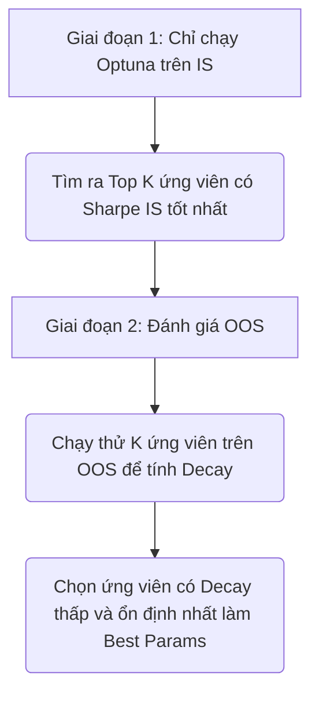

# WalkForwardEngine Phase Plan

Date: 2026-07-08
Branch: dev

This is the agreed implementation plan for upgrading QuantBT with an
institutional-grade, transparent WalkForwardEngine while staying compatible
with the current QuantBT endpoints.

## Design Principles

- Do not replace existing backtest engines.
- Walk-forward owns split, train/validation orchestration, OOS stitching,
  objective scoring, robustness selection, and reporting.
- Existing QuantBT endpoints own the final backtest simulation.
- OOS positions/signals must be stitched into one continuous timeline and then
  backtested once, so boundary trades, fees, slippage, funding, and margin are
  accounted for by the same engine used in normal research.
- Numba belongs in repeated numeric loops such as metrics, bootstrap,
  Monte Carlo, and simulation kernels. Config, pandas alignment, reports, and
  strategy adapters stay in Python.
- All stochastic logic must expose seed/config/data/kernel metadata for audit.

## Phase 1 - Split, Stitch, Endpoint Contract

Status: implemented.

Goal:

- Add the stable public integration surface and correctness foundation.

Scope:

- `QuantBTEndpoint.walk_forward(...)` factory.
- `WalkForwardEngine` with expanding/rolling split generation.
- Yearly, semi-yearly, and quarterly OOS windows.
- Strategy callable/class adapter returning OOS signal/position output.
- OOS stitcher for Series, DataFrame, or `{symbol: Series}` outputs.
- Final single-run backtest routing through existing QuantBT paths:
  `signal_notional`, `%_equity`, `dca_ladder`, explicit orders later,
  portfolio, basket, and supported arbitrage specs.
- Traceback-friendly fold table and metadata.

Tests:

- No lookahead split invariants.
- OOS stitch preserves fold boundaries.
- Boundary position changes are represented in the stitched signal.
- Compatibility smoke tests for `signal_notional`, `%_equity`, portfolio, and
  currently supported arbitrage package specs.

## Phase 2 - Objective Mode 1 And Optuna Basics

Status: implemented in the Phase 2 foundation.

Goal:

- Run real optimization over WFO folds with transparent decay scoring.

Scope:

- Parameter range parser and Optuna trial sampler.
- Duplicate trial pruning.
- Early stopping callback.
- `mode_1_decay` objective:
  `mean_oos_sharpe - lambda * std(decay) - gamma * max(0, mean(decay))`.
- Per-fold IS/OOS metrics.
- Trial ledger with params, objective components, data hash, config hash, seed.

Implemented notes:

- `optimization_mode="mode_1_decay"` is available through
  `QuantBTEndpoint.walk_forward(...)`.
- The optimizer uses transparent return-proxy scoring on strategy output for
  IS/OOS fold metrics, then runs the final stitched QuantBT backtest once with
  the selected params.
- `trial_table`, `best_trial`, `fold_table`, data hash, config hash, and random
  seed are exposed in `result.metadata["walk_forward"]`.
- Bootstrap/SBB and flat-minima are intentionally left for Phase 3.

Tests:

- Synthetic strategy with known robust parameter.
- Duplicate-pruner behavior.
- Early-stopping behavior.
- Objective component audit.

## Phase 3 - Robust Objectives And Numba Compute Helpers

Status: implemented in the Phase 3 foundation.

Goal:

- Add robustness tools without turning the engine into a black box.

Scope:

- `mode_2_sbb` stationary block bootstrap objective.
- `mode_3_flat_minima` top-trial clustering with centroid/medoid selection.
- Numba metric/bootstrap kernels where profiling shows repeated numeric loops.
- Seeded reproducibility for bootstrap/Monte Carlo.
- Fallback to Python/NumPy baseline for debug.

Implemented notes:

- `optimization_mode="mode_2_sbb"` runs Optuna over parameter ranges and scores
  each trial with seeded stationary block bootstrap on the train-fold return
  proxy.
- `optimization_mode="mode_3_flat_minima"` scores trials with the decay
  objective, clusters top trials in normalized parameter space with
  `sklearn.DBSCAN` when available and a deterministic NumPy DBSCAN fallback
  otherwise, then selects the medoid or snapped centroid of the densest stable
  cluster when available.
- `flat_selector="centroid"` creates executable params by snapping centroid
  coordinates back to the declared parameter grid, then evaluates that params
  set before final OOS stitching/backtest.
- Repeated score/turnover and bootstrap-Sharpe loops use optional numba kernels.
  If numba is unavailable, the Python/NumPy baseline path is used.
- `numba_enabled` and selector/bootstrap metadata are exposed in
  `result.metadata["walk_forward"]`.

Tests:

- Bootstrap reproducibility with fixed seed: implemented.
- Flat-minima selector chooses the stable cluster, not a sharp isolated peak:
  implemented.
- Numeric equivalence between Python/NumPy and numba/fallback helpers:
  implemented.

## Phase 4 - Production Hardening

Status: implemented in the Phase 4 foundation.

Goal:

- Make WalkForwardEngine safe to use as a shared research engine.

Scope:

- Benchmark suite with cold/warm Numba timing.
- Performance regression checks.
- Full docs and examples.
- Clear error messages for strategy adapter/data/param issues.
- Compatibility matrix for all current QuantBT routes.
- Reserved hooks for future arbitrage Phase I+ and Nautilus parity upgrades.

Implemented notes:

- Public `walkforward_support_matrix()` exposes current target routes, expected
  strategy output schema, final engine route, and support status.
- Public `validate_walkforward_strategy_output()` rejects non-timestamped
  Series/DataFrame/dict outputs and outputs that do not cover every requested
  fold timestamp before slicing/stitching to prevent silent all-zero or partial
  OOS results.
- `scoring_trading_days` is configurable for optimization-time Sharpe
  annualization, so crypto/equity/intraday research can use the correct
  convention without changing final accounting.
- Strategy adapter exceptions include fold id and train/test date ranges.
- Public `validate_param_ranges()` fails early on invalid optimization math
  such as `high < low`, non-positive steps, empty categoricals, or `None`
  fixed values.
- Public `benchmark_walkforward_kernels()` returns a deterministic
  `WalkForwardBenchmarkSnapshot` with Python vs accelerated scoring/bootstrap
  timings and numeric equivalence diffs.
- `nautilus_validation` remains reserved in the support matrix. Future Nautilus
  WFO parity should route through the same timestamped signal contract.

Tests:

- Full endpoint compatibility: implemented in walk-forward smoke tests for
  single signal, `%_equity`, portfolio, basket-compatible routing, and supported
  arbitrage package routing.
- Invariant tests: implemented for no-lookahead, rolling train window bounds,
  stitched OOS boundaries, and timestamped output validation.
- Reproducibility tests: implemented for bootstrap fixed seed and WFO metadata
  hash/seed exposure.
- Performance baseline snapshots: implemented as deterministic lightweight
  kernel benchmark smoke tests without hard wall-clock thresholds.

## Arbitrage Compatibility Note

Current supported arbitrage specs should be routable through walk-forward as
stitched OOS signal series. Specialized arbitrage engines that are schema-only
today should remain traceable and fail clearly until their engines are added.
# RFC: QuantBT WFO Trade Frequency Penalization

Status: implemented as an optional WFO scoring penalty.

Tài liệu này đề xuất đặc tả tính năng (Feature Specification) để nâng cấp bộ máy Walk-Forward Optimizer của `quantbt` nhằm giải quyết triệt để **bẫy tối ưu hóa lệnh thấp (under-trading/low-trade overfitting)**.

---

## 1. Vấn đề thực tế (Problem Statement)
Khi tối ưu hóa các chiến thuật giao dịch đảo chiều trung bình (Mean-Reversion/Spread Basis) trên các chu kỳ phân tách ngắn (như Quarterly - 90 ngày), bộ tối ưu hóa dễ chọn các tham số cực đoan (ngưỡng vào lệnh quá cao, bộ lọc quá chặt).
*   Các tham số này khiến chiến thuật chỉ thực hiện **1 hoặc 2 lệnh** trong cả quý.
*   Nếu các lệnh này ngẫu nhiên có lãi, Sharpe Ratio của quý đó sẽ cao đột biến. Đồng thời, do tần suất giao dịch cực thấp, mức sụt giảm hiệu năng (Decay) giữa IS và OOS gần như bằng 0.
*   Kết quả là WFO chọn một bộ tham số "tê liệt" (đóng băng giao dịch khi chạy thực tế), không có giá trị thực tiễn.

---

## 2. Giải pháp đề xuất (Proposed Feature spec)
Bổ sung cơ chế **Phạt tần suất giao dịch thấp (Trade Frequency Penalization)** trực tiếp vào bộ máy tính điểm tối ưu hóa của `quantbt` (`walkforward.py`).

### Cấu hình bổ sung trong `WalkForwardConfig`:
*   `min_trades_per_year` (float | None, mặc định `None` - tắt cơ chế phạt): Số lượng lệnh tối thiểu kỳ vọng trên một năm dữ liệu.
*   `trade_penalty_factor` (float | None, mặc định `None`; khi `min_trades_per_year` bật thì None được hiểu là `1.0`): Hệ số phạt (tính theo điểm Sharpe) khi chiến thuật không đạt tần suất giao dịch tối thiểu.

Implemented convention:

- Public config uses `None` as the default disabled state for both
  `min_trades_per_year` and `trade_penalty_factor`, preserving all existing
  notebook/service calls.
- If `min_trades_per_year` is set and `trade_penalty_factor` is left `None`,
  the engine uses a factor of `1.0`.
- The engine computes `actual_trade_count` as initial non-zero fold positions
  plus bar-to-bar position changes across the strategy output, not the
  notional/weight magnitude of those changes. This keeps the penalty focused on
  under-trading rather than position size.
- Mode 1 applies the penalty to both IS and OOS Sharpe before decay/objective
  calculation. Mode 2 SBB applies the same train-fold penalty to IS and
  synthetic OOS Sharpe so the objective is lowered without manufacturing
  artificial decay.

---

## 3. Công thức toán học đề xuất (Mathematical Formulation)

Với mỗi Fold tối ưu hóa:
1.  **Tính toán số lượng lệnh kỳ vọng của Fold ($T_{required}$)**:
    $$T_{required} = \text{min\_trades\_per\_year} \times \left( \frac{\text{Duration of Fold in Days}}{365} \right)$$
    *Ví dụ: Nếu `min_trades_per_year` = 36 và Fold dài 90 ngày (1 quý), $T_{required} = 36 \times \frac{90}{365} \approx 9$ lệnh.*

2.  **Tính toán Sharpe sau khi phạt ($Sharpe_{penalized}$)**:
    Gọi $T_{actual}$ là số lượng lệnh thực tế của chiến thuật trong Fold. Ta áp dụng hàm phạt trơn tuyến tính chuẩn hóa (Normalized Linear Penalty):

    $$Sharpe_{penalized} = Sharpe_{original} - \text{trade\_penalty\_factor} \times \max\left(0, 1 - \frac{T_{actual}}{T_{required}}\right)$$

### Phân tích đặc tính:
*   Nếu $T_{actual} \ge T_{required}$: Không phạt (điểm trừ bằng 0).
*   Nếu $T_{actual} < T_{required}$: Điểm trừ sẽ tăng dần tuyến tính từ $0$ đến `trade_penalty_factor`.
*   Nếu $T_{actual} = 0$ (tê liệt hoàn toàn): Điểm trừ đạt tối đa bằng `trade_penalty_factor` (ví dụ trừ thẳng `1.0` hoặc `2.0` điểm Sharpe).
*   *Ưu điểm*: Hàm này liên tục (continuous) và mượt (smooth), giúp thuật toán TPE Sampler của Optuna dễ học và tránh được các "vực thẳm" đứt gãy trong không gian tham số.

---

## 4. Thiết kế tích hợp mã nguồn trong `quantbt`

### Tệp thay đổi: `quantbt/walkforward.py`
Tích hợp trực tiếp vào hàm `evaluate_params` và `evaluate_params_sbb` trước khi tính toán các mục tiêu Decay hoặc SBB.

```python
# Logic tích hợp hiện tại trong evaluate_params của quantbt:
is_trades = float(is_metrics["trade_count"])
is_required = _required_trades_for_index(fold.train_index, self.config.min_trades_per_year)
factor = 1.0 if self.config.trade_penalty_factor is None else self.config.trade_penalty_factor
penalty = trade_frequency_penalty(is_trades, is_required, factor)
is_sharpe_penalized = is_metrics["sharpe"] - penalty
```


UPGRADE MỚI


# Đặc tả Đề xuất Nâng cấp QuantBT: Anti-Leakage WFO & Advanced Simulation (Mode 2)

Tài liệu này đề xuất phương án nâng cấp tổng quát cấu trúc của bộ máy tối ưu hóa Walk-Forward Optimization (WFO) và mô phỏng giả lập của `quantbt` để ứng dụng cho mọi loại chiến thuật giao dịch (Strategy-Agnostic).

---

## 1. Vấn đề của cấu trúc cũ (Mode 1 & Mode 3 hiện tại)
Trong `quantbt`, quá trình tìm kiếm tham số của Optuna sử dụng hàm mục tiêu:
$$Objective = Mean(Sharpe_{OOS}) - \lambda \cdot Std(Decay) - \gamma \cdot \max(0, Mean(Decay))$$

*   **Rò rỉ dữ liệu OOS gián tiếp (Look-ahead Bias)**: Vì hiệu năng Out-of-Sample (`oos_sharpe`) được tính toán và trả về cho Optuna ở **từng trial**, thuật toán tìm kiếm (TPE Sampler) sẽ liên tục tinh chỉnh các tham số để tối đa hóa Sharpe trên tập OOS. Tập OOS vô tình bị biến thành tập huấn luyện thứ hai.
*   **Hậu quả**: Sharpe OOS trong báo cáo luôn cao vượt trội so với thực tế giao dịch Live sau này.

---

## 2. Đề xuất Ý tưởng 1: Two-Stage Optimization (Tối ưu hóa Hai giai đoạn độc lập)

Ý tưởng cốt lõi là **cô lập hoàn toàn tập OOS** khỏi thuật toán tìm kiếm của Optuna:



### Chi tiết thuật toán:
1.  **Giai đoạn 1 (Train strictly on IS)**:
    *   Optuna thực hiện $N$ trials. Hàm mục tiêu chỉ tính toán hiệu suất trên tập IS:
        $$Objective_{IS} = Sharpe_{IS} - \text{Penalty}_{trades}$$
    *   Kết quả Giai đoạn 1 là danh sách $K$ bộ tham số ứng viên tốt nhất trên IS:
        $$\Phi = \{\theta_1, \theta_2, \dots, \theta_K\}$$
2.  **Giai đoạn 2 (Select on OOS)**:
    *   Chỉ mang đúng $K$ bộ tham số trong tập $\Phi$ đi đánh giá trên OOS của tất cả các Folds.
    *   Tính toán Decay cho từng ứng viên: $Decay = Sharpe_{IS} - Sharpe_{OOS}$.
    *   Lựa chọn bộ tham số cuối cùng có chỉ số Decay tối ưu và ổn định nhất.

---

## 3. Đề xuất Ý tưởng 2: Flat Minima on In-Sample (Gom cụm trên IS)

Thay vì gom cụm DBSCAN trên các Trial đã bị nhiễm Look-ahead bias của tập OOS, ta thực hiện gom cụm **thuần túy trên tập IS**:

1.  **Bước 1**: Chạy Optuna tìm kiếm tham số tối ưu **chỉ trên tập IS** để đạt Sharpe IS cao nhất.
2.  **Bước 2**: Lọc ra Top $N$ trials tốt nhất trên IS.
3.  **Bước 3**: Chạy thuật toán **DBSCAN trên tập IS** để tìm ra các "thung lũng phẳng" (Flat Minima) tiềm năng của riêng tập IS.
4.  **Bước 4**: Xác định điểm trọng tâm (Centroid/Medoid) của các cụm thung lũng phẳng này. Ta thu được danh sách các trọng tâm robust $\Phi_{centroids}$.
5.  **Bước 5**: Đem duy nhất các điểm trọng tâm này đi test trên OOS để đo Decay và chọn ra bộ tham số cuối cùng.

---

## 4. Thảo luận chuyên sâu về tham số ($N$ Trials & Giá trị $K$)

### Thảo luận 1: Số lượng $N = 400$ Trials đã đủ chưa?
*   Số lượng trials cần thiết phụ thuộc vào số lượng tham số cần tối ưu (Dimensionality of Search Space) và độ rộng của từng dải tham số.
*   Với các chiến thuật giao dịch thông thường (dưới 10 tham số), thuật toán **TPE (Tree-structured Parzen Estimator)** của Optuna chỉ cần khoảng **100 đến 150 trials** là bắt đầu hiểu được phân phối xác suất và hội tụ vào vùng tối ưu. Do đó, mức cấu hình **$N = 300$ đến $400$ trials là hoàn toàn đủ** để quét sạch không gian IS, đảm bảo tìm ra các thung lũng phẳng ổn định.

### Thảo luận 2: Nên chọn $K = 20$ hay $K = 50$ ứng viên cho Giai đoạn 2?
Việc chọn số lượng ứng viên $K$ để mang sang test trên OOS là một bài toán **Trade-off (Đánh đổi)**:
*   **Nếu chọn $K = 20$ (Bảo thủ - Kiểm soát chặt Bias)**: Lực lượng tập chọn lọc rất nhỏ. Xác suất Optuna gặp may (False Discovery Rate) trên OOS cực kỳ thấp. Tuy nhiên, có thể bỏ sót những bộ tham số có Sharpe IS đứng ở vị trí thứ 30-40 nhưng lại cực kỳ robust trên tập OOS.
*   **Nếu chọn $K = 50$ (Tìm kiếm cơ hội - Rủi ro Bias tăng)**: Tăng tập ứng viên đa dạng, tăng cơ hội thích ứng khi OOS có sự chuyển dịch regime đột ngột. Tuy nhiên, xác suất chọn phải một bộ tham số "ăn may trên OOS" sẽ tăng lên đáng kể (gấp 2.5 lần so với $K=20$).
*   **💡 Giải pháp đề xuất tốt nhất (Dynamic K-Ratio)**: Cấu hình thông số `top_is_fraction` (ví dụ `0.05` tương đương top 5%, hoặc `0.10` tương đương top 10% số trials đã chạy hoàn thành) thay vì số $K$ cố định.

---

## 5. Đề xuất nâng cấp cho Mode 2 (Conditional Bootstrap & Simulation)

Mode 2 của `quantbt` hiện tại sử dụng **Stationary Block Bootstrap (SBB)** để xáo trộn ngẫu nhiên chuỗi lợi nhuận nhằm kiểm chứng tính bền vững. Tuy nhiên, phương pháp phi tham số này có giới hạn là **chỉ xáo trộn lại lịch sử sẵn có** (không tạo ra các kịch bản thị trường mới).

Để nâng cấp Mode 2 theo các tiêu chuẩn tiên tiến của các quỹ Quant lớn, chúng tôi đề xuất bổ sung các tùy chọn giả lập sau:

### A. Regime-Conditioned Bootstrap (Bootstrap có điều kiện trạng thái)
*   **Cách hoạt động**: Phân tách lịch sử dữ liệu IS thành các trạng thái thị trường khác nhau (ví dụ: High Volatility, Low Volatility, Bull-Trend, Bear-Trend).
*   **Cấu hình mô phỏng**: Cho phép người dùng tùy chỉnh kịch bản test trên OOS bằng cách gán trọng số cấu trúc (ví dụ: mô phỏng 1000 mẫu OOS giả lập chứa 30% mẫu High Volatility Crash và 70% mẫu Low Volatility). SBB sẽ chỉ bốc các khối dữ liệu (blocks) thuộc regime được cấu hình để ghép nối.

### B. Parametric Modeling Simulation (Mô phỏng tham số hóa)
*   Tích hợp các mô hình thống kê như **GARCH** (mô phỏng cụm biến động volatility clustering) hoặc **HMM (Hidden Markov Model)** để tự động sinh ra (synthesize) các chuỗi lợi nhuận nhân tạo có phân phối đuôi béo (fat tails) và độ biến động có thể co giãn theo tham số (ví dụ: stress-test hệ thống bằng cách nhân 1.5x hoặc 2.0x biến động volatily của tập IS).

---

## 6. Đánh giá tính linh hoạt cấu trúc thời gian của QuantBT

Qua phân tích mã nguồn `quantbt/walkforward.py`, công cụ hiện tại có tính linh hoạt cao về mặt xử lý dữ liệu (không phụ thuộc vào độ phân giải dữ liệu đầu vào - Data Resolution, có thể chạy từ 1m, 1h đến 1d). Tuy nhiên, **cấu trúc chia Fold (Split Frequency) vẫn còn bị giới hạn cứng**:

*   **Hạn chế hiện tại**: Biến `split_frequency` trong `walkforward.py` chỉ chấp nhận 3 giá trị cứng: `"yearly"`, `"semi_yearly"`, và `"quarterly"`. Nếu nhập các giá trị khác sẽ báo lỗi `ValueError`.
*   **Đề xuất nâng cấp**: Đối với các chiến thuật giao dịch tần suất cao (High-Frequency Trading) hoặc chiến thuật giữ lệnh ngắn hạn (Short-Horizon/Intraday), chu kỳ tối ưu hóa và test cần ngắn hơn nhiều. Chúng tôi đề xuất `quantbt` mở rộng thêm hỗ trợ cho các chu kỳ phân tách ngắn hơn bao gồm: `"monthly"` (Hàng tháng) và `"weekly"` (Hàng tuần) bằng cách bổ sung các quy tắc tính toán offset tương ứng.
